# Introduction {#21-intro}

Challenged to meet the demands of reduced cost, global competition, sustainability, shorter product life cycles, and product complexity, the manufacturing industry is in the midst of a digital transformation. Industry 4.0 and the underlying shift from mass production to mass customization places new demands on the workforce. Today's manufacturing operators must manage a wider range of responsibilities and increased information flow amidst decreasing margins for error, changing methods, and new technologies. These trends show no signs of abatement [@danielsson2020augme]. Extended Reality (XR) devices, in their various forms, are expected to aid this problem through operator training and support.

Augmented Reality (AR) systems "combine real and virtual, are interactive in real time, and are registered in 3-D" [@azuma1997surve]. By realistically integrating informative and/or interactive virtual objects in our view of the world, AR aims to enhance the users' interaction with and perception of it. Its essential affordance is the direct and natural manipulation of virtual objects in everyday surroundings. Relative to metaphorical digital interfaces, this is thought to improve the uptake of knowledge by reducing the overall cognitive load and better distributing it across multiple sensory pathways [@shelton2003explo]. AR-assisted learners demonstrate improved perception, performance, and understanding of spatial concepts, with outcomes correlated to the amount of physical engagement involved [@chen2019using]. As a result, AR is thought to be well-suited for task-related learning. Using untethered, hands-free devices with optical see-through head-mounted displays, AR can continuously enhance the user's actions in the real world [@leonard2018holog]. These benefits have broad industrial applications.

In manufacturing, operator support has been a common application of AR research and development since the early 1990s [@azuma1994impro]. It is also seen as a source of innovative operator training methods required to meet rapidly increasing demand for skilled labor due to high retirement rates, global expansion, and increasing specialization [@kress2020optic]. Manufacturing support, training, and related applications have been identified in the areas of assembly, maintenance, operations, quality control, safety, design, visualization, logistics, and marketing [@oztemel2020liter].

Despite great potential, the adoption of AR is slowed by technical, market, and other important social and legal obstacles [@azuma2019road]. XR technologies remain relatively immature and will face new challenges as their development moves from research labs to the shop floor. There, priorities shift from building technology to delivering solutions. No longer "proofs of concept," these systems will be evaluated on the basis of their return on investment and other key performance indicators essential to the business case [@masood2019augme; @masood2020adopt]. That performance will be assessed in the context of the entire operation, where technical considerations are balanced by organizational and environmental factors. The long-term success of XR initiatives ultimately rests on how those results compare with other investment alternatives.

But AR remains a highly fragmented market, including a diverse selection of screen-based, projected, and head-mounted technologies [@kress2020optic]. Studies show that the efficacy of these systems varies with the task type, technology used, application design, and other factors [@kaplan2021effec]. Research in this area is young but accelerating. Most of it focuses on efficiency (task time) and accuracy (error count). These are relevant but incomplete measures for assessing training outcomes, where the learning rate and transfer effectiveness must also be considered [@buttner2020augme].

This investigation extends prior work [@havard2021case] to explore the relationship between a variety of AR technologies and their underlying affordances [@parsons2021curre] and learning outcomes for manufacturing assembly operations. By controlling for the task type and application design we hope to better understand the relative value of these systems, filling in important gaps that can lead to a cohesive framework for successful adoption.

TODO: add problem, purpose, research questions; summary of conclusions(?) to introduction

The balance of this first chapter provides a thorough background of the historical, contextual, technological, theoretical, ergonomic, and biopsychosocial considerations related to augmented, mixed, and virtual reality. Chapter 2 provides a review of literature relevant to the applications of this technology, the readiness of each market, barriers to adoption and methods proposed to overcome them, and assessment tools. Based on the gaps identified in the literature, Chapter 3 identifies the central problem of this research and its three contributions. The experimental methods are detailed in Chapter 4, and results follow in Chapter 5. Finally, we conclude this work by summarizing the key findings, stating the limitations of this work, and identifying opportunities for future research.

## Background

### Advanced Manufacturing

Ongoing changes are expected to have profound impact on the people, businesses, and governments of the world. The so-called *Fourth Industrial Revolution* (4IR) follows prior revolutions of mechanization, mass production, and digitization, and is the first to be predicted in advance, not observed after the fact [@drath2014indus]. First described by Klaus Schwab[^21-intro-1] of the World Economic Forum [@schwab2015fourt], 4IR is driven by today's rapidly evolving and converging digital technologies. Brynjolfsson and McAfee note that these *Second Machine Age* advances uniquely exhibit sustained exponential rates of improvement while being easily combined and efficiently distributed [@brynjolfsson2014secon]. The innovative fusion of these cross-disciplinary technologies is transforming our physical, digital, and biological worlds in unprecedented ways.

[^21-intro-1]: Footnote about Klaus Schwab

::: content-hidden
manufacturing is vital to the economy and security of the United States ICAMS goals and SMM needs
:::

### Industry 4.0

Four years before Schwab's 4IR keynote, European manufacturing leaders had already imagined the potential benefits of digital convergence. In January of 2011 Germany's BMBF (the Federal Ministry of Education and Research) announced a new initiative. "Industrie 4.0" (I4.0) was introduced as the digital transformation of manufacturing, a paradigm shift intended to protect and expand Germany's influence as a world leader in the sector [@kagermann2011indus]. Since then, I4.0 has become a prominent trend in Advanced Manufacturing. Its adoption is driven by a combination of application-pull (social, economic, and political change) and technology-push (automation, digitalization, communication, and miniaturization) market factors [@lasi2014indus].

I4.0 is a data-driven approach to manufacturing, where product specifications direct aspects of production. This is accomplished with connected, automated, autonomous components that respond in real-time to variable requirements [@negri2017revie]. I4.0 is therefore advocated as the means by which manufacturing operations can meet modern organizational and societal demands for increased decentralization, flexibility, and resilience [@tao2017digit]. Time and cost to market and productivity are also expected to improve, along with sustainability measures, including energy cost and emissions. There is widespread optimism for these outcomes and their positive overall effect on global economic growth [@kagermann2013recom].

That optimism has encouraged the adoption of I4.0 methods worldwide. The Industrial Internet Consortium (IIC), founded by AT&T, Cisco, General Electric, IBM, and Intel, is the most prominent of several I4.0-related alliances in the United States [@hardy2014conso]. As of 2021, the IIC (now known as the Industry IoT Consortium) boasts more than 150 member companies. Other major initiatives are underway in the UK, Taiwan, Japan, South Korea, France, Turkey, and more [@oztemel2020liter]. As of 2015, China was reportedly investing over \$200B / year to related research and development. This bid to move from imitator to innovator is a clear signal of the returns that China expects from new markets and efficiencies unlocked by its I4.0 transformation [@woetzel2015china].

Though a crisp definition of I4.0 might be expected given the support it has received, the literature is sorely lacking. It seems that "Industry 4.0" simply emerged as the most popular of several names given the technology-driven manufacturing renaissance that was commonly expected to result from its digital transformation [@culot2020behin]. The integration of adjacent schools of thought, including "Industrial Internet" [@evans2013indus] and "Smart Manufacturing" [@radziwon2014smart], partially explains the lack of a standard definition for I4.0. Rapid divergent development by academics and practitioners and overzealous marketing have also contributed to the diffusion of this idea.

In fact, the literature suggests that I4.0 is best understood as a general concept, philosophy, or vision of manufacturing characterized by a group of functionalities, including process integration, real-time information transparency, virtualization, and autonomy, and their enabling technologies [@culot2020behin].

I4.0 has been linked to over 1200 technological components, from 30 disciplines [@chiarello2018extra]. To provide a useful definition of I4.0 in terms of the technologies involved, some abstraction is essential. In their review of over 100 relevant and credible sources, Culot, et al. [@culot2020behin] identified 13 categories of technology. Each was assessed along two continua: software-hardware technology and local-global connectivity, as seen in @fig-tech.

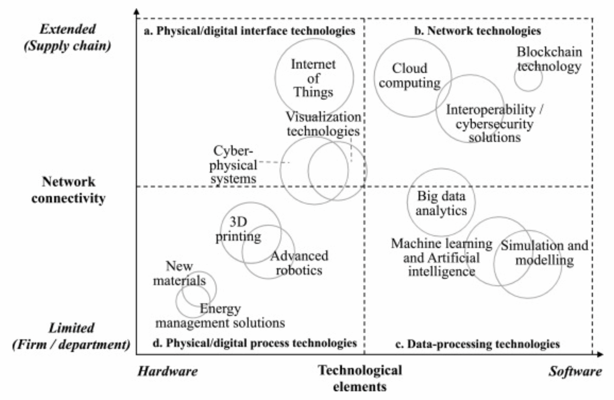{#fig-tech width="5in"}

Four technology quadrants emerge in this figure: (a) physical-digital interfaces, (b) networking, (c) data-processing, and (d) physical-digital processes. The sensing, connecting, and analyzing activities of the first three quadrants are what differentiate I4.0 from advanced manufacturing.

As described in the next section, the specific technologies and the manner in which they are integrated and applied define an I4.0 system. The permutation of possible outcomes, each a different embodiment of the I4.0 concept, is the ultimate source of definitional ambiguity in this field.

### Cyber-Physical Systems

Cyber-Physical Systems (CPSs) is an emerging cross-disciplinary field engaged in the design of new models and methods for problems at the intersection of physical and digital engineering traditions [@lee2015past]. It was simply defined in E. Lee's seminal paper [@lee2006cyber] as the "integrations of computation with physical processes." CPS promotes the novel evolution of classic embedded systems through their interconnection and integration with computation and control mechanisms. This enables the real-time autonomous control of large engineering systems [@lee2006cyber; @pascual2019handb]. Though commonly associated with I4.0, CPS is independent of specific applications or implementations, e.g. I4.0 and IoT.

CPS enables I4.0 by integrating the previously identified sensing, connecting, and analyzing capabilities to "monitor and control physical processes, usually with feedback loops where physical processes affect computations and vice versa" [@lee2006cyber]. An I4.0 CPS is comprised of physical objects, networked data models of those objects, and services based on that data [@drath2014indus]. Their technical building blocks are summarized below [@bottani2017from]:

-   Internet of Things (IOT) - sensored networked devices
-   Machine-to-Machine (M2M) - interconnected, interoperable systems
-   Digital Twin (DT) - mirroring of physical and virtual objects
-   Cloud Computing - distributed computing services
-   Big Data - large scale data capture, storage, and analysis
-   Modeling - data or physics driven methods for descriptive, diagnostic, predictive, and prescriptive analysis
-   Extended Reality (XR) - virtual, augmented, or mixed reality visualization and interaction
-   Advanced Manufacturing - including additive methods, automation, and robotics

To understand their roles in an I4.0 CPS, J. Lee's 5C Architecture is instructive [@lee2015cyber]. This popular framework identifies five implementation activities in step-wise fashion: get data from sensors, convert data to information, analyze information, present data, and provide control feedback. These activities correspond to the 5Cs of Connect, Convert, Cyber, Cognition, and Configuration, as depicted in @fig-5c, with related attributes.

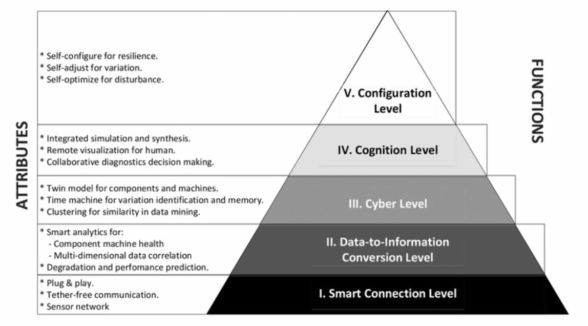{#fig-5c width="5in"}

In this framework IOT and M2M enable smart Connections between sensored devices. In the Conversion level Big Data collects and contextualizes the data. Virtual representations of the physical components are created by Digital Twins in the Cyber step. Extended Reality devices aid visualization and Cognition. Various Modeling methods are employed throughout to support manual and automated decision-making. The Cloud Computing architecture integrates it all and facilitates feedback in Cognition. The resulting closed loop system drives Advanced Manufacturing processes in real-time.

Ideal I4.0 CPS systems are fully integrated within the enterprise: horizontally, vertically, and across the system life-cycle. Horizontal integration occurs across the value chain, from supplier and production to end customer. Vertical integration covers the manufacturing hierarchy, from the shop floor to enterprise planning [@pascual2019handb]. Fully realized systems are driven by individual product specifications, maximizing flexibility and resiliency, along with their attendant social, market, and sustainability benefits. Taken to the limit, such systems are capable of operating with a batch size of one, the ultimate Lean Manufacturing benchmark and the key to unlocking mass personalization and customization [@kagermann2011indus; @lasi2014indus; @culot2020behin].

In the following section we focus on the heart of Lee's 5C architecture, the Digital Twin.

### Digital Twins

The Digital Twin is the mechanism by which I4.0 synchronizes the virtual and physical system states. It consists of a virtual replication of the system that is coupled to its physical counterpart via a bi-directional flow of sensor and control data. DTs enable a data-driven approach to life-cycle management that can employ optimal methods and practices for each environment. The continuous, bi-directional data flow and synchronization of an idealized DT differentiates it from traditional modeling and simulation methods which typically operate as off-line, asynchronous processes [@jones2020chara].

The DT concept was introduced by Michael Grieves[^21-intro-2] in late 2002, partly inspired by dynamic CAD modeling methods that were then emerging. He originally promoted it as a tool for distributed, collaborative problem solving in product life-cycle management (PLM) [@grieves2017digit]. Grieves developed the idea under different names until 2011, when he first used the phrase Digital Twin to describe it [@grieves2011virtu]. Therein he credits collaborator John Vickers[^21-intro-3] of NASA with coining the term, which also appeared in NASA's draft strategy for Simulation-Based Systems Engineering in 2010 [@shafto2012model].

[^21-intro-2]: Footnote about Michael Grieves

[^21-intro-3]: Footnote about John Vickers

Following similar growth in adjacent fields, interest in the DT concept has accelerated rapidly since 2016. While most research activity remains focused on Industry 4.0 applications, progress in academia and industry has led to some divergence in both interpretation and application of the concept [@ante2021digit]. A 2017 survey of manufacturing literature found that no less than 16 unique definitions had been proposed for Digital Twin since 2011 [@negri2017revie]. Despite the literature offering no common understanding of the term, the DT concept is recognized as a key enabler for I4.0 [@kritzinger2018digit].

#### The Synchronization Process

Jones described the DT synchronization process, also known as "twinning," as a cycle of measuring and reflecting changes in the parameters of interest [@jones2020chara]. During metrology, changes to one system state are measured. In the realization phase those changes are reflected in the other system. This process operates bi-directionally between physical and virtual entities, creating a system that is capable of continuous adaption. See @fig-twinning.

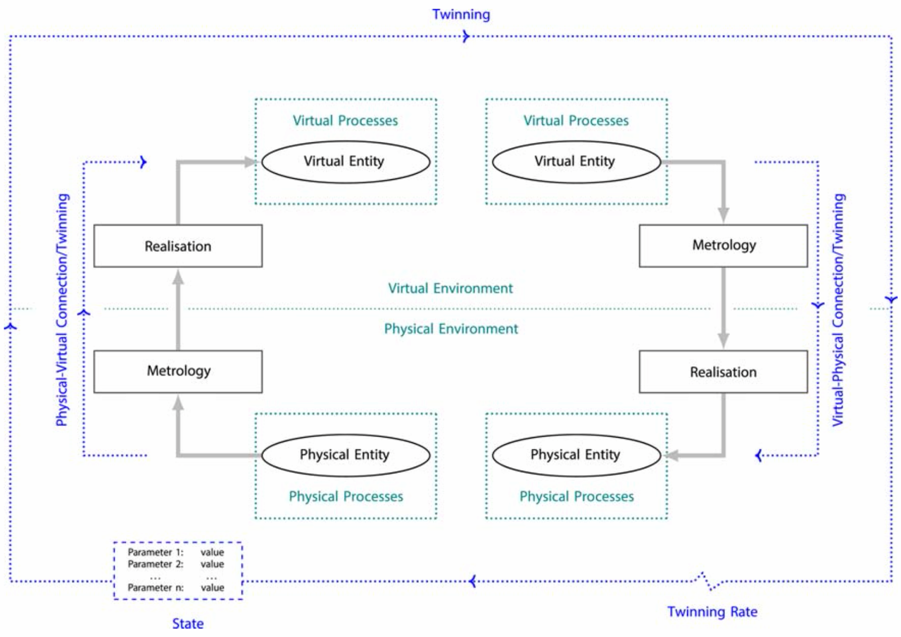{#fig-twinning width="5in"}

In Jones' model the term parameter refers to the values synchronized by the DT. Common parameters are related to form, functionality, process, and performance. Examples include part tolerance, assembly time, and machine health. Parameters can be measured, computed, observed, or otherwise derived. The overall system state is described by the current value of all parameters. The fidelity of a DT is a measure of the number of parameters, their accuracy, and the level of abstraction involved [@jones2020chara].

The DT concept is not entirely new. Elements of it are evident in other fields, including Computer-Integrated Manufacturing and Virtual Manufacturing Systems, both of which predate Grieves' work. Of those, only Model-Based Predictive Control, Advanced Control Systems, and Building Information Modeling (BIM) share DT's approach to closed-loop control [@jones2020chara].

#### Life-cycle Considerations

This method is most valuable for objects that are changing over time, and when measurement data that can be correlated with this change can be captured [@wright2020tell]. To account for this, Grieves describes two manifestations of the Digital Twin: Prototype (DTP) and Instance (DTI). The DTP models a prototypical physical object, providing an idealized, immutable reference for that thing, including the means to produce physical instances of it. The DTI is the virtual reflection of a unique, as-built thing in the world. Multiple DTIs are maintained, each synchronized with a single instance of the physical object for the duration of its life-cycle [@grieves2017digit].

The DT model is dynamic. In each phase of the system's lifecycle (creation, production, operations, disposal) the directionality of metrology and reflection changes. Modeling tools are first used to develop and test the DTP in the creation phase. Physical instances are derived from the DTP in production, when their as-built specifications are captured and reflected in corresponding DTIs. During the operations phase the real-virtual link becomes bi-directional, synchronizing the system states and enabling continuous adaption. Finally, information about the system is used to properly dispose of it, before being archived for the benefit of future designs [@grieves2017digit].

Data collected throughout this process is used by various modeling methods that support the Conversion, Cognition, and Configuration levels of Lee's 5C architecture. The conversion layer primarily relies on descriptive and diagnostic approaches to interrogate and analyze system status. The cognition layer utilizes predictive methods to aid human understanding. Prescriptive methods that recommend specific actions are employed in the configuration level to drive continuous adaption through parameter optimization or policy selection [@bottani2017from].

#### State of the Art

In 2017, Grieves set the lofty goal for models that "fully \[describe\] a potential or actual physical manufactured product from the micro atomic level to the macro geometrical level" [@grieves2017digit]. His position is representative of a bias towards fidelity that is commonly expressed in the literature, despite the absence of any example using more than a subset of the known parameters [@jones2020chara]. Digital Twins that perfectly replicate the reality of complex systems in real-time may never be practical. Tradeoffs must be made between fidelity, accuracy, available compute, and update rate. Models need only be sufficiently physics-based, accurate, and quick to meet the system requirements in a trustworthy manner. This depends on properly managing model verification and validation, uncertainty, model selection, and associated metadata [@wright2020tell].

We are still far from the idealized DT described above. Though many perceived benefits have been identified, few papers include quantitative analysis to validate those claims [@jones2020chara]. Most research in the area is concept oriented. Of the few published case studies, most systems are uni-directional, with low fidelity and/or little integration [@kritzinger2018digit]. Implementation relies on connections between physical and digital systems that are often difficult to implement without human involvement, and current modeling tools fall well short of understanding and replicating the physical world [@grieves2017digit]. Limited collaboration and a lack of technical standards are also commonly noted [@ante2021digit]. Together, these shortcomings hinder development and slow adoption of the DT concept.

Though the research area remains immature, a number of additional frameworks have recently emerged in response to issues with standards, validation, fidelity, and interoperability. Grieves' Tests of Virtuality (GTV) were proposed as a means to evaluate the fidelity and validity of a DT. Performance is assessed by comparing the look, behavior, and synchronization of a physical system and its virtual counterpart [@grieves2017digit]. Tao's seminal paper describes the DT of a shop floor in terms of its architecture and technology. Architecturally, he identifies four integrated layers: geometry, physics, behaviors, and rules. The many necessary technologies are grouped into the five areas of interconnection and interaction, modeling and verification, construction and management, operation and evolution, and smart production services [@tao2017digit].

At least two maturity models have been proposed. Kritzinger's model is based only on the level of physical-virtual integration, as expressed by the Digital Model (DM), Shadow (DS), and Twin (DT) classification scheme. A DM has no connection or uses manual methods of data exchange. One-way flow of data characterizes the DS, while bi-directional flow is the hallmark of a DT [@kritzinger2018digit]. Hyre's model also considers how capability and complexity increase with a DT's level of integration. Her 4Rs (Representation, Replication, Reality, and Relational) provide a framework for the incremental development of a DT that incorporates verification and validation of the system [@hyre2022digit].

#### DTs for the Development and Testing of Complex Systems

The physical-virtual synchronization of Digital Twins enables the operational benefits of an I4.0 CPS, as previously described. That twinning process requires a trustworthy virtual replication of the system, which offers many additional benefits for the development and testing of these complex systems.

A complex system is defined as one in which connections between the components are unfamiliar, unplanned, unexpected, and/or invisible, making it difficult to predict system states [@incose2015incos]. Such systems are prone to "Normal Accidents," in which cascading failures escalate suddenly and often catastrophically. Human inconsistency (following rules, processes, and procedures) and poor sensemaking (understanding what is perceived) often play a role in those accidents, especially in high stakes situations when good decision making is most critical [@perrow1999norma].

Complex systems are the domain of Systems Engineering, where traditional methods rely on the verification and validation of physical objects. This approach, exemplified by the commonly used Waterfall, Spiral, and Vee models, is expensive, centralized, and sequential. As a consequence, it focuses the scope of investigation on areas where undesirable effects are predicted. The most dangerous category of system behavior, that which leads to unpredicted and undesirable outcomes, is often first encountered when the system is deployed, creating the risk of catastrophic failure and harm to the users [@grieves2017digit].

Digital methods are, by contrast, low cost, composable, and easily distributed [@brynjolfsson2014secon]. Trustworthy virtual systems can be tested more thoroughly than the physical equivalent, with less risk. Increased test coverage helps identify and mitigate unpredicted, undesirable outcomes. Reduced risk permits the evaluation of circumstances that traditional methods would not allow. Thus, DTs can test more broadly, including conditions that are uncommon or hazardous and/or involve interaction with a diversity of personnel. This directly addresses the leading causes of those "Normal Accidents" that we seek to avoid, and is a primary intended benefit of the Digital Twin [@grieves2017digit].

#### DTs for Visualization

Though DTs are widely embraced as the synchronizing mechanism in an I4.0 CPS, and for the development and testing of complex systems, they offer another important benefit. As previously mentioned, the concept was first promoted as a tool for collaborative problem solving; a way for stakeholders to understand and visualize the current system state.

A Digital Twin improves problem solving and innovation by aiding the human processes of conceptualization, comparison, and collaboration. Effective visualization simplifies the cognitive steps involved in translating symbolic information, facilitating conceptualization. Overlaying the physical and virtual allows for direct comparison, which is ideal for human perception and analysis. Collaboration is enabled by digitally replicating and distributing the experience to an audience of stakeholders [@grieves2015digit].

Visualization is an essential outcome of the Digital Twin concept. High fidelity interactive visualizations of virtual systems can be shared globally in real-time using modern technology, allowing the direct, side-by-side visual comparison of the physical and virtual product.

Today, the tools and technologies best suited to deliver on this promise are found in the area of Extended Reality.

### Extended Reality

Extended Reality (XR) is the umbrella term for a range of technologies where human-machine interactions occur in environments that blend real and simulated stimulus [@ul2022xr8400]. XR covers the entire Virtuality Continuum (VC), as famously described by @milgram1994taxon, and pictured in @fig-vc.

{#fig-vc width="5in"}

This continuum spans the complete range of real to synthetic experiences. Though typically associated with adding or replacing visual stimulus, the VC also includes technologies that are subtractive in nature and/or affect other senses. For example, noise cancellation headphones can be considered a form of "diminished reality" audio AR device [@kress2020optic].

#### Origins of XR

Many precursors to XR can be identified in the 1800s and early 1900s, culminating in Morton Heilig's[^21-intro-4] patented head-mounted display (HMD) in 1960, which boasted 140° field of view, stereo earphones, and air / scent discharge nozzles [@heilig1960stere]. As seen in @fig-heilig, images from the 60 year old filing are surprising in their familiarity. Soon thereafter, engineers at the Philco Corporation created the first such device that tracked the wearer's head motion and updated the display accordingly [@jerald2016book].

[^21-intro-4]: Footnote about Morton Heilig

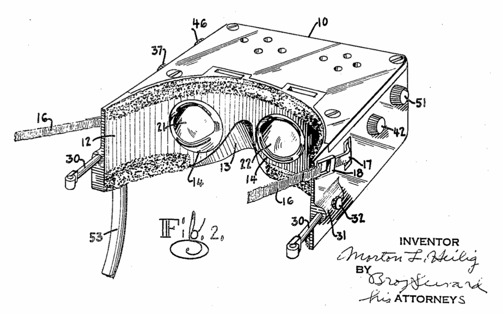{#fig-heilig width="5in"}

In 1965 Ivan Sutherland[^21-intro-5] published *The Ultimate Display*, which described his vision for a "kinesthetic display" at a time when "the ability to draw simple curves would be useful" [@sutherland1965ultim]. In it, he commented:

[^21-intro-5]: Footnote about Ivan Sutherland

> *A display connected to a digital computer gives us a chance to gain familiarity with concepts not realizable in the physical world. It is a looking glass into a mathematical wonderland.*

Three years later, Sutherland and his students at the University of Utah were first to demonstrate a HMD that combined tracking and computer generated imagery. The device, known as the Sword of Damocles, is the original prototype for all modern VR technology. Its name was in reference to the story of King Damocles, owing to the precarious position the device maintained over a user's head [@kiyokawa2015head]. It took nearly 30 years for its AR equivalent to emerge.

In 1994 Ronald Azuma[^21-intro-6] presented the first AR system capable of accurately maintaining the spatial registration of real and virtual objects based on changes to the user's viewpoint. Key contributions of that open-loop system included custom hardware, calibration, and head pose prediction methods [@azuma1994impro].

[^21-intro-6]: Footnote about Ronald Azuma

Commercial interest in XR has since experienced alternating periods of boom and bust, fueled by promises that exceeded the technologies of the time. Through it all, research in the corporate, government, academic, and military sectors continued. Capitalizing on the runaway success of the smartphone industry following the 2007 iPhone launch, the current wave of XR began to emerge in 2012. This generation of hardware leveraged newly available components, including displays,[^21-intro-7] processors, batteries, cameras, and sensors, along with the maturing software infrastructure, to offer products that were more sophisticated and compelling in all sectors [@kress2020optic].

[^21-intro-7]: In this context the term *display* can apply to devices that present information for any human sense. For example, a speaker is an audio display, and haptic devices are displays for the senses related to touch.

Emblematic of that shift is Field of View To Go (FOV2GO), an experimental, untethered, DIY HMD developed in the Mixed Reality Lab at the University of Southern California's Institute for Creative Technologies, and first shown at the IEEE VR conference in 2012 [@olson2011desig]. Their design utilized two iPhone 4's as displays with an off the shelf lens assembly and tracking system, all mounted on a cardboard body. Software was powered by the Unity game engine and a Python script. Their conference poster is pictured in @fig-fov2go.

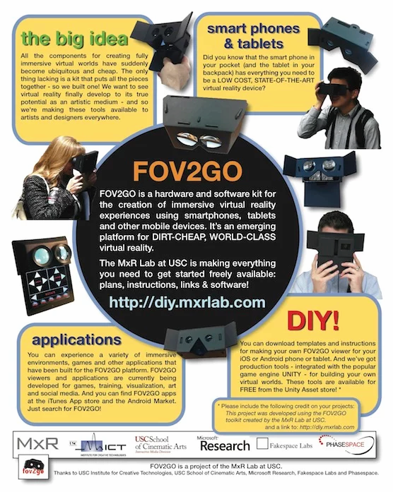{#fig-fov2go width="5in"}

FOV2GO team members founded Oculus VR soon thereafter and demonstrated a prototype of their Rift VR HMD in June of that year. The Rift Kickstarter campaign launched in August, meeting its \$250,000 funding target in less than four hours and securing over \$2.4m in total. Oculus subsequently raised over \$90m in venture capital before being acquired by Facebook for \$2b in March of 2014 [@jerald2016book].

XR has experienced tremendous growth and development in the last 10 years. Many declinations of XR have been identified, including Virtual, Augmented, Mixed, Blended, and Merged Reality. The literature identifies significant overlap and some disagreement in their interpretation. Of those, virtual and augmented reality are the most agreed upon terms.

#### Virtual and Augmented Reality

Virtual Reality (VR) is a synthetic, multi-sensory experience that imitates real-world interactions. VR is a very concrete concept in which purely synthetic environments are experienced through opaque HMDs, via interactions that are primarily controller-based. This combination of familiar features has been experienced by many, thanks to the availability and maturity of consumer devices like the Meta Quest. VR is widely understood as a way to provide immersive experiences that lead to the sensation of presence.

Immersion is the degree to which an XR experience provides consistent, believable inputs with corresponding outputs. It is a function of the range and congruence of the sensory modalities involved, the quality and spatial cohesion of the displays used, and the simulation's responsiveness to user interaction [@slater1997frame]. Vividness and interactivity are often cited as the functional mechanisms underlying the efficacy of XR [@steuer1992defin; @jiang2007resea]. A study by @yim2017augme, involving over 800 US college students found that immersion plays a mediating role in that relationship. That is, vividness and interactivity lead promote immersion, which promotes presence.

Yim's study defined vividness as the ability of the technology to display high fidelity stimuli over multiple sensory channels. Interactivity was described as a function of both the underlying technology, including responsiveness, interface, and overall level of interaction supported, and the quality of the experience's design and implementation. Together, technology and design enable and engender interaction [@yim2017augme]. The depth of immersion is a characteristic of the hardware and software involved, and its effects are subjective. The way different users experience immersion is known as presence.

Presence refers to a psychological state that can result from immersion, and is commonly defined as "a sense of being there" [@cummings2016immer]. Presence is associated with an “illusion of nonmediation,” where users fail to perceive or acknowledge the existence of the interfacing technology and act as if it were not there [@lombard1997heart]. A strong sense of presence leads to experiences that are perceived as real, generating cognitive, psychological, and behavioral effects that are similar and long-lasting [@bailenson2018exper]. While presence can also occur in AR, other mechanisms of the medium have a stronger, more valuable effect.

Augmented Reality (AR) is a more abstract and nuanced concept which has so far refused to converge on a single implementation. As originally described in Azuma's highly cited first survey of the field, Augmented Reality (AR) systems "combine real and virtual, are interactive in real time, and are registered in 3-D" [@azuma1997surve]. The value of AR comes from its ability to enhance a user's natural interaction with and perception of the real world.

Azuma's definition demands real-time interaction with a spatially coherent mix of real and virtual objects. This new interface paradigm is based on concepts that would become known as Spatial Computing, which Greenwold defined as "human interaction with a machine in which the machine retains and manipulates referents to real objects and spaces" [@greenwold2003spati]. In this way, AR proposes to replace metaphorical input devices like the keyboard and mouse with sensor-based interfaces that directly measure and interpret the world and our actions in it.

In a general sense, AR systems can enhance perception by mapping any sensor input to any mix of displays, allowing users to see, hear, feel, etc. in ways not normally possible. Sensor inputs can refer to either raw data from a single measurable phenomenon or "fused" data developed from multiple sources. Interaction also benefits from the user's improved understanding [@azuma1997surve].

Traditional AR and VR devices integrate computation, sensors, and displays into a HMD, which may suggest they offer a similar experience and benefits. Both offer novel forms of visualization and interaction, but the essential characteristics of each are entirely different. In the study of interaction design and related fields these characteristics are referred to as *affordances*, the quality or property of an object that defines its possible uses or makes clear how it can or should be used [@norman2013desig]. For example, a button affords pushing and a handle affords pulling.

VR is a new medium that immerses the senses in a virtual replacement for reality and, through the psychological phenomena of presence, mimics the effects of as-lived events [@bailenson2018exper]. AR is a new model of computing that augments our perception of reality and, through a natural, spatially connected interface, enhances our understanding of and interactions with the real world [@azuma2019road]. Where VR is an extension of games and film, AR is seen as the most likely next step on the path towards ubiquitous computing.

#### Ubiquitous and Wearable Computing

Ubiquitous computing is the idea, first proposed by Weiser at the Xerox Parc research lab in 1988, that technology should or will be completely assimilated, disappearing into the woodwork of our lives [@weiser2002compu]. The steady march of miniaturization began with the invention of the transistor and has continued ever since. Today this trend presses the limits of human physiology, where human interfaces, not computational considerations, constrain the size of machines. Ubiquitous computing requires the replacement of physical interfaces with more natural mechanisms [@greenwold2003spati].

In the field of wearable computing, the assimilation of technology is the goal. A wearable computer is any worn or body-borne computer that is designed to provide useful services while the user is performing other tasks. Their on-the-go use and background operation are the primary characteristics that distinguish wearables from other computing devices. This is accomplished through interfaces designed to be unobtrusive and unencumbering, if not entirely hands-free [@starner2015weara]. From the beginning, research in the field has been ego-centric, i.e., focused on the user and their interaction with the world. Devices that supplement the user's memory and data retrieval, or augment their view have been demonstrated since the late 1990s [@billinghurst2015colla]. Wearables are always-on devices that rely on sensor-based interactions with and between the user and their environment [@barfield2015weara].

::: content-hidden
AR applies innovations born in the HMD space to the goal of wearable, ubiquitous computing. other wearables in the market - smart watches, rings, health monitors an unobtrusive device that aids perception and cognition while providing an integrated interface to real and virtual systems

Viable AR devices like HL2 have emerged recently. They remain immature, with notable shortcomings in X, Y, and Z. ==cite me== Despite their immaturity, the promise of a safe, natural, hands-free experience with an unobstructed view of the real world is too great to dismiss. This leads many to see AR as the logical successor to smartphones and tablets. \[azuma2019road - adoption, successor\] That market opportunity drives innovation that is expected to deliver on the promise one day. ==cite me==
:::

The potential benefits of such a device have been recognized by industry since the 1990s, when AR R&D was already exploring the areas of medical visualization and training, manufacturing and repair, annotation and visualization, robot path planning, entertainment, and military aircraft navigation and targeting [@azuma1997surve].

#### XR Devices

While VR has converged on a singular form, Azuma's definition of AR is not constrained to any particular display type or "mix" of real and virtual. As such, XR includes a diverse range of possible devices, each best suited for different use cases. This is summarized in @fig-offerings from Bernard Kress'[^21-intro-9] 2020 book, *Optical Architectures for Augmented-, Virtual-, and Mixed-Reality Headsets* [@kress2020optic]. Kress divides the range of XR HMDs into four classes: smart eyewear, VR, AR, and Mixed Reality. In his taxonomy, Mixed Reality refers to AR devices with the precise world tracking capabilities and other advanced spatial features.

[^21-intro-9]: Dr. Kress was principal optical architect on the Google Glass project before joining Microsoft in a similar role for their first and second generation HoloLens devices. He has since returned to Google as their Director for XR Engineering. He serves as Vice President of the International Society for Optics and Photonics (SPIE). Dr. Kress' publications are heavily leveraged throughout this section. SPIE Profile: <https://spie.org/profile/Bernard.Kress-16356>

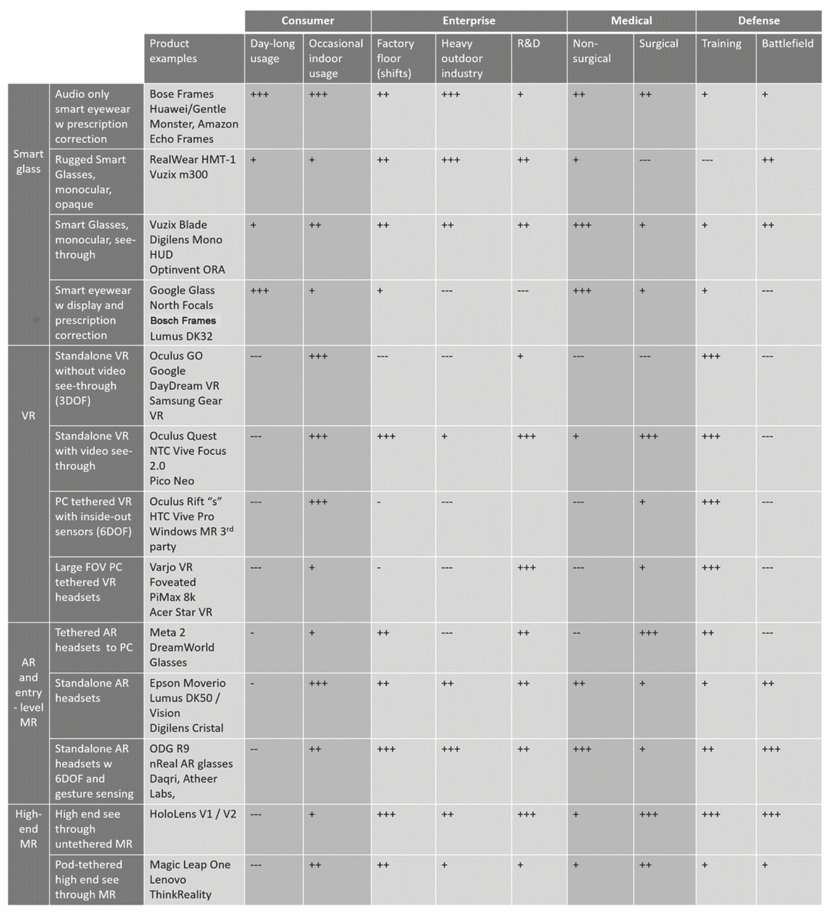{#fig-offerings width="5in"}

From this chart it can be inferred that HMD physical configurations vary by:

-   form factor: overall size, shape, and balance
-   displays integrated: visual, audio, haptic etc.
-   visual display type: opaque or optical / video see-through
-   visual display ocularity: monocular, binocular, or stereo
-   visual display location: centered or offset in the user's field of view
-   tracking: none, three, or six degrees of freedom
-   input modalities: controllers and/or gestures
-   tethered or standalone
-   integrated vision correction

World-fixed and hand-held alternatives to HMD XR must also be considered. World-fixed solutions use projectors or flat panel displays to surround the observer / participant with imagery. This is typified by the Cave Automatic Virtual Environment (CAVE[^21-intro-10]) invented in the Chicago Electronic Visualization Lab at the University of Illinois [@cruz-neira1992cave]. Hand-held XR implementations are common on smartphone and tablet devices, where integrated cameras, displays, and sensors enable screen-based AR that is device-centric (i.e., motion and display are relative to the device, not the user's head and eyes) [@jerald2016book].

[^21-intro-10]: CAVE is a recursive acronym and reference to the *allegory of the Cave* from Plato's *Republic*, in which a philosopher contemplates perception, reality, and illusion. [en.wikipedia.org/wiki/Cave_automatic_virtual_environment](https://en.wikipedia.org/wiki/Cave_automatic_virtual_environment)

::: content-hidden
content types also differ, along with the authoring tools used to create them: 360-video to custom applications
:::

XR devices, particularly AR HMDs, are not "one size fits all." In addition to their physical configuration, key specifications strongly dictate the intended purpose of a device and its suitability for specific tasks. Technology limitations and the diverse requirements found in different application domains force trade-offs in system design and selection [@kiyokawa2015head]. Subsequent sections will discuss each of those considerations in greater detail.

#### XR HMD Requirements

All modern XR HMDs are complex devices comprised of display, sensing, compute, and power management systems. Optical see-through (OST) devices require additional components to project and combine the image in the user's field of view. @fig-buildblocks depicts the major sub-systems of an OST HMD [@kress2020artif]. The peak complexity of an idealized OST AR HMD provides a comprehensive case study in the tradeoffs and benefits of XR. Lessons learned from state of the art requirements and architecture apply, in limited fashion, to devices with a reduced feature set.

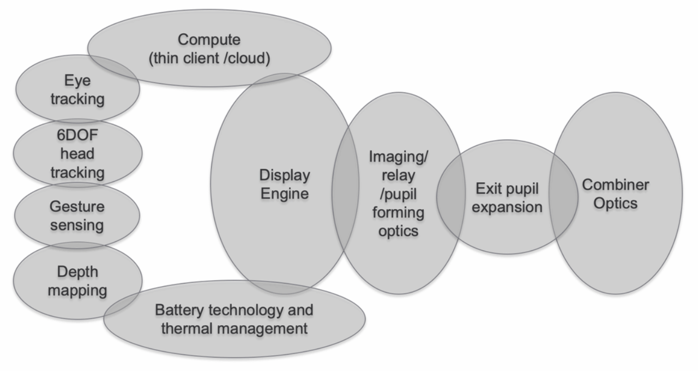{#fig-buildblocks width="5in"}

Mixed Reality (MR) is the label given by Kress to advanced AR devices with the precise head tracking, gesture sensing, and depth mapping capabilities required to support spatially synchronized interactions, providing an elevated and differentiated user experience [@kress2017towar]. He measures the ultimate quality of that experience in two dimensions: comfort, including wearable, vestibular, visual, and social components; and immersion, a function of all sensory input and output. Given the goals of comfort and immersion, an extensive list of design requirements can be derived for idealized MR devices. In @fig-requirements, dark grey shading indicates features that are reliant on fast, accurate, universal eye tracking, a critical enabling technology for idealized MR HMDs.

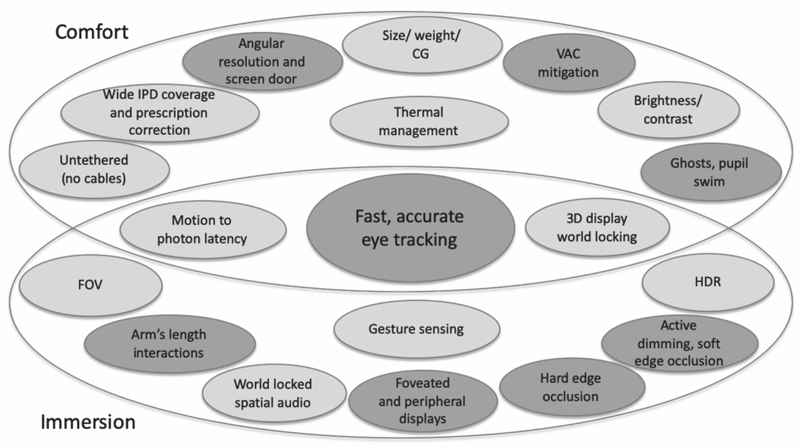{#fig-requirements width="5in"}

This summary reflects other findings in the literature which identify requirements related to precise tracking, form factor, brightness / contrast, field of view, latency, resolution, occlusion, frame rate, depth of field, and visual discontinuity [@jerald2016book; @fischer2015visua; @ul2022xr8400; @gay-bellile2015appli; @azuma2017makin; @kiyokawa2015head].

Visual comfort is a function of both the display features and the overall speed and accuracy of the integrated sensor output. Sensor fusion refers to that integration process and the hardware / software system that accomplishes it. @fig-fusion depicts the inputs and processing flow for a typical system. The demands of sensor fusion have led companies like Microsoft to design custom processors to provide the best user experience [@kress2020optic].

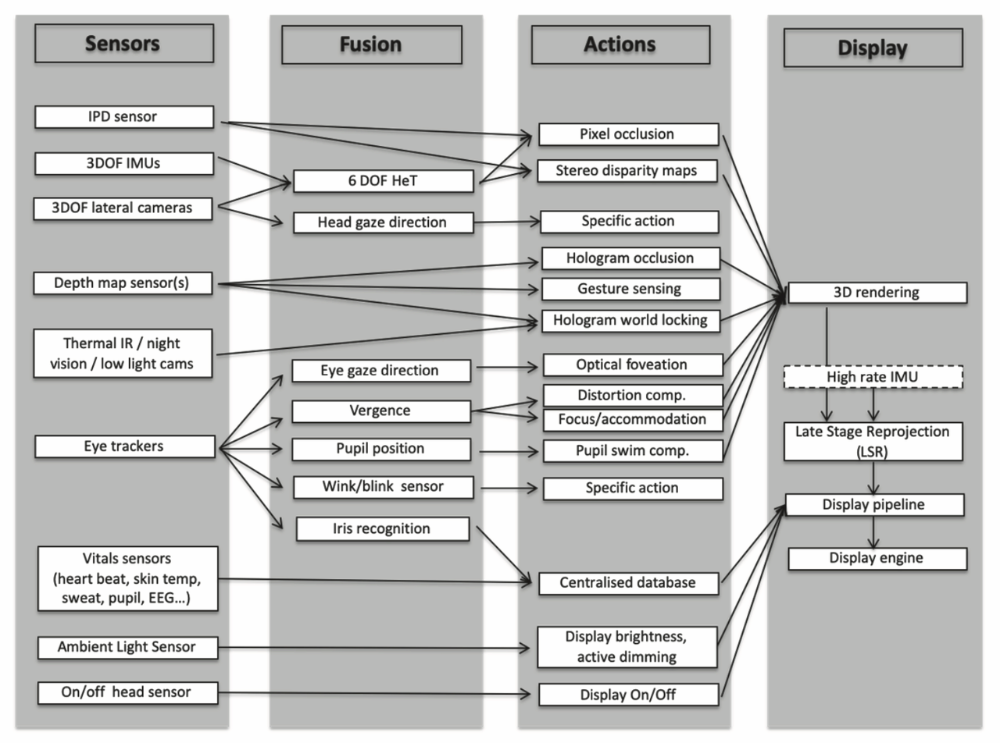{#fig-fusion width="5in"}

High-level considerations in the design of HMD systems include tradeoffs between real world visibility and pictorial consistency, FOV and angular resolution, near and far accommodation, and the importance of perceived depth, which is influenced by occlusion and ocularity [@kiyokawa2015head]. Directly conflicting requirements are common in OST HMD design, where the tight interdependencies of these sub-systems and ambitious overall requirements necessitate a global optimization approach to design [@kress2014segme]. Knowledge of the human factors involved can aid the process.

### Human Factors

A human-centered approach to HMD development allows designers to tailor requirements to human needs rather than absolute measures of performance, reducing system complexity without impact to the immersiveness or comfort of the experience. The following sections provide a brief overview of human factors related to vision, balance, and motion. The senses involved are critical to both immersion and comfort.

#### The Visual System

Optical components of the eye, including cornea, iris, pupil, and lens, coordinate to focus an image on the surface of the retina, where photosensitive cone and rod cells translate it into signals sent to the brain via the optic nerve. Cones are adapted to provide detailed color vision in high illumination. They are concentrated in the fovea, near the center of the retina, maximizing the eye's resolving power around the line of sight. Conversely, rods are concentrated in the visual periphery. They perform well in low light and are optimized to detect fast motion or flicker. The resulting signals follow different visual pathways in the brain, where they are strongly influenced by other sensory systems and cognitive processes, forming our subjective, conscious perception of the experience.

##### Visual Acuity

Visual acuity refers to a group of measures for human visual performance, including separation and recognition acuity. Separation acuity is the ability to resolve fine details at a distance. Specifically, it is the smallest angular separation that can be resolved between neighboring black stripes on a white background. One arc minute (1/60th of a degree) is the lower limit for "normal" separation acuity, corresponding to a gap of just over 1/16" (1.75mm) when viewed from 20' (6m). This attribute of human vision is rarely measured directly. Instead, recognition acuity tests like the Snellen eye chart are designed to assess separation acuity via the discernment of shapes or symbols. The results are given as a ratio expressing the acuity of the subject relative to someone with "normal" (20/20) vision. For example, "20/40" indicates half the normal acuity. Visual acuity is influenced by the entire optical-neural path, but is primarily a function of the cones and varies with their distribution in the field of view. These concepts are illustrated in @fig-acuity.

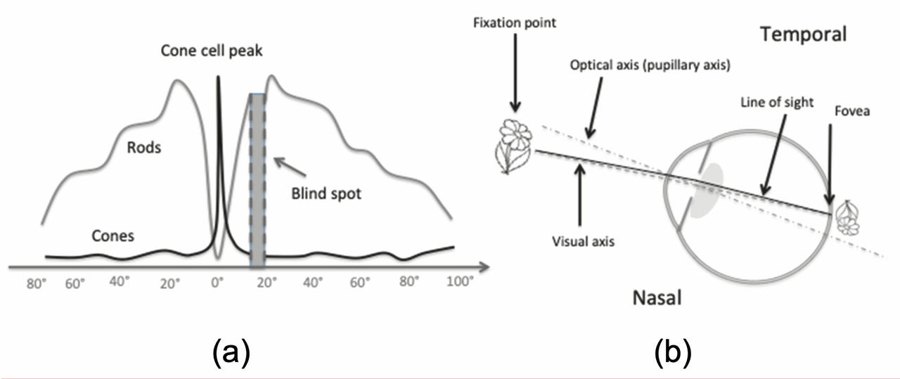{#fig-acuity width="5in"}

##### Field of View

Field of view (FOV) is the angular measure of the environment that is visible at any instant. As shown in @fig-binocfov, the horizontal FOV is approximately 160 deg for each eye, and 200-220 deg combined. Vertical FOV is slightly smaller, with a slight downward bias. Overlapping monocular vision creates a central binocular range of 120 deg with vertical asymmetries caused by the facial profile.

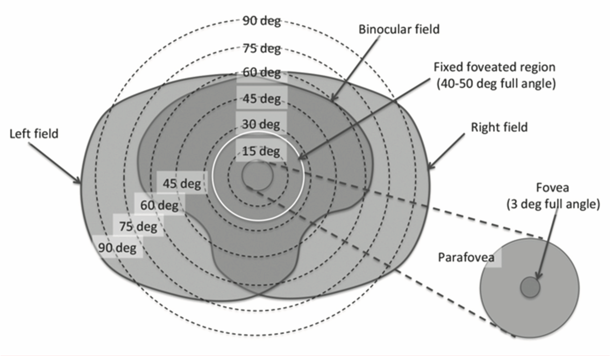{#fig-binocfov width="5in"}

Though depicted in static terms, the FOV is dynamic due to continuous voluntary and involuntary eye motions that balance our directed attention with general awareness while accounting for motion of the head, body, and environment.

##### Stereopsis and Depth Perception

Due to the separation of binocular vision, a slightly different view of the world is observed in each eye. In a process called stereopsis, the brain processes these disparities to form a single percept with a sense of depth and three-dimensional structure. In a related process called vergence, a variety of depth cues trigger the inward (convergence) or outward (divergence) rotation of the eyes to effectively regulate binocular vision. When vergence occurs, it triggers the natural focusing reflex known as accommodation.

Other than the binocular disparities described above, the strongest triggers for the vergence-accommodation reflex are occlusion and motion parallax. Occlusion occurs when nearby opaque objects naturally obscure more distant objects. Motion parallax is the phenomena where an object in motion appears to move at different rates based on its depth in the scene.

#### The Somatosensory System

The somatosensory system is a part of the sensory nervous system responsible for the perception of touch, temperature, body position, balance, and pain. It is a network of sensory receptors and neurons spread throughout the body and brain. Within this system, proprioception and balance, which enable our awareness of the body's dynamic and kinematic state, are most relevant to the design and use of HMDs.

##### Proprioception

Proprioception is the egocentric sense of movement, force, and body position. Through largely subconscious processes it provides the feedback mechanism necessary for effective coordination, refinement, and regulation of body motions. Specialized neurons distributed throughout the musculoskeletal system sense joint extension and limb position, velocity, and resistance. Signals from those proprioceptors are integrated with information from the visual and vestibular systems to create a sense of the body's overall state, enabling fast and unconscious execution of planned and reflexive behaviors. Proprioception is essential to both voluntary and involuntary motor control activities. It drives the continuous adjustment of body posture required to maintain balance and is a critical contributor to the process of learning and perfecting motor skills.

##### Balance

Equilibrioception is the sense of balance and spatial orientation. It is the integrated perception of stimuli from the visual, proprioceptive, and vestibular systems. Two organs of the inner ear comprise the vestibular system: semicircular canals and otolith organs. Three semicircular canals located in the labyrinth of each ear sense rotation around their orthogonal axes. Movement of fluid in the canals is sensed as pressure changes, which are signaled to the brain. In the otolith organs, signals from hair cells are triggered by head motion. Those signals are interpreted by the brain to distinguish head tilt from body motion and sense the lateral and vertical components of acceleration.

Rotational and translational stimuli from the vestibular system are used to control posture, as described above, and eye movement, via the vestibulo-ocular reflex (VOR). VOR helps stabilize gaze direction as the head moves by directing opposing eye movement to compensate. This limits retinal image slip by maintaining the visual point of interest in the center of the field of view.

### Enabling Immersion

The immersiveness of an XR experience is limited by the ability of the hardware and software systems involved to create an illusion that is cohesive and undistracted. Understanding the human factors involved, as described above, can help achieve that. The following sections will explore the technical underpinnings of vividness and interactivity, the primary components of immersion.

#### Resolution and FOV

Resolution and FOV are key measures of the fidelity for visual display devices. For near-to-eye (NTE) displays found in HMDs, resolution is typically expressed in dots per degree (DPD), rather than dots per inch (DPI) or raw pixel counts, as in conventional displays. An angular resolution of 50 DPD (1.2 arc minute) roughly corresponds to the resolving power of 20/20 vision [@kiyokawa2015head].

The FOV of an HMD includes the aided region, where real and virtual images are overlaid; the peripheral region, outside the aided region; and the occluded region, where vision is obscured by the device [@kiyokawa2015head]. FOV specification in HMD design must identify the angular span, aspect ratio, and location of the aided region within the user view. These decisions are interrelated and driven by task and market requirements [@kress2015optic]. @fig-xrfov depicts the range of implementations found in state of the art XR HMDs, overlaid on the binocular FOV and the fixed foveated display region [@kress2020optic].

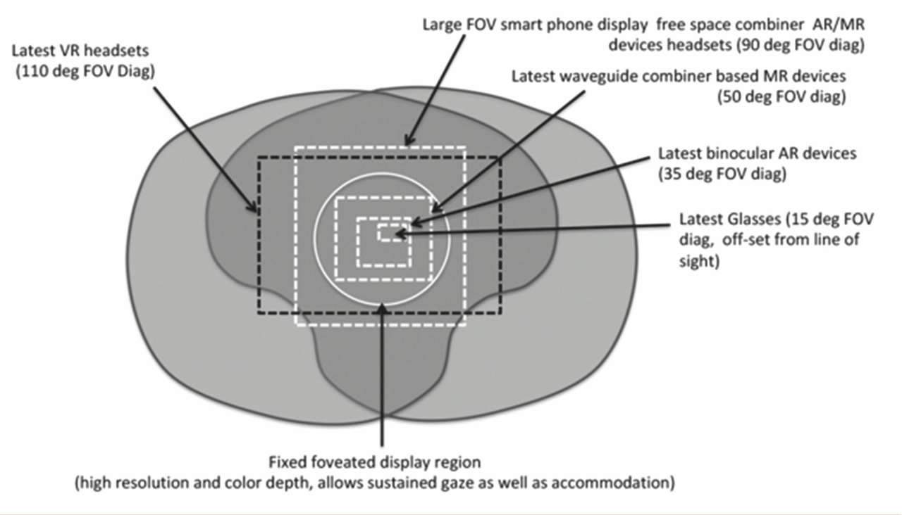{#fig-xrfov width="5in"}

Very high pixel counts are required for ideal resolution in wide FOV devices. For example, a 16:9 display with 50 DPD angular resolution and 160 deg horizontal FOV per eye, would require 8,000 x 4,500 pixels. Two such displays (one per eye) would have more than eight times pixel count of a modern 4k monitor (3,840 x 2,160).

Such devices will not soon be practical. Meanwhile, pixel doubling and other mitigating techniques can improve perceived resolution. Foveated displays offer an alternative that exploits the bi-modal nature of human vision. This emerging technique renders a high resolution region, positioned either statically, central to the field of view, or dynamically, based on eye tracking. This image is combined with a lower resolution peripheral display using digital or optical methods [@kress2020optic]. AI-based methods also show promise [@kaplanyan2019deepf].

#### Frame Rate and Latency

Frame rate is the number of times the rendered scene is updated per second. It can be different from the system update rate, which is the rate at which the display updates. Both are typically on the order of 30-120Hz, with most modern XR devices operating at 60-90Hz. High frame rates increase the smoothness of motion, approaching the continuous nature of real world visuals. Update rate is a fixed property of the display hardware, but frame rate depends on the scene complexity and visual fidelity, along with hardware and software performance. The inverse of frame rate, rendering time, contributes to overall system latency. Tradeoffs must be made in the design and implementation of XR experiences to achieve the desired visual performance and limit system lag [@jerald2016book].

Latency is the lag between head motion and update of the rendered scene, resulting in discrepancies between the user's visual and vestibular senses. In optical see-through systems this results in registration error, which leads to confusion, disorientation, and motion sickness. To compensate, head motion prediction and other methods are used [@kiyokawa2015head]. Specifically, motion-to-photon (MTP) latency of no more than 20ms, and ideally less than 10ms is recommended in the literature [@albert2017laten]. Because MTP latency greater than 20ms is a key factor in motion sickness, this is a foundational requirement of HMD design [@ul2022xr8400]. Approaching this goal compels optimization of the entire pipeline, including custom silicon designs for the sensor fusion process.

#### Pictorial Consistency and Visual Quality

Visual quality is an assessment of the visible stimuli produced by an XR device. It is a qualitative measure of vividness, also described in the literature as realness, realism, or richness [@yim2017augme]. Key contributors, including geometric resolution, scene complexity, and the quality of lighting and shading are limited by the frame rate and latency related considerations previously described. Visual quality is a critical performance measure for VR devices. In OST and VST AR/MR devices it is only one component of pictorial consistency.

Pictorial consistency refers to the degree with which virtual objects match their real world counterparts in an AR/MR display. Visual discontinuities introduced throughout the imaging pipeline reduce immersion and its attendant benefits in OST devices. The limited visual quality of virtual objects is further diminished by an incomplete understanding of scene depth and environmental conditions. When rendered, this creates additional lighting, shading, and depth related discontinuities in the real-world view [@fischer2015visua]. Limitations in display and optical combiner technologies, particularly in their ability to mimic the brightness, contrast, and dynamic range of the real world compound this problem [@kress2020optic].

VST devices trade combiner related discontinuities for those introduced by the image acquisition and processing pipeline. Intrinsic parameters of the camera, including the lens properties, sensor characteristics, and camera settings (e.g. exposure time, ISO, and white balance), introduce noise, geometric distortion, motion blur, defocus blur, and color cast. Virtual objects rendered free of those distortions stand out as relatively crude but synthetically perfect elements of the scene. Methods to emulate camera distortions or stylize the entire scene can reduce this effect, but may not be suitable for all applications [@fischer2015visua].

#### Tracking {#sec-tracking}

Combining real and virtual scenes in a spatially coherent fashion is the essence of AR [@azuma1994impro]. See @fig-tracking. To maintain accurate "registration" (alignment) of the virtual and real world scenes in three dimensions, AR devices must determine their position and orientation in the world, or "pose" [@you2015visua]. This process, known as tracking, typically uses methods from computer vision to estimate the pose of a camera based on features identified in its video stream.[^21-intro-11] In general, this process involves three steps: recognition, tracking, and pose estimation [@yang2015scala]. Once the camera's real world pose is aligned with the virtual coordinate system virtual objects can be rendered in the scene with appropriate scale, orientation, and placement.

[^21-intro-11]: 3D registration for navigational purposes is commonly achieved using a combination of GPS related technologies, but the results are not sufficiently accurate for AR applications.

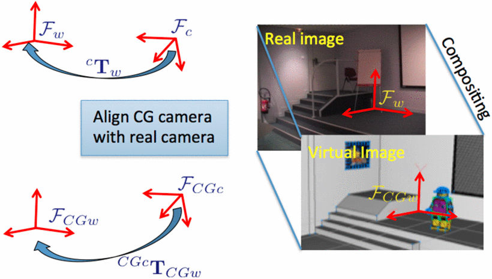{#fig-tracking width="5in"}

Recognition identifies features in the 2D imagery and matches them to corresponding points in a database of 3D features. Typically, the database consists of image, model, or area feature types, which are described in greater detail below. Recognition and tracking are interrelated problems, where the former is used to initialize the later, or reinitialize it when tracking performance degrades. Tracking updates the position of recognized features over time to reduce the computational costs associated with recognition [@you2015visua].

Camera pose estimation calculates the camera's transformation matrix based on the tracked features. It is achieved by solving the perspective-n-point (PnP) problem for 2D-3D pairs based on intrinsic camera parameters (e.g. focal length, aspect ratio, lens distortion). PnP is a fundamental computer vision problem with many modern applications. The details of PnP are beyond the scope of this work but the essence of the problem is captured in @fig-estpose. For more information, including a survey of implementations, see @marchand2016pose.

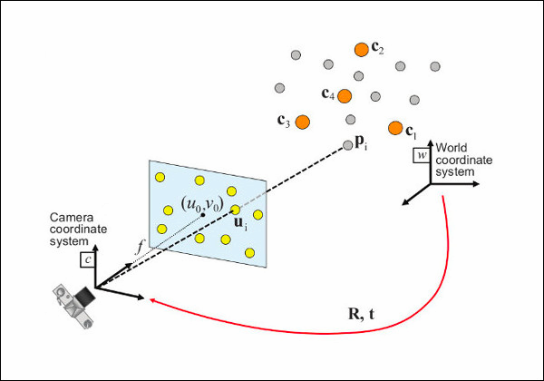{#fig-estpose width="5in"}

Tracking methods are typically characterized by the features used in the registration process. This is an active area of research where terminology and implementations vary, but image, model, and area feature types are common. Image based tracking relies on 2D pixel data. Model and area based methods use discrete and continuous objects of 3D geometry, respectively. Hybrid methods are also used.

Image-based methods use either photographic image data, graphic symbols called templates, or barcode-style marker designs. The feature database is created through an offline preprocess which identifies critical reference points in the image data and encodes them as vector representations. During recognition a similar process is used to encode reference points identified in the live imagery, which are then matched to the feature database using nearest neighbor methods. This process is resource intensive for arbitrary image and template data [@yang2015scala].

Marker-based AR affords simplifying assumptions for the registration process with standard fiducial designs optimized for all stages of the tracking process. Black-and-white encoding patterns and clearly delineated boundaries aid recognition and tracking. The corners emphasized by square marker designs provide four coplanar, non-collinear points required for PnP pose detection [@yang2015scala]. DensoWave's Quick Response (QR) codes store 2953 bytes of easily-decoded binary data and are widely used for AR applications [@iso2015qr18004]. The marker-based process is depicted in @fig-markers.

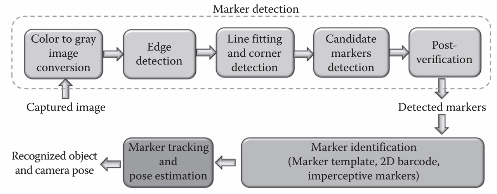{#fig-markers width="5in"}

Marker-based optical tracking systems use two approaches. The "inside-out" approach places markers on the target object and camera pose is estimated from images of the marker in the observer-borne camera. In the "outside-in" case, markers are placed on the observer, who is localized by a set of static cameras surrounding the scene. The outside-in method, more commonly used in motion capture applications, requires an additional pre-calibration process that establishes the pose of the target object. Both cases require prior instrumentation of the scene with markers or cameras, the number and placement of which determines the trackable volume. This deployment process and the visually obtrusive nature of markers may be inappropriate in some applications [@gay-bellile2015appli]. Additionally, markers are often impractical in controlled and/or outdoor environments and are sensitive to occlusion [@ventura2015urban; @yang2015scala]. Together, these shortcomings compel the use of more sophisticated tracking methods.

Instead of image data, model based tracking relies on a 3D model of the target object for feature identification. The process is analogous to what is described above: key points encoded from the 3D model data are compared with features extracted from the live scene data and corresponding pairs are used for pose estimation. Live scene data can consist of imagery or 3D geometry generated from camera data using SFM (structure from motion) [@schonberger2016struc] or SLAM (simultaneous localization and mapping) [@durrant-whyte2006simul] related methods [@you2015visua]. Alternatively, active scanning systems using LiDAR (light detection and ranging) or TOF (time of flight) can be used to reconstruct scene geometry in real time [@behzadan2015recen].

The accuracy of model based tracking methods suffers when geometric or photometric details are not easily discerned. As a result, it is sensitive to lighting conditions (color, intensity, direction) and visibility (small in FOV, occluded, or outside DOF). Area based tracking uses SFM / SLAM to address those shortcomings by tracking a 3D model of the entire scene rather than discrete elements of it. This greatly increases the likelihood of achieving the confluence of 2D-3D matches required to achieve recognition [@gay-bellile2015appli].

Vision based methods are often supported by incorporating additional sensor data to augment the tracking process. A complementary source of orientation and translation data can be derived from GPS data fused with signals from a trio of inertial measurement units (IMUs): accelerometer, gyroscope, and magnetometer [@ventura2015urban; @yang2015scala].

Proper tracking is the essence of AR/MR devices and a critical element of pictorial consistency in both OST and VST devices. But the accurate placement of virtual objects in the real scene does not guarantee spatial coherence. Such objects must also appear naturally occluded.

#### Occlusion

As discussed in reference to Stereopsis and Depth Perception, occlusion occurs when objects nearer the viewer naturally obscure background objects. Real world scene depth is largely informed by our perception of this. Thus, proper occlusion of virtual objects in the real world is essential to the user's understanding and acceptance of a mixed reality scene, as well as their interaction with it.

The graphics pipeline and depth sensors of a modern XR HMD can provide the information required to enable per-pixel masking of virtual objects for accurate depth sorting. The believability of the combined scene is dependent on the resolution, dynamic range, and opacity of the virtual object. So-called "hard-edged occlusion," where virtual objects appear opaque and naturally occluded, with crisp edges, is the ideal. This requires blocking light from the scene at a pixel level, which is achievable on VST devices using traditional digital compositing methods [@kiyokawa2015head].

OST devices rely on optical compositing techniques, with little control over the scene's natural dynamic range and displays unable to match its brightness. As a result, virtual objects on OST AR/MR devices have a ghostly, semi-transparent look. This may be suitable for overlays and other augmentations, but falls short of enabling a cohesive mix of real and virtual objects. Currently, few optical methods are capable of addressing this problem. Pixel dimming is often suggested as a compromise in OST HMDs. This method, also known as soft-edge occlusion, selectively dims areas of the real world to help virtual objects stand out [@kress2020optic].

Despite significant research and development efforts, occlusion remains an unsolved problem in OST devices. Few implementations of soft-edge occlusion exist in the market, and hard-edge solutions remain entirely absent. The details of the challenges involved are beyond the scope of this work, but are well summarized by Karl Guttag.[^21-intro-12] Guttag identifies technical and physical roadblocks for both approaches and declares a general solution to hard-edge occlusion "infinitely complex" for current optical architectures [@guttag2021magic].

[^21-intro-12]: Footnote about Karl Guttag

### Ensuring Comfort

Well-designed hardware and software can exhibit the fidelity, responsiveness, interactivity, and believability necessary to promote immersion through the user's overall sensory comfort. The previous section outlined many of the key technical considerations in doing so. In time, many of shortcomings identified will likely be overcome.

Meanwhile, comfort related considerations must help guide the necessary tradeoffs. For the effects of immersion to take hold, the experience must limit distractions due to wearable, social, vestibular, or visual discomfort.

#### Wearable Comfort

Wearable comfort refers to general ergonomic traits, including size, weight, and balance, as well as surface treatments and thermal management features. Overall usability and safety are also factors. For example, the safety and mobility benefits offered by a direct view of the environment and cable-free use motivated the HoloLens' untethered OST design [@kress2017towar].

#### Social Comfort

Social comfort concerns are primarily related to privacy and acceptable public use. The suitability of a design's aesthetic and form factor is one consideration [@cook2019chall], as is allowing an unaltered view of the wearer's eyes. The number and packaging of outward-facing sensors, and the nature and use of the data they collect, entails a number of public privacy concerns that influence social comfort [@kress2020optic]. Each of these balance the wearer's willingness and right to wear the device with the needs of the public, and are strongly influenced by the context and manner of intended use. @bass1997issue describe the ultimate test of social comfort as “whether or not a wearer is able to gamble in a Las Vegas casino without challenge.”

#### Vestibular Comfort

Due to the interrelated nature of the human visual and vestibular senses, it is difficult to clearly separate the relevant comfort issues. Here, vestibular comfort is primarily concerned with motion sickness. However induced, motion sickness is XR's most common and significant adverse health effect. In VR and VST AR devices the primary contributors are movement and visual effects.

The most widely accepted explanation for sickness caused by real or apparent motion attributes it to a mismatch of sensory inputs. In XR, visual and auditory stimuli are experienced through the HMD while the vestibular and proprioceptive signals are coming from body motion. When discrepancies occur, motion sickness can follow. Sensory mismatch in XR is commonly caused by latency or unnatural motion. When MTP latency is excessive, the perception of body motion and corresponding visual stimuli are not synchronized, leading to visual-vestibular mismatch. Unnatural motion is often implemented with the intention of improving the experience. For example, head bobbing or strafing motions commonly used to add dramatic or interactive effect in screen-based experiences can have unintended effects in XR. The negative health effects of latency partly motivated the push for high frame rates and sensor fusion optimizations common today. Intended unnatural motion is a content design issue easily addressed through best practices [@jerald2016book].

Visually induced motion sickness (VIMS) is "a subcategory of motion sickness that specifically relates to nausea, oculomotor strain, and disorientation from the perception of motion while remaining still"[@ul2022xr8400]. Several characteristics of VR and VST AR HMD design directly contribute to VIMS, including optical design issues, the presence of motion artifacts, and tracking / sensor fusion issues, all of which contribute to scene instability.

Elevated levels of vergence-accommodation conflict (VAC) are known to cause discomfort and nausea in OST AR devices. Our visual reflexes naturally work together to look at (vergence) and focus on (accommodation) objects in the FOV. But most modern AR/MR devices use fixed focal length displays in which all virtual objects appear in focus at the same distance from the eye point, typically 2m. Virtual objects that occur at any other depth in the scene will lead to conflicting signals from the eyes' vergence and accommodation demands. When that occurs, depth and focus cannot be reconciled, leading to eye strain and disorientation [@kiyokawa2015head]. For example, mixed reality experiences that rely on arm's length interactions are focused on an area 30-70 cm from the user. This is well within the headset's fixed 2m focus, and often leads to VAC-induced discomfort [@kress2020optic]. Extended VAC exposure can lead to visual adaption, temporarily decoupling vergence and accommodation. The reduction of depth perception that results can create a hazardous situation. As such, UL 8400 recommends that users avoid sensorimotor-demanding activities (e.g. taking the stairs, driving, bike riding) for 30 minutes after each session [@ul2022xr8400].

#### Visual Comfort

The primary visual comfort related considerations are vision correction, eye box design, and the limits and parasitic effects of screen-based display technology.

HMD designers cannot ignore the fact that a large portion of the population have some form of vision impairment, yet the method and degree of corrective support varies. Depending on the device type and form factor, interchangeable lenses, adjustable focal length, or custom corrective lenses may be integrated. Correction is particularly important in OST HMDs, and many are designed to accommodate the wearer's prescription glasses. This has an impact on the eye box design.

Ideal optical system designs provide a clear, consistent, and unobstructed view of the entire FOV. A key contributor to that outcome is the size of the eye box: the volume of "3D space in which the viewer’s pupil can be positioned to see the entire FOV" without a reduction in brightness or distortion near the extents [@kress2020optic]. Eye box designs vary with user anthropometry (inter pupillary and temple to eye distances), system design (combiner thickness, optical architecture, and eye relief), and pupil size. Though mechanical adjustments may allow users to optimize a system's eye box for their static anthropometry, scene visibility will still vary with their pupil size. For example, the edges of the display may become blurry when the pupil dilates in bright conditions. The complexity of eye box design and ambiguities of the "easy viewing" requirement make this a challenging problem [@kress2014segme]. Large eye box designs can improve visual and wearable comfort (fit), but at a cost to perceived brightness (luminance) due to physics based constraints (étendue).

Current hardware continues the trend of exploiting the latest advances in components designed for the screen-based smartphone and tablet markets, sometimes with little effect. In particular, flat panel display technologies used as immersive near to eye (NTE) displays are inherently limited by fixed focus, low brightness / contrast, and optical invariants including étendue. These pixel-based displays are also susceptible to a variety of parasitic effects. The screen-door effect appears when the optical quality, typically expressed in terms of MTF,[^21-intro-13] is high enough to see gaps between the pixels of the display device. Aliasing is the visible side-effect of representing continuous visual phenomena with discrete pixels. Where aliasing is the spatial artifact of sampling, motion blur is its temporal side effect. The Mura effect describes an unevenness of the display caused by imperfect illumination or screen geometry. Each of these effects can be mitigated with hardware and/or software methods [@kress2020optic].

[^21-intro-13]: Modulation transfer function (MTF) is a quantitative measure of the ability of an optical system to reproduce contrast detail. It is known to correlate with our perception of image quality. MTF is the magnitude of the optical transfer function. <https://en.wikipedia.org/wiki/Optical_transfer_function>

### Tradeoffs

Due to directly conflicting requirements common in XR systems, there is no "one size fits all" solution. Amidst the hype surrounding this promising but immature technology, it is important to have an accurate understanding and realistic expectations. Numerous considerations important to the design, selection, and implementation of XR solutions are detailed above. @fig-requirements assesses the importance of selected optical requirements in HMD devices across common market segments.

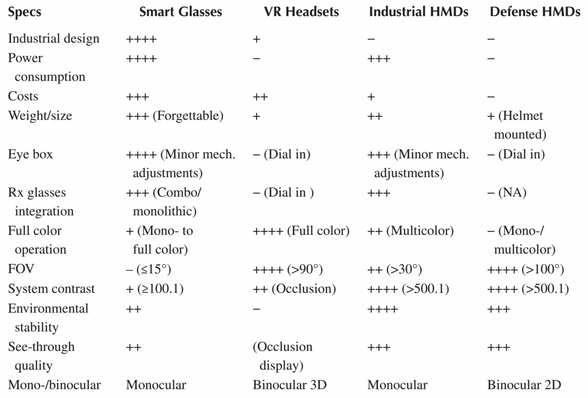{width="5in"}

Tradeoffs should be informed by requirements specific to the context, manner, and goals of intended use, prioritizing human factors related to perception. Aligning the desired outcomes with the primary affordance of the chosen device is essential. These choices are aided by an understanding the theoretical underpinnings of those affordances.
