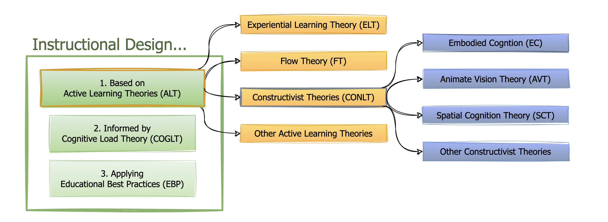
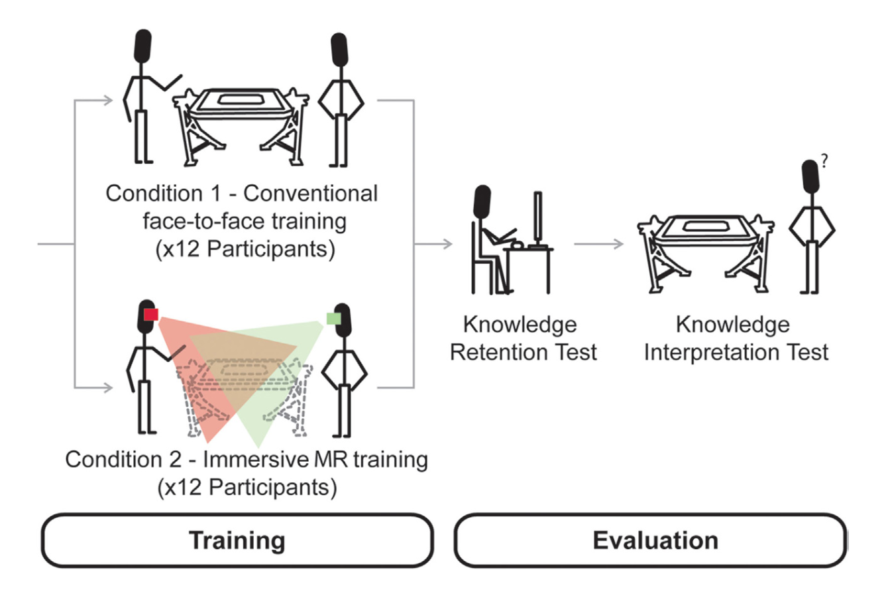
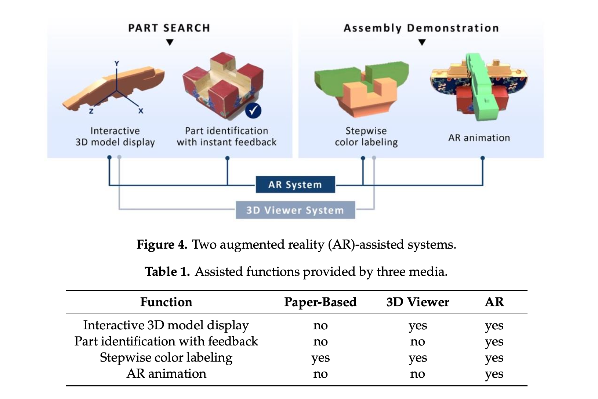
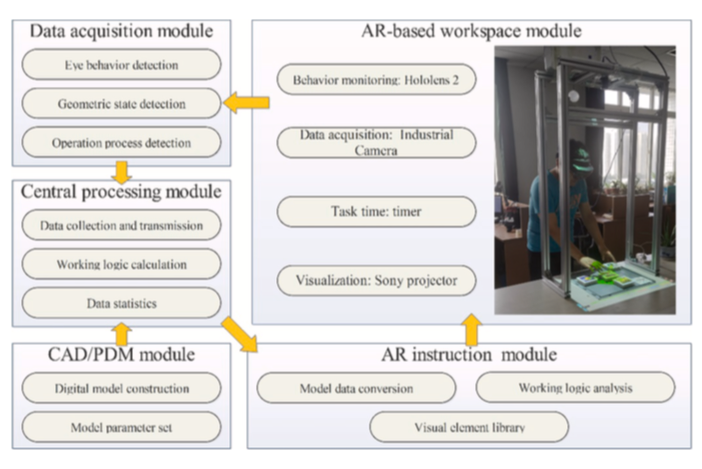
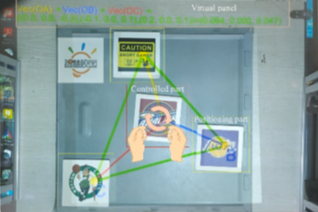
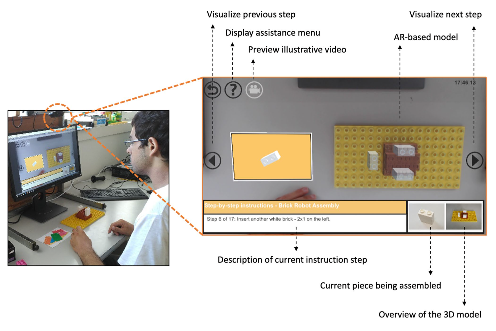

# Literature Review {#22-lit_review}

::: content-hidden
TODO: move background from Introduction to LR and revise LR intro accordingly
:::

## Introduction

The adoption of augmented and mixed reality (AR/MR) technologies for manufacturing training has shown promise, yet faced significant barriers hindering widespread implementation. This literature review provides a comprehensive examination of the current state of research in this domain, critically analyzing empirical studies that assessed the efficacy of AR/MR interventions while also identifying persistent gaps, limitations, and adoption challenges. Moreover, the review introduces a novel affordance-based framework as a theoretically-grounded approach to guide the design and evaluation of AR/MR training solutions.

We begin by providing background information on the challenges faced by the manufacturing industry in the era of I4.0, highlighting the need for effective and efficient training methods to address the growing skills gap. The objectives of the review are then outlined, followed by a description of the innovative methodology employed to identify and synthesize relevant literature.

The review goes on to discuss preliminary results that highlight potential benefits of AR/MR in manufacturing. The theoretical basis for these benefits is explored, with a focus on differentiating AR from VR and examining relevant theories of learning and cognition. The review then addresses the barriers to widespread adoption of AR/MR in manufacturing, including technical limitations, market considerations, and social/legal issues. A number of empirical case studies are reviewed to better understand the quantifiable benefits of AR/MR in this domain. Finally, the review examines existing tools and frameworks for the development and assessment of AR/MR systems in manufacturing training. We conclude by summarizing the findings, describing the proposed framework, and enumerating important considerations for future research.

### Background

As discussed in the [Introduction](#21-intro), the manufacturing industry is undergoing a profound digital transformation, I4.0 [@kagermann2011indus]. This shift is driven by a combination of market needs and technological capabilities [@lasi2014indus]. Connected, autonomous components allow product-driven control over manufacturing operations [@negri2017revie], providing increased decentralization, flexibility, and resilience [@tao2017digit]. This enables the shift from mass production to mass customization, in line with current market demands [@culot2020behin].

This transformation is placing new demands on its operators, who must manage a widening range of responsibilities, process an increasing volume of information, and adapt to ever-changing methods, all while maintaining increasing expectations for accuracy and efficiency [@danielsson2020augme; @longo2017smart; @vanneste2020cogni].

Moreover, the manufacturing industry is grappling with a widening skills gap, as the demand for skilled labor continues to outpace supply. Several factors contribute to this skills gap, including high retirement rates among experienced workers, global expansion of manufacturing operations, and increasing specialization of roles [@kress2020optic]. As a result, there is a pressing need for effective and efficient training methods to upskill the existing workforce and onboard new employees quickly. This situation demands innovative solutions to enhance operator support and training.

::: content-hidden
TODO: previous paragraph about workforce skills gap would benefit from additional citations
:::

### Approach

This review employs a hybrid approach, combining traditional systematic approaches [@kitchenham2004proce] with an emerging class of modern tools. Systematic methods were used to identify interesting references for each search, based on relevance, prominence (citation count), and debate (supporting and contrasting citations). This phase of the search primarily leveraged meta-databases including Web of Science,[^22-lit_review-1] Scopus,[^22-lit_review-2] Semantic Scholar,[^22-lit_review-3] and Google Scholar.[^22-lit_review-4] The specific search parameters and criteria for inclusion varied with each use.

[^22-lit_review-1]: Web of Science: <https://www.webofscience.com/>

[^22-lit_review-2]: Scopus: <https://www.scopus.com/>

[^22-lit_review-3]: Semantic Scholar: <https://www.semanticscholar.org/>

[^22-lit_review-4]: Google Scholar: <https://scholar.google.com/>

The resulting set of publications was used to seed a secondary search using a combination of graph and AI-based tools, including scite\_,[^22-lit_review-5] Inciteful,[^22-lit_review-6] ResearchRabbit,[^22-lit_review-7] Connected Papers,[^22-lit_review-8] and Litmaps.[^22-lit_review-9] At the time of this writing, this category of tools was experiencing rapid growth and change. No single "best" tool or approach had yet emerged, but their collective benefits provided a valuable complement to the systematic approach. The tools and methodology described here were influenced by the work of Mushtaq Bilal [-@bilal2023overv] and Ilya Shabanov [-@shabanov2024effor].

[^22-lit_review-5]: scite\_: <https://scite.ai/>

[^22-lit_review-6]: Inciteful: <https://inciteful.xyz/>

[^22-lit_review-7]: ResearchRabbit: <https://www.researchrabbit.ai/>

[^22-lit_review-8]: Connected Papers: <https://www.connectedpapers.com/>

[^22-lit_review-9]: Litmaps: <https://www.litmaps.com/>

{#fig-litmaps width="6in"}

Broadly speaking, these tools link papers based on citation trees, bibliographic coupling, analysis of the citation statement, and other sophisticated methods. From their original findings, users can interactively traverse connected papers in graph and/or timeline view, focus on specific authors or collaborators, and otherwise refine the search. Abstracts and links to the papers are available throughout the process to guide exploration.

Integrating traditional and modern approaches in this iterative and exploratory fashion teased out unexpected connections, incorporated a wider range of sources, and facilitated the author's understanding of relevant discourse across multiple dimensions, including time, application context, and research domain. This iterative process was repeated for each question and topic area. The resulting reference collections were imported into Zotero, which managed the bibliographic data and related PDFs. Notes made while reading these sources were imported to Obsidian for review and synthesis.

This approach involves several sources and tools, the implementation of which creates technical challenges that may dissuade many researchers. Over time, as the benefits are better understood and more integrated workflows emerge, it seems likely that it will become widely adopted.

## AR/MR Potential for Industrial Training Applications

While XR has yet to provide consumers with a value proposition that is broadly compelling and sustainable,[^22-lit_review-10] the industrial, healthcare, and military markets have embraced its potential for cost savings and competitive advantage.

[^22-lit_review-10]: This claim may well be tested in 2024, with the recent introduction of Apple's Vision Pro, a state of the art video pass-through device, and Meta's Quest 3, which is positioned primarily as a VR device, but also offers video-pass through.

Across industry, preliminary studies have shown that AR's essential connection to reality (e.g. guiding a surgeon's hand) can have a variety of benefits. AR has improved learning rates, reduced errors, increased yields, improved quality, and enhanced designs. By enabling collaborative design, remote expert guidance, and enhanced monitoring, it has also improved the end-user experience [@azuma2019road]. In industrial settings HMDs are typically designed to support operators in an unobtrusive fashion, allowing them to focus on a task in the physical world, e.g. inspection, maintenance, repair, and order picking. In doing so they can reduce cognitive and/or physical load thru supplemental hands-free displays [@starner2015weara]. Manufacturing, healthcare, and defense are three industries that have invested heavily in the early development of this technology.

### Applications in Manufacturing

In manufacturing, supporting operators and repair technicians with digital work instructions has been a common application of AR research and development since the early 1990s [@azuma1994impro]. AR is a core component of I4.0 that allows intuitive, real-time access to contextually appropriate information. It provides the ideal visual interface for collaborative problem solving as described in Grieves' original vision for digital twins [@grieves2015digit]. Due to the many benefits described above, a 2020 study documented applications in operations, maintenance, quality control, safety management, design, visualization, logistics, and marketing [@oztemel2020liter]. XR shows particular promise as a source of innovative tools and technologies for training workers at a time when finding skilled labor is increasingly difficult due to high retirement rates, global expansion, and increasing specialization [@kress2020optic].

A compelling case study for the use of AR in manufacturing comes from the automotive sector, where its benefits can be leveraged across the entire product life cycle [@gay-bellile2015appli]. During design it reduces the need for and cost of physical mock-ups. AR complements the traditional design process, enhancing physical prototypes with virtual elements that can be accurately evaluated in real-world context. Prior to production, AR can reduce the impact and cost of factory planning. Operators can evaluate simulated workspace changes virtually integrated into the real environment without disturbing production or requiring a complete and accurate 3D model of the existing environment. During production AR can benefit tasks related to assembly, picking, and quality control by delivering instructions naturally, in the ideal context (what, when, where, how needed). AR allows the operator to remain focused on the work area while augmenting their perception with relevant data from sensors and/or information systems. Sales efforts benefit from AR's ability to communicate aspects of the vehicle that are not otherwise observable, (e.g. performance characteristics), or demonstrate unaccessible features (e.g. options for models not in inventory). Unlike other methods, the AR based approach retains accurate perception of dimensions, volumes, and other cues that are subtle but important to human perception. During the operation phase, AR can enhance the driver experience in many ways by visualizing system characteristics, highlighting potential dangers, aiding perception in degraded conditions, and augmenting instructional materials and support services.

### Applications in Healthcare

In healthcare, XR has therapeutic and educational applications ranging from pain management and the diagnosis of mental disorders to medical decision-making and surgical support [@aqlan2020detec]. AR in various forms has been adopted by the medical industry to improve patient / procedure outcomes and safety while reducing radiation exposure, recovery time, and costs. It is a well-suited complement to the trend towards minimally invasive procedures, where access and vision are limited [@yaniv2015appli]. In those cases AR eliminates the need for surgeons to map preoperative data to the patient from an adjacent monitor. It allows direct cognition of the operator's movements relative to patient anatomy. This form of image-guided surgery is achieved by tracking the surgical instruments and visualizing them over preoperative data registered to the patient. The challenge, time, and error of these procedures are less than screen-based alternatives that require filtered cognition [@kersten-oertel2015augme]. Medical necessity will likely drive the adoption of wearable devices that include AR functionality. Conditions like diabetes and macular degeneration can be monitored and/or improved with such devices. Eye worn sensors are being developed to address both of these medical necessities by improving the user's perception [@barfield2015weara].

### Applications in Defense

In the military market, where many of these technologies were first proven, there remains a strong and growing demand for custom XR hardware solutions. In addition to the traditional HMD / Heads-Up-Display (HUD) systems common in fixed and rotary wing aircraft, there are efforts underway to outfit service members with AR devices that support their mission [@kress2020optic]. The US Army's IVAS (Integrated Visual Augmentation System) is the most ambitious current example. Originally awarded in March of 2021, IVAS is a \$22b partnership with Microsoft to improve "Soldier sensing, decision making, target acquisition, and target engagement" [@army2022ivas]. While these custom hardware solutions provide further evidence of XR's adoption and future, educational applications for XR in the military are more relevant to this work. The wide range of applications include training and briefing support for pilots [@alexander2019trans], maintainers, leaders [@clayton2020virtu], and officers [@millican2017virtu].

### Interpretation

The reviewed literature underscores the significant potential of AR/MR technologies in industrial training applications, particularly in manufacturing, healthcare, and defense sectors. Despite the gradual pace of consumer adoption, these industries recognize the potential advantages of leveraging AR/MR to enhance operations, reduce costs, and improve workforce development.

The key benefits of AR/MR in industrial training contexts stem from its ability to provide contextually relevant, spatially registered information and instructions integrated with the real-world environment. This promises to enhance learning, reduce errors, improve task performance, and ultimately contribute to a more skilled and efficient workforce.

## Theoretical Basis

Before we proceed, it is essential to differentiate AR and MR from VR and establish the theoretical basis of their advantages for learning and retention.

### Differentiating AR from VR

As we saw in @sec-xr, the XR devices lie along a continuum of user experience. For the purposes of this discussion, we will consider MR a subset of AR, with the added ability to manipulate virtual objects within the real-world scene.

AR and VR devices are often confused with one another and/or mistaken as new means for the consumption of traditional content. Both are head-mounted devices that display believable sensory stimuli to augment or reproduce real-world interactions. Both do so in a manner that is contextually cohesive and responsive to a wide range of body-centered inputs. Despite their commonalities, AR and VR are fundamentally different from one another and other modern media. Where VR is designed to immerse the user in a synthetic world, AR is intended to strengthen the user's connections with reality. Failing to recognize and leverage their unique affordances severely limits the utility of these devices [@leonard2018holog].

VR provides a form of interactive sensorimotor simulation that, when immersive enough to enable presence, the brain interprets as a lived experience. This enables situated learning experiences which, if designed to be appropriately challenging and/or visceral, can be enhanced by flow and may elicit an emotional response [@kwon2018verif; @kappes2016menta; @millican2017virtu]. The learning effect of a VR experience is thus largely grounded in the theoretical requirements and benefits of immersion & presence, experiential learning, and flow theory.

As an active learning method[^22-lit_review-11], VR is best suited for the development of higher-order cognitive skills. The potential for emotional impact also makes VR a useful tool for affective learning. Because the experiences are simulated, VR enables training that is otherwise impractical or impossible. Finally, the digital nature of VR experiences makes them easy to repeat, instrument, scale, and distribute. These practical benefits are accurately summarized as offering "experience on demand" in Jeremy Bailenson's[^22-lit_review-12] popular book of the same name [@bailenson2018exper].

[^22-lit_review-11]: Active learning and other educational theories mentioned in this section will be detailed in the *THEORY SECTION*

[^22-lit_review-12]: Jeremy Bailenson is a prominent figure in the field of VR and its applications, particularly in education and behavioral change. As the founding director of Stanford University's Virtual Human Interaction Lab, his work focuses on how VR can affect users' cognition, behavior, and social interactions.

AR allows augmentation of the real world with virtual objects that are informative and/or interactive, thus enhancing our understanding of and connection with the world. The essential affordance of AR is direct interaction with virtual objects in which visual and spatial queries take the form of natural object manipulation in everyday surroundings. Applying embodied cognition and animate vision theories in the context of learning suggests that, by retaining proprioception and sensorimotor function, AR experiences are more aligned with human cognitive architecture than metaphorical digital interfaces. AR interfaces provide a combination of procedural and configurational spatial knowledge via haptic and pictorial sources. Visual, spatial, and sensorimotor feedback provides multiple reference frames that enhance perception and cognition. By reducing the overall cognitive load or better distributing it across multiple sensory pathways, AR improves the uptake of sensorial-based knowledge [@shelton2003explo].

AR is also an active learning method best suited for higher-order cognitive development. Its affordances are well-suited for task-related learning because of the inherent connections between visual perceptual activity and physical movement. These effects are enhanced by untethered, hands-free OST HMDs which improve mobility and enable unencumbered use. AR facilitates local collaboration and remote assistance. Where VR excels at delivering discrete packages of simulated experience, AR is best applied to the continuous enhancement of action in the real world [@leonard2018holog].

Neither AR nor VR have proved more effective than traditional classroom methods for the recall-oriented learning outcomes found low in Bloom's cognitive domain, including remembering, understanding, or applying. However, both demonstrated other benefits in line with theory. VR users perform better on high-order questions related to analyzing, evaluating, and creating. It is also known to improve student attitudes, including engagement and self-efficacy [@cook2019chall; @kwon2018verif]. AR users demonstrate improved perception, performance, and understanding of spatial concepts, with student outcomes correlated to physical engagement with the content. The psychological benefits of AR include reduced test anxiety and increased self-efficacy [@chen2019using; @shelton2003explo]. These benefits have broad industrial and military applications.

### Theories of Learning and Cognition {#sec-theory}

The perceptual, cognitive, and learning benefits of XR devices are generally attributed to theories rooted in experiential and constructivist learning, as well as related cognitive theories, all integral to the concept of active learning. These theories collectively emphasize the importance of direct experience, active engagement, and integrating all human faculties in the learning process. By applying these principles, XR devices are posited to optimize learning outcomes, assuming other factors are conducive. The following section will delve deeper into these theoretical frameworks, explaining their relevance and application in the context of XR-enhanced learning.

#### Active Learning Theories

Active learning theories (ALT), particularly constructivism and experiential learning theory (ELT), describe the relationship between situated experiences and educational outcomes, where the self-directed construction of new knowledge occurs through activity in a supportive environment [@clayton2017multi]. Fundamentally, these ideas have epistemological origins in empiricism, rationalism, and pragmatism, which consider the role of experience, reason, and action in knowledge.

The idea of learning by doing is ancient, but the origins of modern ELT are usually attributed to John Dewey and his 1938 work, *Experience and Education* [@dewey1938exper]. Jean Piaget's theory of cognitive development later introduced the idea of constructivist learning theory (CONLT), wherein learners build new understanding through the interaction of prior knowledge and experience [@piaget1928judgm]. Russian psychologist Lev Vygotskii's "Zone of Proximal Development" (ZPD) emphasized the learner's need for knowledgeable support, along with the social aspects of constructivist learning [@vygotskii1986thoug]. These ideas were expanded on by Jerome Bruner's theory of "instructional scaffolding." Bruner claimed that understanding is developed through carefully guided and supported learner experiences that build on their current knowledge [@bruner1960proce].

In 1984 David A. Kolb, a protégé of Bruner's, published his cycle of experiential learning, which identified four stages: concrete experience, reflective evaluation, abstract conceptualization, and adaptive experimentation [@kolb1984exper]. Kolb's conceptual model incorporated elements from previous theories and is widely used to operationalize ELT concepts today. Later, Lave and Wegner's Situated Learning Theory emphasized the contextual aspects of ELT. They claimed that an environment relevant to the subject matter helped situate the learner's mind, strengthening the experience and thus the learning effect [@lave1991situa].

Active learning theories are grounded in andragogy and its methods, as espoused by Malcolm Knowles [@knowles1970moder]. Where andragogy emphasizes the self-directed methods described above, pedagogy is primarily concerned with the delivery of knowledge and skills by an instructor. Modern educational systems are commonly designed to maximize the uptake of content knowledge using the later approach [@leonard2018holog]. Pedagogy is well suited to the developmental and intellectual needs of young learners focused on the cognitive domain of Bloom's *Taxonomy of Educational Objectives* [@bloom1956taxon]. The objectives in this domain, as revised in 2001, are: remember, understand, apply, analyze, evaluate, and create. The extended taxonomy also describes the domain of affective (emotional) development [@simpson1966class]. Where pedagogy excels at delivering content knowledge, andragogical methods better support "higher order" cognitive and affective learning. For example, andragogy is commonly employed in the development of 21st Century Skills, including critical thinking, innovation, collaboration, and problem solving [@millican2017virtu].

#### Flow Theory

Focused activity can lead to a state of psychological absorption. This intuitive phenomena is known as 'flow,' a term coined by Mihály Csikszentmihályi[^22-lit_review-13] who described it as the "optimal experience" [@csikszentmihalyi1990flow]. Flow is a cognitive and affective state in which individual attention and motivation feel in harmony with the situation. This leads to a period of absorbed productivity wherein the normal concern for our immediate needs abates. Most of us recognize this highly gratifying experience, which is colloquially known as being in the zone or groove. Many previous studies have established flow's positive influence on learning effects [@kwon2018verif].

[^22-lit_review-13]: Mihály Csikszentmihályi was a renowned Hungarian-American psychologist and researcher whose work has been influential in various fields, including psychology, education, and business. His last name is pronounced *me-high chick-sent-me-high*.

Csikszentmihályi's work claims that activities leading to flow must have structure and direction, provide clear and immediate feedback, and balance perceived challenges and skills. These interrelated requirements enhance the sense of competence and self-efficacy, in a way that is highly engaging without creating anxiety [@csikszentmihalyi2014flow]. The so-called "flow channel," in which challenge and skill are appropriately balanced for the individual, is similar in concept to Vygotskii's ZPD, as previously described.

#### Cognitive Load Theory

Cognitive Load Theory (COGLT) is a framework for instructional design that aims to optimize learning by managing the cognitive load placed on learners. It is based on the assumption of a limited working memory and an unlimited long-term memory [@sweller1998cogni]. COGLT suggests that effective instructional material should direct cognitive resources towards relevant learning activities [@chandler1991cogni]. It identifies three types of cognitive load: intrinsic, extraneous, and germane. Intrinsic cognitive load is determined by the nature of the material, while extraneous cognitive load is caused by poorly designed instructional materials [@sweller1994cogni]. Germane cognitive load, on the other hand, is the cognitive load that contributes to learning by promoting the construction and automation of schemas[^22-lit_review-14].

[^22-lit_review-14]: In learning theory, a schema is an organized pattern of thought or behavior that helps in processing, interpreting, and storing information in long-term memory. Schemas allow learners to categorize and assimilate new information efficiently by integrating it with existing knowledge.

Like Flow Theory and the ZPD concept, COGLT can inform both active learning theories and pedagogical practices to optimize learning experiences. The former both deal with aligning the challenge level of learning activities with the learner's abilities to promote engagement and learning. Meanwhile, COGLT deals more directly with how the presentation of information affects memory and learning processes. Together, these theories provide a comprehensive framework for designing effective and engaging learning experiences.

#### Embodied Cognition

Theories related to embodied cognition (EC) are concerned with the role of mind-body relationship in cognitive processes, and how those processes are influenced by interaction with the environment. EC makes diverse claims, some of which are controversial. Fundamentally, it asserts that cognition and sensorimotor processing are deeply intertwined. "On-line" cognition, which occurs in the context of the real world, involves perception. In that case, the purpose of the mind is to guide responses in real-time, and interactive experimentation with the environment is often used to aid cognition. But much of human cognitive activity occurs "off-line," separate from the environment (e.g. planning, analysis). In those times, cognitive processes are often informed by simulations of sensorimotor activity, including mental imagery, spatially-oriented mental models, and procedural memory. Thus, EC ultimately claims that perceptual and motor systems are not merely peripheral input and output services; they are essential components of an integrated mind-body process which is highly reliant on real or simulated interaction with the world [@wilson2002views].

Mental practice is an instructive example of off-line cognition, defined as mentally rehearsing or "visualizing" a motor task in the absence of physical movement. These sensorimotor simulations typically entail detailed mental representations of a specific real or hypothetical event. Compared to the corresponding physical experiences, they are shown to engage similar neural and conceptual systems and have corresponding effects on perception, cognition, motivation, and action. This form of mental simulation is known to be effective in a range of cognitive and physical skill-based tasks, including golf putting, rock climbing, piano playing, and surgery. The effects of mental practice appear to come from improved connections between action planning, movement, and proprioception, demonstrating that the brain responds similarly to imagined and real experiences [@kappes2016menta].

#### Spatial Cognition Theory

EC is related to spatial cognition theory (SCT), which describes the forms and sources of spatial concepts. Spatial knowledge, it claims, comes in three forms: procedural, declarative, and configurational. Procedural knowledge relates to navigating spaces or things. Simple facts about a space and the entities therein are the basis of declarative knowledge. Configurational knowledge concerns the relative positions and orientations between spatial entities, as well as their relationships. Likewise, three sources of spatial knowledge have been identified: haptic, pictorial, and transperceptual. Haptic knowledge is formed by touch or body movement. Visual information is the source of pictorial knowledge. Transperceptual knowledge is synthesized over time from multiple sources [@shelton2003explo].

#### Animate Vision Theory

Though our language of human vision shares terms and ideas with cameras and photographs, the relationship is only analogous. A photo may resemble the mental image of what we perceive, but it is a shallow, incomplete representation of the experience [@greenwold2003spati]. The operation of human vision is less like a camera than it is a computational imaging system with multiple sensory inputs and a brain-based CPU.

Animate vision theory (AVT) proposes that "vision is not the transformation of light signals into a representation of the enveloping 3D world, but ... a tool used for sensory exploration of the environment," in which humans "sample a scene from the world in ways suited to their immediate needs" [@shelton2003explo]. Human vision involves physical and visually-related behaviors that iteratively construct a cognitive map of the environment. With each cycle, those mental representations guide movements and actions that redirect perception. New information acquired in each iteration is used to refine the cognitive map. In this visuo-motor model, motor movement is essential to vision as it provides valuable information about the relative location of objects in the environment and the movement of the perceiver in relation to them [@clark1997being].

### Interpretation {#sec-idframework}

This review emphasizes the importance of differentiating AR from VR when considering their application in learning and training contexts, particularly in manufacturing settings. While VR excels at delivering self-contained, emotionally engaging simulations, its fully immersive nature disconnects users from the real world, making it less suitable for supporting manufacturing operators who need to interact with physical tools, machines, and workpieces.

In contrast, AR's ability to enhance the user's connection with the real world aligns well with the demands of manufacturing tasks. These claims are supported by well-established theories of experiential and constructivist learning, including embodied, spatial, and visual cognition. By preserving the user's connection to the real world and leveraging natural perception-action couplings, AR is believed to align more closely with human cognitive architecture in ways that may enhance the acquisition of spatial and procedural knowledge. These affordances make AR particularly well-suited for enhancing real-world task performance and skill acquisition in manufacturing contexts, where operators need to navigate complex spatial arrangements, manipulate physical objects, and execute precise procedures.

Cognitive load theory and flow theory offer additional insights about balancing cognitive load and the level of challenge to enhance engagement and motivation. Ultimately, the practical and theoretical implications of these theories must be carefully considered during the instructional design of AR/MR-based training in order to meet the specific learning objectives and demands of the manufacturing industry.

Together, these theories inform a cohesive approach to instructional design for augmented training methods. As depicted in @fig-idforar, instructional design should be based on Active Learning Theories and informed by Cognitive Load Theory, while applying Educational Best Practices. Active learning theories are comprised of experiential and constructivist components, along with related theories of cognition, embodiment, and flow.

{#fig-idforar}

## Barriers to Adoption in Manufacturing

XR, particularly AR/MR, is still relatively immature. Despite promising results from pilot studies, widespread industry adoption of AR/MR for training requires clear justification in terms of return on investment (ROI) and measurable improvements in training outcomes. A number of other important technical, market, and social / legal obstacles must also be overcome [@azuma2019road].

@doolani2020revie conducted a comprehensive review of the current state-of-the-art in the use of XR technologies for manufacturing training. The review included 52 peer-reviewed articles published between 2001 and 2020, covering applications of VR, AR, and MR in various manufacturing training domains, such as maintenance, assembly, and human-robot collaboration. The authors found that XR technologies are effective in improving performance, reducing errors, and increasing engagement compared to traditional training methods. They also identified key benefits of using XR in manufacturing training, including enhanced safety, cost-efficiency, and scalability. However, the review highlights current barriers to XR adoption, such as hardware limitations and the need for further research on the application of AR in later phases of the manufacturing process. The authors conclude that XR technologies are powerful tools for manufacturing training, with each technology having unique capabilities and applications. They emphasize the need for future research to focus on developing interactive training interfaces and addressing the limitations of current XR systems to facilitate wider adoption in the manufacturing industry.

### Measurable Improvement of Outcomes

In this section, we specifically focus on quantitative studies that evaluate the effectiveness of AR in enhancing instructional techniques. Our inclusion criteria are centered on case studies that require participants to learn and apply new cognitive and/or physical skills in practical, hands-on tasks within a manufacturing context. Such studies must also involve AR technologies that enable hands-free interaction. From an initial pool of 44 generally relevant studies, only *XXX* were found to align with these stringent criteria.

::: content-hidden
TODO: fix XXX - number of relevant studies
:::

Upon closer review, two cases were later found less relevant than originally understood. @gonzalez-franco2017immer primarily assessed knowledge retention through fact-based quizzes, and not the acquisition of practical assembly skills. @wang2021role was designed to compare different instructional designs using the same AR device. Those studies were retained in the literature review but excluded from further consideration in the interpretations and conclusions that followed.

@tang2003compa explores the comparative effectiveness of AR versus traditional and other computer-assisted instructional media in an assembly task utilizing LEGO Duplo blocks. In a carefully designed between-groups experiment involving 75 undergraduate students with no previous AR experience, participants performed an assembly task under one of four instructional conditions: traditional printed manual, computer-assisted instruction (CAI) on an LCD monitor and see-through HMD, and spatially registered AR instructions through an HMD. The assembly task, involving 56 procedural steps, was chosen for its generalizability to a wide range of assembly tasks across sectors. Key performance metrics included task completion time, error rate, and perceived mental workload, measured by the TLX. The authors discovered that spatially registered AR instruction significantly reduced assembly errors and decreased participants' mental effort compared to other media, highlighting AR's potential to offload cognitive processing. However, while AR outperformed the printed manual in completion time, it did not significantly outpace the other CAI conditions. The study underscores the risk of attention tunneling in AR, where users might become overly-reliant on its cues and become less aware of their physical surroundings. The authors suggest that AR systems should be carefully designed to balance those inputs.

@gonzalez-franco2017immer examines the effectiveness of MR against traditional training in manufacturing. As seen in @fig-gonzalez, the study uniquely employed an OST HMD setup to facilitate a face-to-face training where participants and instructors collaborated using a virtual model of an aircraft maintenance door. Twenty-four employees of the institution, without prior manufacturing knowledge, were recruited for this between-groups study. Knowledge retention tests and practical application assessments were used to determine the effectiveness and knowledge transfer. Analysis unexpectedly revealed that no significant differences were found in knowledge retention and interpretation scores between the MR and traditional methods. Task times did increase for MR training, attributed to the complexity of and user inexperience with HMDMR. The research highlights a unique capability of MR as equivalent training tool that can support, not replace some forms of face-to-face training in the future.

{#fig-gonzalez width="5in"}

@chu2020compa investigates the comparative effectiveness of instructional methods for assembling models of traditional Chinese architecture. The between-groups study recruited 48 engineering students to compare traditional paper instructions with a 3D viewer and an AR-assisted system. Each treatment was designed to include a progression of instructional affordances, as seen in @fig-chu, based on validated paper-based instructions. Despite this, paper methods were associated with the most part-fetching errors, suggesting they lacked the necessary clarity. The AR system showed a trend towards reducing assembly errors and improved the accuracy of component placement, albeit at the expense of longer assembly times. Participants indicated a preference for the interactive features of AR, but a comparison of TLX responses showed no significant difference in perceived workload. The authors conclude that while AR has the potential to support complex manual assembly, the longer assembly times suggest areas for improvement in AR-assisted systems, such as reducing part confirmation time and addressing user fatigue. They also emphasize the importance of well-designed instructional content and user interaction methods in AR-assisted assembly systems, as these factors can significantly impact assembly performance and user experience.

{#fig-chu width="5in"}

@buttner2020augme investigates the efficacy of projection-based AR systems compared to personalized training and paper manuals for industrial assembly work training. The between-groups study simulated assembly tasks using a fischertechnik construction kit. Training cycles, training time, error rates after 24 hours and 1 week, and quiz scores were tracked across 24 participants without prior AR experience. Personalized training outpaced both projection-based AR and traditional paper manuals in immediate learning efficiency. While AR systems somewhat improved training efficiency by preventing systematic mislearning through immediate feedback, they did not significantly outperform other methods in terms of training speed or long-term recall precision. The approach emphasized impact on the learning process--—training efficiency (rate of skill acquisition) and sustainability (recall and retention)—--over immediate task performance metrics like error rates and task completion time. The authors conclude that while projection-based AR can prevent mislearning, it does not offer significant benefits over paper manuals. They suggest exploring ways to incorporate aspects of personalized, adaptive training into AR systems to potentially improve training efficiency.

@hoover2020measu examines the efficacy of using a first generation Microsoft HoloLens (HL1) for delivering AR guided assembly instructions against traditional and tablet-based digital instructions. Data for desktop and tablet model-based instructions, along with tablet AR conditions were drawn from prior studies. Participants in this between-groups study completed a mock aircraft wing assembly task in 46 steps. This task, created in partnership with the Boeing Company, was designed to reflect the complexity and variety of operations required in aircraft construction. The study found that HL1 AR instructions significantly improved task completion efficiency and accuracy, though floor effects make those accuracy findings less definitive. While outperforming non-AR instructions, HL1 AR led to significantly fewer errors than desktop MBI and tablet MBI but not tablet AR. User satisfaction measured by Net Promoter Score was lower for HL1 AR than tablet AR, attributed to comfort issues like the device being heavy and 3D tracking problems identified in qualitative feedback. The authors recommend using HL1 AR for complex assemblies with minor changes like toggling instructions on/off, and employing SUS for more rigorous user experience evaluation.

@vanneste2020cogni examines the comparative efficiency of projected AR, oral, and paper instructions in enhancing assembly operations, particularly for workers with cognitive or motor disabilities. In this within-groups study, various outcomes were measured, including productivity, quality, and help-seeking behavior. Stress was professionally observed and a modified version of the TLX was administered post-hoc. The findings reveal that AR instructions, specifically projection-based ones, significantly improved task quality by reducing error rates and aided operators in achieving better task comprehension and independence, as evident from reduced help-seeking behavior compared to oral instructions. However, AR did not outperform other media in terms of productivity or physical effort. The authors conclude that while AR has the potential to provide cognitive support by reducing perceived complexity and stress for novice learners, these advantages seem to diminish with repeated attempts as operators gain experience.

@havard2021case assesses the impact of AR against traditional PDF instructions on performing complex maintenance tasks within industrial settings, focusing on task complexity and operator competency. The authors claim novelty in their approach of separating out and measuring consultation duration as distinct from physical execution duration. In this between-groups study involving a 27-step drilling module maintenance task, measures like maintenance duration, consultation times, error rates, and satisfaction (TLX, SUS, feedback) were evaluated. The study found no significant differences in total maintenance duration between AR and PDF tablets for either competency group, regardless of if AR search time was included. Like other studies, it found that AR users were less prone to skip steps due to the direct feedback provided. However, AR was found to provide particular benefits over PDF for operation steps involving parts that are small, hidden or hard to locate, or easily confused, and steps requiring coordinated gestures. The study shows that AR acquisition and tracking delays account for a 34% increase in consultation times compared to PDF instructions, but the mean number of consultations was lower. The same delays impacted performance, especially for less experienced operators who faced greater usability issues and gave lower SUS ratings for AR, despite an overall "good" score. It did not find significant differences in mental workload between AR and PDF for either competency group. The authors conclude that, if tracking delays are overcome, AR exhibits promise for facilitating complex industrial tasks. In particular, they find it is well suited for frequently repeated or complex operations (due to accumulated consultation savings) and situations involving high operator turnover. This is especially true when the benefits previously enumerated can be leveraged, and operator competency is considering during deployment.

::: content-hidden
TODO: review tense of all verbs, esp. here - havard assess, assesses, assessed?
:::

@kolla2021compa explore the efficiency of AR against paper-based instructions. Participants in this study constructed a planetary gearbox using a variety of operations representative of a real manufacturing scenario. Both AR methods---HoloLens and a mobile device---notably reduced errors and improved system usability over traditional paper instructions, albeit without significantly affecting task completion times or workload. The authors underscore the critical role of thoughtful application design in AR's efficacy, highlighting how leveraging benefits like spatial mapping and speech recognition, while addressing limitations like occlusion and collision, contribute to smoother user interfaces and more positive task outcomes. The study's within-groups design with counterbalancing helps control for individual differences and learning effects. Participant responses to TLX and SUS surveys further confirmed the superior user experience offered by AR instructions. However, the authors suggest that further research with a larger sample size is needed to investigate task completion time and workload more conclusively. They recommend future work to validate AR's effectiveness in real assembly or training tasks within enterprises.

@wang2021role investigated the effectiveness of user-centered AR instruction in improving assembly performance and reducing cognitive workload compared to traditional 2D paper-based instruction. The study recruited 30 participants with an engineering background but no prior AR experience. Each were given the task of locating the centroid of a triangle, which they completed for both treatments. The crossover design of this study counterbalanced the order of conditions to help control for learning effect. As seen in @fig-wang, AR instructions were delivered through a projected display system, while a HL2 was used to collect eye-tracking data. Assembly time, error rates, and NASA-TLX scores were also measured. Results showed significantly faster completion times, fewer errors, and lower cognitive workload for the AR condition. The authors conclude that augmented instruction, when designed to meet users' cognitive needs, enhances spatial understanding and task performance for novices.

::: {#fig-wang layout-ncol="2"}
{#fig-wang-a}

{#fig-wang-b}

Experimental Setup from @wang2021role
:::

::: content-hidden
TODO: improve image resolution
:::

@alves2022compa investigate the efficacy of three AR methods---Mobile, Indirect, and Optical See-Through HMD---in supporting assembly tasks. Specifically, this study aims to address the lack of research using equivalent task designs to compare multiple AR methods and their relative advantages. The crossbalanced, within-groups study recruited 30 participants from the university community, each with varying exposure to AR assembly support. Participants were asked to prioritize accuracy and speed while constructed an 18-step LEGO Duplo assembly. Uniquely, they were given the choice to to either superimpose the virtual assembly or view it adjacent to the workpiece. Mobile AR was associated with significantly higher task completion times than both Indirect AR and HMD AR, while no significant difference was found between the latter two. Indirect AR, often overlooked, led to significantly fewer location errors compared to the other methods, and along with Mobile AR, was more prone to shape errors than HMD AR. Notably, the analysis focused heavily on workload evaluation, with Indirect AR demonstrating significantly lower mental and physical demand as measured by "raw" (unweighted) TLX scores. The study also found a significant difference in the error types most common to each treatment and a tendency of participants not to leverage beneficial affordances. The authors conclude that while all three methods were adequate, factors like price, comfort, usability, and control would determine the best fit for the application, highlighting the need to understand their relative advantages for the task and outcomes of interest. Specifically, they identify monitor-based Indirect AR implementations as a very promising yet relatively unexplored option. Finally, despite stipulating that "Spatial AR" has been found to provide the best overall results, a lack of capable equipment prevented its inclusion in this study.

#### Summary of Study Results

The results of these studies are summarized in @tbl-lr-results, including columns for Sample Size (SS) and AR/MR treatment type (AR), along with the primary results: Time, Errors (Err), Workload (Work), and Usability (Use). Where a study included more than one AR/MR treatment type, one is listed that best leverages the available affordances. Cells for each of the four primary results denote the nature and significance of measured differences between the identified intervention and control (paper or digital work instructions). This approach maximizes the theoretical benefits, providing a "best case" interpretation of the results. For studies that involved two sessions (Büttner, Hoover), the outcome represents an approximate average of the findings.

The letter *P* is used to indicate a positive effect, where negative effects are indicated with an *N*. Asterisks indicate varying levels of significant effect, where one, two, and three stars correspond to increasing levels of statistical significance ($p < 0.05$, $p < 0.01$, and $p < 0.001$). Check or cross marks without asterisks denote situations where a difference was reported without a test for significance. Empty cells were not measured.

| Paper                     | SS  |   AR   |  Time   |   Err   | Work | Use |
|---------------------------|:---:|:------:|:-------:|:-------:|:----:|:---:|
| @tang2003compa            | 75  |  HMD   |   P\*   |   P\*   |  P   |     |
| @gonzalez-franco2017immer | 24  |  HMD   |   N\*   |         |      |     |
| @chu2020compa             | 48  | Mobile |  N\*\*  |   P\*   |  —   |     |
| @buttner2020augme         | 24  |  Proj  |    —    |    —    |      |     |
| @hoover2020measu          | 30  |  HMD   |  P\*\*  | P\*\*\* |      |  N  |
| @vanneste2020cogni        | 40  |  Proj  |         |  P\*\*  |      |     |
| @havard2021case           | 42  | Mobile |    —    |    P    |      | P\* |
| @kolla2021compa           | 30  |  HMD   |    —    |   P\*   |  —   | P\* |
| @wang2021role             | 30  |  Proj  |  P\*\*  |         | P\*  |     |
| @alves2022compa           | 30  |  HMD   | P\*\*\* |    N    | P\*  |     |

: Summary of Results, AR/MR Case Studies {#tbl-lr-results tbl-colwidths="\[36,10,14,10,10,10,10\]" .striped}

Most studies found that AR significantly reduced error rates compared to traditional instructional methods. However, @chu2020compa noted that only part-fetching errors were significantly reduced in AR, while @buttner2020augme noted that AR prevented mislearning, but found no significant improvement in short or medium-term recall. @alves2022compa reported mixed results.

The impact of AR on task completion time was less consistent across studies. Some studies reported significant improvements, while others found increased times or no significant differences. Notably, @havard2021case found longer consultation times due to tracking delays but fewer overall consultations with AR, resulting in similar overall task times.

Several studies assessed cognitive workload using the NASA-TLX or modified versions, with many finding that AR significantly reduced workload compared to traditional methods. @tang2003compa did not support that finding with pair-wise analysis, while neither @chu2020compa nor @kolla2021compa found significant differences in perceived workload.

Only three studies evaluated usability using standardized instruments, with mostly positive results. @hoover2020measu found lower user satisfaction with AR compared to tablet-based instructions due to comfort and tracking issues, but the study did not report significance. @havard2021case and @kolla2021compa reported improved usability with AR.

@havard2021case suggests that the benefits of AR may be more pronounced for complex tasks or in situations involving high operator turnover. However, @vanneste2020cogni found that the advantages of AR may diminish as operators gain experience with repeated task performance. @alves2022compa noted that "indirect AR," as pictured in @fig-alves, is a particularly promising and generally overlooked option.

{#fig-alves}

::: content-hidden
TODO: improve image resolution
:::

This literature review demonstrates broad support for the preliminary findings previously discussed. These eight case studies, drawn from various domains and with a range of task types and complexity, provide empirical evidence that aligns with the promised improvements to learning transfer, accuracy, and performance compared to traditional instructional methods. However, that effectiveness is shown to depend on various factors such as task complexity, user experience, and application design. We will explore this claim further in the following section.

#### Summary of Study Designs

While the outcomes of these studies provide valuable insights, a comprehensive understanding of their collective significance requires a closer examination of their design and features, as summarized below. @tbl-lr-design includes columns for Relevance (Rel), and AR/MR treatment type (AR), as well as the instruments used for assessing Workload (Work) and Usability (Use).

Relevance is an overall measure of how closely the study's task resembles real-world assembly tasks, designed to facilitate the assessment of each study's ecological validity.[^22-lit_review-15] It was assigned based on the nature and complexity of the task design, using a standardized 5-point scale. Purely abstract tasks were given scores in the 1-3 range, LEGO assemblies 2-4, and realistic tasks 3-5. The final determination was based on the assigned range and relative complexity. Two studies were assigned an overall relevance of zero as they did not meet the criteria for inclusion, as described above.

[^22-lit_review-15]: In the context of this review, ecological validity pertains to how well the study's task design mirrors authentic manufacturing assembly tasks in terms of complexity, tools, and environment. Studies with higher ecological validity would, therefore, be considered more relevant and informative for understanding the effectiveness of AR technologies in real-world industrial settings.

| Paper                     | Task                             | Rel |   AR   | Work | Use |
|------------|:-----------|:----------:|:----------:|:----------:|:----------:|
| @tang2003compa            | Abstract LEGO Assembly           |  3  |  HMD   | TLX  |     |
| @gonzalez-franco2017immer | Aircraft Door Assembly           |  0  |  HMD   |      |     |
| @chu2020compa             | Architectural Model Assembly     |  3  | Mobile | TLX  |     |
| @buttner2020augme         | Industrial Model Assembly        |  4  |  PAR   |      |     |
| @hoover2020measu          | Realistic Aircraft Wing Assembly |  5  |  HMD   |      | NPS |
| @vanneste2020cogni        | Assembly & Quality Control Tasks |  3  |  PAR   | MTLX |     |
| @havard2021case           | Drill Maintenance Operation      |  5  | Mobile | TLX  | SUS |
| @kolla2021compa           | Realistic Gearbox Model Assembly |  4  |  HMD   | TLX  | SUS |
| @wang2021role             | Abstract Spatial Procedure       |  0  |  PAR   | TLX  |     |
| @alves2022compa           | Simple LEGO Assemblies           |  2  |  HMD   | RTLX |     |

: Summary of Design, AR/MR Case Studies {#tbl-lr-design tbl-colwidths="\[36,31,8,8,8,10\]" .striped}

::: content-hidden
TODO: make sure tables don't break page boundaries
:::

The reviewed studies employed a wide range of task types, relevance, study designs, and AR/MR technologies. All studies assessed immediate learning effects, while only @buttner2020augme assessed recall or retention. Workload was commonly measured using the TLX or variations thereof. In all but one case, usability was evaluated using the SUS. @hoover2020measu, after using the Net Promoter Score (NPS), noted plans to switch to SUS for future studies for improved rigor.

Most studies used paper instructions as the control condition, though two utilized digital equivalents. Some studies, such as @alves2022compa, compared multiple AR methods using equivalent task designs to assess their relative advantages. All but one [@buttner2020augme] measured task completion times. All studies measured error count, but only @chu2020compa and @tang2003compa measured error types. @chu2020compa and @havard2021case broke down time by task step.

Several studies incorporated unique design features or methodological approaches. @buttner2020augme focused on training efficiency and sustainability, using quizzes and training cycles as additional measures of knowledge capture. @havard2021case and @vanneste2020cogni were the only studies to measure consultation time, providing insights into help-seeking behavior and AR tracking delays. The later's work included participants with cognitive or motor disabilities.

@kolla2021compa and @chu2020compa designed treatments with affordances in mind, emphasizing the importance of leveraging AR's unique capabilities. The later employed deliberate instructional design with progressive affordances across treatments. Though it was otherwise excluded from this summary, @wang2021role demonstrated the benefits of instructional design for AR-assisted learning outcomes.

All studies employed either between-groups or within-groups designs. In order to help control for learning effect, all within-groups studies were counterbalanced via task ordering. All but @vanneste2020cogni, @havard2021case, and @kolla2021compa employed a toolless task design to control for previous experience.

Finally, it is important to note that neither @chu2020compa nor @hoover2020measu were entirely hands-free designs. The former required some manipulation of the device and the later utilized a wrist-mounted wireless button for input. @hoover2020measu chose this over voice or gesture control of the HL2, which "are not always feasible in a factory environment."

::: content-hidden
| Paper                     | Results Notes                                                                                                                                                                  | Design Notes                                                                                                           |
|-------------------|-------------------------|----------------------------|
| @tang2003compa            | Workload differences significant but pair-wise analysis was not provided.                                                                                                      | Task so abstract that it may limit the formation of mental models                                                      |
| @gonzalez-franco2017immer | No significant differences in knowledge retention and interpretation scores.                                                                                                   | Fact-based quizzes for knowledge capture; collaborative instruction; MR based instruction                              |
| @chu2020compa             | Only part fetching errors were significantly reduced in AR.                                                                                                                    | Deliberate instructional design; progressive affordances in treats                                                     |
| @buttner2020augme         | Prevented mislearning, but no significant improvement in training speed or recall after one day / week. Quiz results, training cycles not statistically different.             | Only study on training efficiency and sustainability; quizzes and training cycles                                      |
| @hoover2020measu          | Lower user satisfaction than tablet AR due to comfort and tracking issues. No analysis of significant differences.                                                             | Will switch from NPS to SUS for future studies; task designed in partnership with Boeing                               |
| @vanneste2020cogni        | Reduced help-seeking behavior, but advantages diminished with repeated attempts.                                                                                               | Participants with cognitive or motor disabilities; measured consultations (help-seeking behavior)                      |
| @havard2021case           | Longer consultation times due to tracking delays, but fewer overall consultations. Advanced users not included in these results. No statistical analysis of error differences. | Measured consultation times and AR tracking delays; real maintenance task                                              |
| @kolla2021compa           | Thoughtful application design critical for leveraging AR benefits.                                                                                                             | Emphasized careful application design, leveraging affordances, avoiding limitations                                    |
| @wang2021role             | User-centered AR instruction enhanced performance.                                                                                                                             | Focused on "user centered AR instructions" developed by experienced users                                              |
| @alves2022compa           | Indirect AR showed lower task times, errors, and mental/physical demand compared to Mobile AR.                                                                                 | Workload-focused analysis; no control specified, but compared three different AR methods using equivalent task designs |
:::

### Other Considerations

#### Technical

Among technical limitations, general concerns about usability and immaturity are commonly noted [@leonard2018holog]. Usability is primarily concerned with qualities of the application software, including user interface design, which are outside the scope of this work but obviously critical to the user experience and thus adoption. Technical immaturity relates to display fidelity (e.g. resolution, FOV, brightness, and contrast) and pictorial consistency. Of the later, robust tracking is the most fundamental. AR devices must provide accurate, stable tracking in a variety of environmental conditions [@azuma2016most; @gay-bellile2015appli]. Related to tracking, and of particular concern to OST AR devices, is occlusion. Accurate compositing and occlusion require an understanding of the structure and illumination of the real world scene. These so-called scene semantics also allow for advanced interactions that build meaningful connections with the world [@fischer2015visua; @azuma2017makin]. Finally, VAC mitigation techniques are necessary to eliminate it as a source of user discomfort in fixed focal length displays [@kress2020optic].

Over time, compounded incremental improvements promise to address many of the issues related to display fidelity and world tracking. Fast, accurate, universal eye tracking is premiering in the latest generation of XR devices, enabling other critical technologies. VAC mitigation methods that utilize gaze direction to perform discrete or continuous focus tuning should soon follow, along with foveated displays [@kress2020optic]. Scene semantics is an active area of research in the deep learning community, and promising methods are emerging [@roberts2021hyper]. Hard-edged occlusion in OST AR and multifocal displays still seem intractable with modern optical designs. Future advancements will likely rely on innovative methods, including light field and digital holographic displays that allow for layered or even per-pixel scene depth [@kress2020optic]. Until then, tradeoffs guided by human factors and a deep understanding of customer needs will be required to deliver solutions with optimal product-market fit.

#### Market

Meanwhile, market considerations will limit adoption, even for XR systems that are "good enough" for today. Key among those are interoperability, standards, validation, metrics, organizational readiness, and access to content. Interoperability promotes open and/or standardized interfaces between systems. Commercial XR solutions are frequently built on stacks of interconnected technology that rely on other systems for data, etc. As such, interoperability is essential to the development of reliable, cost effective systems [@gay-bellile2015appli]. Interoperability depends heavily on the emergence of standards created to promote and enable it.

Here, standards is a broadly interpreted term. It includes publications from "standards bodies" like UL, ISO, and ANSI; similar publications from professional organizations; written frameworks that guide organizational processes and decision-making; and software frameworks, including APIs, libraries, or stacks that facilitate development. Together, these standards provide informational scaffolding, development support, tools, and even legal cover that many organizations need to reduce uncertainty and ease adoption. Relevant examples include the UL 8400 safety standard [@ul2022xr8400], IEEE 1589 AR Learning Experience Model [@ieee2020ieee], ETSI's Augmented Reality Framework [@etsi2022arf], and Microsoft's Mixed Reality Toolkit [@ms2022mrtk].

Validation and metrics both relate to demonstrating the claimed benefit of these systems. For industrial applications, adoption depends on quantifying the system value in terms of ROI and/or other metrics. Domain-specific modeling methods and evaluation metrics are needed to facilitate direct assessment and comparison of these systems [@kersten-oertel2015augme]. Organizational readiness is an overall assessment of a company's ability to adopt an XR solution. It includes considerations that are both cultural (e.g. leadership, attitude, risk tolerance) and practical (e.g. budget, goals, capacity) in nature [@cook2019chall]. In part it is a measure of how well equipped the organization is to recognize and leverage the innovative benefits of XR, along with their willingness and ability to adapt to them [@leonard2018holog]. The final market consideration is access to content. At this stage of adoption, most industrial XR systems will be custom applications, with few consumer-off-the-shelf (COTS) solutions. That said, software frameworks are available that enable low / no-code alternatives for common application types. Also, there is a growing network of specialized development studios and value-added resellers available for XR development.

#### Social and Legal

Important other social and legal barriers to XR adoption exist, most related to social comfort. Issues related to privacy and wearer's rights, censorship / disinformation / propaganda, driving with headsets, medical regulations, and related liabilities is a partial list of potential impediments [@barfield2015weara]. While important to consider in the context of XR adoption, this category is outside the scope of this work.

In order to address many of the barriers identified above, a number of frameworks have been proposed to guide the specification, design, and implementation of XR solutions.

### Interpretation

The adoption of AR/MR for manufacturing support and training faces a number of important obstacles. Technical limitations, such as usability issues, display fidelity, tracking robustness, occlusion handling, and vergence-accommodation conflict mitigation, pose significant challenges. While ongoing research and incremental improvements are expected to address many of these concerns over time, tradeoffs guided by human factors and a deep understanding of customer needs will be necessary to deliver optimal solutions in the near term.

Market considerations, including interoperability, standards, validation, metrics, organizational readiness, and access to content, also play a crucial role in the adoption of AR/MR technologies. The development of open and standardized interfaces, along with the emergence of industry standards and frameworks, will be essential to promote cost-effective and reliable systems. Organizations must also be equipped to quantify the value of AR/MR solutions in terms of cost-benefit and other relevant metrics. Organizational and user readiness, encompassing both cultural and practical aspects, will determine a company's ability to recognize and leverage the innovative benefits of AR/MR technologies. Finally, important social and legal barriers must be addressed.

Fundamental to any industry adoption process is fact-based decision-making. To that end, the case studies reviewed showed AR/MR assisted instruction can help address the needs of manufacturing assembly training, but is not a one-size-fits-all technology. Its effectiveness varies with task complexity, user experience, the specific technology used, and other factors. The exact nature of those relationships is still not well understood.

Meanwhile, researchers should consider whether AR/MR needs to be "better" than traditional methods. This may seem counterintuitive in our age of high-tech wonders, but merely equivalent performance, when combined with other benefits, such as scaleability, cost-efficiency, repeatability, and safety, could be enough to drive adoption in the short term [@kaplan2021effec].

When examining the specific technologies used in these studies, HMDs stand out as particularly relevant for manufacturing assembly tasks due to their hands-free interaction methods, spatial registration, and unrestricted field of view. It is still essential to recognize the potential benefits of other AR technologies, such as mobile, projected, and indirect AR, as each has its own unique advantages and limitations. This is especially true as full-featured AR/MR headsets still suffer from technological limitations.

An important and related insight from these studies is the importance of well-designed instructions minimize AR's limitations while leveraging its affordances. Effective instructional design must consider user needs, abilities, and the context of the task. As discussed in @sec-theory, when done correctly, this leads to lower cognitive load, improved performance, and higher user satisfaction.

Despite the promising findings, there are notable gaps and limitations in the existing research. Most studies focus on immediate learning effects, with minimal coverage of long-term retention. The lack of industry recruitment in these studies may limit the ecological validity of their findings, as the tasks and settings may not fully represent real-world manufacturing contexts. Additionally, the highly abstract nature of some tasks (e.g. @tang2003compa), may have hindered some participants' ability to form the mental models required for learning.

Measuring user satisfaction and usability through instruments like the NASA-TLX and SUS is crucial for assessing the quality of AR/MR implementations and guiding iterative improvements in tool development. By considering user feedback and needs, researchers and developers can create effective, engaging training solutions that address human problems and fit seamlessly into users' workflows. Adopting a human-centered design approach that incorporates user perspectives throughout the development process is essential for success.

Upon closer review, the heterogeneity of study designs emerges as a key concern. The wide variety of tasks, technologies, methodologies, and measures employed across these studies, while representative of the broader field, may hinder our ability to draw generalizable conclusions about the effectiveness of AR/MR in manufacturing assembly training. This issue is not unique to the domain and is identified in related studies.

@kaplan2021effec conducted a meta-analysis comparing XR training's efficacy with traditional methods. Specific inclusion criteria were employed to ensure the validity and relevance of the included studies. Twenty-five studies were identified that quantified performance among adults after XR training for cognitive, physical, or mixed tasks. The analysis focused on learning transfer as a critical measure of the direct effect of training on real-world performance, and used a random-effects model to allow for direct comparison of results across diverse study designs. The authors concluded that the heterogeneity of study designs complicates the search for standardized efficacy metrics in XR training. They identified a need for more empirical studies and called for a unified methodological approach in those future explorations.

::: content-hidden
here is the full kaplan summary: @kaplan2021effec conducted a meta-analysis comparing XR training's efficacy with traditional methods. Specific inclusion criteria were employed to ensure the validity and relevance of the included studies. Twenty-five studies were identified that quantified performance among adults after XR training for cognitive, physical, or mixed tasks. The authors focused on learning transfer as a critical measure of the direct effect of training on real-world performance, and relied on a random-effects model due to the heterogeneity of the included studies. Despite the diversity of XR platforms, task types, and context involved, XR training was deemed as effective as traditional strategies, with a noted advantage in physical tasks that require spatial interaction. Given the similar performance outcomes, the study suggested that XR's secondary benefits (e.g. safety, cost-efficiency, scalability) make it a potentially superior option. The authors also highlighted the need for more research on individual differences, the importance of considering XR technology quality and fidelity, and XR's potential for training in situations where traditional methods are not feasible or safe. An important observation underpins this study: the heterogeneity of study designs and the current scarcity of research complicates the quest for standardized efficacy metrics in XR training. The authors state the need for a more unified methodological approach in future explorations.
:::

Further evidence of this gap is found in Moro et al.'s [-@moro2021virtu] meta-analysis of VR/AR for anatomy and physiology knowledge acquisition, which found substantial unexplained heterogeneity ($I^2 = 72\%$) across eight studies. This suggests that the studies were not measuring the same effect, and makes it difficult to interpret the overall results. The source of this heterogeneity could not be identified by removing outliers or conducting a post hoc sensitivity analysis, and authors ultimately noted it as worthy of further exploration. Here again, it is most likely due to the small number of studies and their diverse designs.

Together, these studies support our interpretation that more uniform and rigorous study designs are required to identify key factors influencing the success of AR/MR interventions in real-world industrial contexts.

As a final note, these case studies span over two decades (2003-2022), during which time AR technology, instructional design, and manufacturing needs have all evolved significantly. This evolution may contribute to the improved results observed in more recent studies and highlights the importance of ongoing research to identify the key factors that influence the success of AR/MR interventions in real-world manufacturing contexts.

## Tools for Development and Assessment

As shown in the previous section, the successful adoption and implementation of AR/MR technologies for manufacturing training requires careful consideration of various factors, including technical feasibility, user acceptance, organizational fit, and economic viability. Researchers and practitioners have developed a variety of methods, frameworks, and instruments to guide this process. These tools ensure that AR/MR solutions are aligned with the specific needs and requirements of the manufacturing domain, and are designed and implemented for users in a way that maximizes their effectiveness.

### Development

In this section, we will discuss methods for the specification, design, and implementation of AR/MR systems for industrial trainging applications.

#### Specification

@palmarini2017innov proposes a questionnaire based strategic decision making tool to guide the selection of AR systems for maintenance applications. The authors noted that these selections are challenging, with many considerations and a fragmented market of hardware and software solutions. The authors developed 30 questions, grouped into four questionnaires, based on the analysis of AR system characteristics described in related papers. Each questionnaire is designed to address the main hardware, software, and content choices involved, along with the overall suitability of an AR based solution. The author notes that the approach is not validated, does not address economic or ergonomic considerations, and does not generalize to other applications. Additionally, the resulting recommendations are general in nature and exclude VR and MR options.

#### Design

@borsci2015empir describes the importance of alignment between training objectives, contents, method, and expected outcomes, along with the criteria used to evaluate those outcomes, in program design. This alignment is considered essential in the field of training assessment but usually overlooked in VR/AR studies. The authors found that experimental methods ignored important factors, did not employ standardized instruments, and failed to consider organizational or environmental needs. As a result, most studies are not reliable or generalizable. They concluded that a common framework is needed to address these issues in the design and assessment of XR training systems.

@taylor2021form proposes a framework for adapting live training events to distance learning via immersive environments. Flow Driven Learning Experience Design (FLXD) integrates flow and transactional distance theories into Kolb's experiential learning model. FLXD describes how the designer can combine traditional and immersive learning methods in a way that best meets the unique needs in each of ELT's four stages. Taylor's work was designed to meet the needs of the large, diverse population of learners typical in military training programs.

#### Implementation

@longo2017smart details SOPHOS-MS, a methodological framework and reference implementation for augmented operators in I4.0 based on Lee's 5C architecture. Their framework adopts a human-centered approach wherein the operator is essential to the optimal integration of real and virtual assets. By providing real time feedback, support, and access to the IT knowledge-base, SOPHOS-MS extends operator capabilities. This is accomplished via a verbal natural language interface using a variety of XR hardware. Their approach is suitable for a both on-line and off-line purposes, including training, collaboration, and support. Tests of this versatile implementation showed that operators trained with it outperform traditionally-trained counterparts throughout a two week period of use.

@geng2020syste notes that industrial AR adoption is hindered, in part, by its reliance on custom software that is rarely reusable or flexible. The authors propose an adaptive no-code authoring system that allows end users to quickly customize and deploy ARWI (AR work instructions). The structure of their system enhances its adaptability to user needs, training environments, work processes, and system configurations. Its data driven design and form-based authoring tool are flexible, modular, and easily extensible. A collaborative implementation approach ensures that process requirements are accurately portrayed. Authoring tasks alternate between engineers and operators as each ARWI moves through four stages of development. Together, these features, and many more described therein, provide an agile alternative to rigid systems bottlenecked by their reliance on experienced developers.

@laviola2021minim identified a lack of standards for the design of AR work instructions, without which choices are based on personal preference. This can lead to unnecessarily complex visuals that negatively impact cost and performance without improving the user experience. The authors proposed a standard process for AR work instruction design that conveys only the information required to accomplish a task, considering real objects involved, end-user needs, and task complexity. Experiments confirmed this "minimal AR" approach did not degrade any measured variable of user performance for various levels of task complexity.

### Assessment Methods

Here, we review literature related to the assessment of XR systems, including well-known frameworks and popular instruments.

#### Frameworks

@kersten-oertel2015augme described their DVV Taxonomy for describing AR image-guided surgical systems, and proposed a framework for their assessment. DVV is an acronym of the three components identified in the taxonomy: data, visualization processing, and view. Those components, their classes and subclasses, and the relationships between them are considered at each step of the surgical scenario. The framework assesses image-guided surgical systems based on technical parameters, reliability, surgical performance, patient outcomes, economics, and social / legal / ethical aspects of use. Each component is evaluated in terms of the primary components of the operating room environment - surgeon, patient, and AR system - and the relationships between them.

@jetter2018augme identified key performance indicators (KPIs) that influence user acceptance of AR for industrial applications. From a list of 16 candidate KPIs identified in a structured literature review and semi-structured expert interviews, the authors identified reduction of time and errors, spatial representation of contextual information, cognitive workload, and ease of use as the most predominant and suitable factors to study. Hypothesizing that the perceived usefulness of AR is influenced by those factors, a theoretical framework based on the Technology Acceptance Model (TAM) was developed to evaluate their effects on user attitudes and intentions. Their qualitative study found that all four KPIs had a positive role in users' perceived usefulness of AR, and thus their attitude towards and intent to use it. Despite that positive outcome, they also found that users are not yet convinced of AR's benefits, suggesting the importance of clear and convincing use cases.

@masood2019augme identify factors that influence the success of industrial AR using a research model based on the Technology, Organization, and Environment (TOE) for the adoption and implementation of innovation. Where implementation success (IS) is often measured in the literature by measures of worker performance improvement, here it refers to the benefits received by the company and their willingness to make further investments. Quantitative analysis found technological considerations, including system configuration along with technology hardware readiness and compatibility, and organizational fit had the most impact on IS. Their study also included a qualitative survey, which identified important challenges to IS. Together, these results provide a valuable, cohesive, and holistic depiction of success factors.

The following year @masood2020adopt extended their prior research with 22 experiments conducted in an industrial setting and designed to identify challenges and success factors for IAR adoption. Using a combination of quantitative and qualitative analysis, the authors found that user acceptance, system stability, and organizational fit were the primary factors for success. Likewise, user rejection, system incompatibilities, technical maturity, and content creation issues were the main challenges. These findings can help guide strategic planning and requirements development for new IAR initiatives. In addition, the study gathered diverse industry feedback related to each context of the TOE model. A key implication of this study is that the relative importance of technological and organizational considerations vary, with the later are more relevant in industry.

@danielsson2020augme developed and applied a framework to assess the state of AR for industrial assembly applications. From a manufacturing engineering perspective, the authors considered authoring, infrastructure, and validation. Technical maturity concerns focused on the Technical Readiness Levels (TRLs) of available devices. Key requirements and enabling technologies were described. From both perspectives, AR is rapidly improving but still only suitable for limited usage. The authors identified a need for strategic decision-making guidelines for the integration of these systems. Such guidelines should need to be validated and account for economic considerations.

#### Instruments {#sec-lrinstruments}

Witmer and Singer's [-@witmer1998measu] Presence Questionnaire consists of 32 items and measures the degree of presence experienced in a virtual environment. The same publication describes the Immersive Tendencies Questionnaire which measures the tendency of an individual towards immersion with 29 items. Both instruments use a seven-point scale where the endpoints are anchored by opposing descriptors (e.g. not compelling / very compelling).

The Flow State Scale by @jackson1996devel is a 36 item instrument used to measure nine dimensions of the flow state described by Csikszentmihályi. It uses a 5-point Likert-type scale anchored with strongly disagree / strongly agree descriptors.

@kennedy1993simul derived the Simulator Sickness Questionnaire from a prior instrument intended to measure real-world motion sickness. Differences in the origin, type, and severity of simulator sickness symptoms demanded it. Users self-report the presence of 16 symptoms ranging from general discomfort to nausea. Each symptom is measured on a scale of none, slight, moderate, severe. Three principal factors of this instrument are interpreted as clusters of oculomotor, disorientation, and nausea symptoms.

Hart's NASA Task Load Index [TLX, -@hart2006tlx] has been used to estimate workload for almost 40 years. It assesses overall task workload based on the magnitude of mental, physical, and temporal demands imposed by the task, the operator's emotional response to those demands (effort, frustration), and their perceived ability to meet them (performance). These six factors are weighted based on the factors each subject feels best describe the workload associated with the task under study.

The System Usability Scale (SUS) was designed by John Brooke [-@brooke1996susq] to provide a "quick and dirty" assessment of usability for industrial systems, where detailed analysis is often expensive and impractical. The design of SUS was partly informed by his work on ISO 9241-11 [@ISO9241-11], a standard for the definition and measurement of usability. It describes usability in terms of effectiveness, efficiency, and satisfaction in the context of use. Because the first two are difficult to compare across systems, SUS focuses on user satisfaction [@brooke2013sus]. The resulting score is only indicative in nature. The SUS is not diagnostic and can not pinpoint specific usability issues. Despite its limitations, multiple studies have shown the SUS is a valid and reliable high-level measure that is applicable to a wide range of technologies [@bangor2008empir; @sauro2011pract].

### Interpretation

The reviewed methods, frameworks, and instruments share common themes and goals. They aim to guide the specification, design, and implementation of AR/MR solutions to align with the specific needs and requirements of the manufacturing domain, assess the effectiveness and impact of these systems in terms of user acceptance, performance, and organizational fit, and provide structured approaches to support informed decision-making and optimization of AR/MR adoption in manufacturing training.

Several connections can be drawn between the methods discussed. Palmarini et al.'s [-@palmarini2017innov] questionnaire-based tool and Danielsson et al.'s [-@danielsson2020augme] framework both focus on guiding strategic decision-making for AR/MR adoption in industrial contexts. The emphasis on alignment between training objectives, contents, methods, and outcomes in @borsci2015empir is echoed in the design considerations of Taylor's [-@taylor2021form] FLXD framework and Laviola et al.'s [-@laviola2021minim] "minimal AR" approach. Additionally, the human-centered approach of Longo et al.'s [-@longo2017smart] SOPHOS-MS framework aligns with the user-centric focus of both Jetter et al.'s [-@jetter2018augme] TAM-based framework and Masood et al.'s [-@masood2019augme; -@masood2020adopt] TOE-based model. Crucially, three studies [@palmarini2017innov; @borsci2015empir; danielsson2020augme] explicitly state the lack of validated tools.

This review highlights the importance of considering user needs, systematic fit, and technical feasibility when designing and implementing AR/MR systems for manufacturing training. It demonstrates the potential of structured approaches to guide the development and assessment of AR/MR solutions, ensuring their alignment with domain-specific requirements to maximize their effectiveness.

Ideally, these frameworks should serve to align all aspects of the system's design with the business objectives [@borsci2015empir], consider user needs related to usability and benefits to deliver a compelling value proposition [@jetter2018augme], and address technology and organizational issues that threaten short and long term success [@masood2019augme]. Priority should be given to user acceptance, technical integration, organizational fit, and content creation considerations [@masood2020adopt]. However, the need to validate and refine existing tools and frameworks through empirical research in real-world manufacturing contexts is evident [@danielsson2020augme].

## Conclusion

This section will provide a high-level recap of findings before describing a novel affordance-based approach to study design for AR/MR assisted learning assessment. Finally, it will enumerate the key gaps and limitations identified in the literature, which will provide the basis for our problem statement and study design.

### Summary

Turnover in the manufacturing workforce and the lack of skilled labor necessitates scalable, efficient training methods. Furthermore, the shift from mass production to mass customization forces operators to contend with wide variance in the assembly steps required at each workstation. Together, these trends demand innovative methods for operator training and support.

Preliminary studies suggest that emerging AR/MR technologies may provide a solution to address these challenges. These systems offer real-time, contextually relevant instruction, the educational benefits of which are grounded in well-established learning and cognitive theories. However, despite their proclaimed advantages, the manufacturing industry has been slow to embrace augmented training systems. That adoption has been hindered by various factors, including technical limitations, market considerations, and business requirements.

Researchers and practitioners have developed various tools, frameworks, and instruments to help overcome those obstacles. These tools aim to guide the specification, design, implementation, and assessment of AR/MR systems, ensuring their alignment with the unique requirements of the manufacturing industry.

Various case studies have also been conducted within the context of manufacturing. Unfortunately, their results do not yet provide a clear picture of the value proposition of AR/MR in manufacturing training. The research landscape is characterized by a limited number of empirical studies, heterogeneity in study designs, and insufficient validation in real-world manufacturing contexts. These factors make it challenging to draw definitive conclusions about the effectiveness and generalizability of AR/MR interventions in the domain.

### An Affordance-Based Approach

To address some of the identified limitations and provide a more comprehensive understanding of the factors influencing the effectiveness of AR/MR in manufacturing training, this research proposes an affordance-based framework. The framework conceptualizes AR/MR technologies as bundles of affordances that, when appropriately leveraged and implemented using best instructional design practices, can lead to improved learning outcomes and performance. The development of this framework is grounded in the theoretical bases and informed by the insights gained from the literature review.

@parsons2021curre emphasizes the benefits of this approach over a feature-based perspective. They claim affordances are more generalizable than specific implementations and enable comparison across contexts, while still being highly contextualized to the domain of interest. Their systematic review of 21 empirical studies found that "studies that did not address any of the key affordances identified as relevant ... showed relatively poor learning outcomes" [-@parsons2021curre, pp. 89-90]. This suggests paying close attention to relevant affordances when designing AR systems may lead to better results.

Through their review, the authors synthesized five key affordances of AR/MR that can enhance learning in medical education: (1) reducing negative impacts like risk and cost, (2) visualizing the invisible, (3) developing practical skills in a spatial context, (4) enabling device portability across locations, and (5) facilitating situated learning grounded in the professional context. By highlighting the rationale for an affordance-based approach and the specific affordances identified as relevant for training in this hands-on domain, the authors provide a strong framework for adopting a similar approach.

While @parsons2021curre affordances captured high-level organizational goals like risk reduction and operational flexibility, our approach focuses on identifying specific benefits that can directly optimize learning processes and outcomes in AR/MR manufacturing training environments. Rather than focusing on broad potential benefits, our affordances directly apply established learning theories and instructional principles that promote hands-on practice, reducing cognitive load, improving spatial awareness, and creating an intuitive user experience within the manufacturing training context. The ten affordances are summarized in @tbl-afford.

| \#  | Affordance               | Description                                                                                                    |
|:----:|------------------|-----------------------------------------------|
|  1  | Task Instructions        | A description of how to complete the task.                                                                     |
|  2  | Hands-On Engagement      | The learning method involves physical interaction with the subject matter.                                     |
|  3  | Direct View of Work      | The work area is viewed directly, without requiring a shift of focus from the workspace to a separate display. |
|  4  | Freedom of Movement      | The device does not hinder the user's movement with a bulky or tethered design.                                |
|  5  | Step-Wise Guidance       | Instructions are presented sequentially, adapting to user needs and pace.                                      |
|  6  | Feedback Mechanisms      | The system provides real-time feedback on user actions.                                                        |
|  7  | Workspace Integration    | Instructional materials are integrated with the workspace.                                                     |
|  8  | Sensor-Based Interaction | The system is controlled with sensor-based input devices, eliminating the need for physical controllers.       |
|  9  | User-Centric Display     | Instructions are displayed in the user's view, rendered from their perspective.                                |
| 10  | Freeform Interaction     | The system allows for natural manipulation of the workpiece.                                                   |

: Proposed Affordances for AR/MR Manufacturing Training {#tbl-afford tbl-colwidths="\[5,35,60\]" .striped}

::: content-hidden
TODO: make sure tables don't break page boundaries
:::

These affordances were identified based on their direct applicability to the learning tasks within an AR/MR environment, their alignment with a carefully chosen set of instructional treatments, and their foundation in educational theories known to influence learning outcomes positively. Each affordance serves to operationalize these theories within the context of the experimental design, with the expectation that their integration into the instructional treatments will lead to measurable improvements in learning and performance.

As discussed in @sec-theory, the theoretical benefits underpinning these affordances are rooted in educational theories that are particularly relevant to AR/MR learning environments. *Active learning theories*, including *experiential learning theory* support the idea that learning is enhanced through direct experience and reflection, which is fundamental to several of the identified affordances, including "Hands-On Engagement," "Step-Wise Guidance," and "Feedback Mechanisms."

*Flow theory* emphasizes the importance of a state of heightened focus and immersion for optimal learning, which is fostered by affordances that engage users in a compelling and intuitive way, such as "Egocentric Display" that ensures the instructional content is seamlessly integrated into the user’s field of view.

The theory of *embodied cognition* posits that cognitive processes are deeply intertwined with the physical actions of the body. In an AR/MR setting, affordances that align with this theory, such as "Freeform Interaction," allow for a more natural and intuitive learning process by leveraging the body's movement and spatial orientation. Other *constructivist* theories, including *animate vision* and *spatial cognition theory* are similarly represented by "User-Centric Display," and "Workspace Integration."

*Cognitive load theory* provides a framework for understanding how information is processed and suggests that well-designed instructional materials can reduce unnecessary cognitive load, making learning more efficient. This directly relates to affordances like "Sensor-Based Interaction" which simplifies the user interface, and "Workspace Integration," which eliminates context switching associated with referencing instructions away from the work surface.

Lastly, the affordances have been selected with *educational best practices* in mind, ensuring that they not only align with theoretical perspectives but also adhere to the principles of effective instruction design, such as clarity, engagement, and scaffolding.

This design links the chosen affordances with the framework for instructional design with AR/MR augmentation for industrial training applications that was proposed in @sec-idframework and illustrated by @fig-idforar.

### Advancing the Research {#sec-gaps}

The findings of this literature review underscore the need for further research to address the gaps and limitations in the current understanding of AR/MR technologies in manufacturing training. To advance the field, future studies should prioritize the following nine considerations, listed in no particular order:

1.  **Address Ecological Validity**: Conducting research in real-world industrial settings, with suitable tasks and participants to help ensure that the findings are directly applicable and relevant to the unique challenges and requirements of manufacturing training.

2.  **Incorporate Instructional Design Best Practices**: Firmly grounding study designs in learning and cognitive theories will optimize the effectiveness of AR/MR training solutions. By leveraging these principles, researchers can provide a model for future implementations and contribute to the development of evidence-based guidelines for designing AR/MR training programs.

3.  **Employ Rigorous Methodologies**: Using well-controlled experimental designs, reliable and valid measurement instruments, and appropriate statistical analyses to establish the reliability and generalizability of the findings.

4.  **Compare Multiple AR/MR Technologies**: Comparing Mobile, HMD, Projected, and Indirect methods to provide insights into their relative effectiveness and suitability for different manufacturing training scenarios.

5.  **Study Learning Outcomes Hollistically**: Providing a more comprehensive understanding of the impact of these technologies on skill acquisition and maintenance over time by assessing training outcomes not just in terms of immediate learning effects but also longer term recall and retention

6.  **Collect User Feedback**: Including data and analysis on user satisfaction, usability, and workload to inform iterative improvement and user-centered design, and help ensure that the resulting systems are effective, engaging, and intuitive for the target audience.

7.  **Use an Affordance-Based Approach**: Designing treatments and interpreting their effects not in terms of transient hardware capabilities, but as a bundle of affordances each with corresponding theoretical benefits.

8.  **Apply a Standard Methodology**: Reducing the heterogeneity of study designs will facilitate the direct comparison of results and synthesis of findings, improve their collective generalizability, and provide a common language for researchers and practitioners alike.

9.  **Provide Practical Recommendations**: Framing research and findings in a way that supports the successful design and implementation of these systems, and translating those into fact-based decision and planning frameworks will accelerate industry adoption.

This proposed affordances framework serves as a foundation for the current study, which, in part, aims to empirically validate its application in a real-world manufacturing training context. This work will apply the affordance framework to the design of the treatments, allowing us to interpret effects based on the underlying benefits, which are ephemeral, rather than any transient technologies. We trust this will provide valuable new insights into the most influential factors in the value of augmented instruction for learning, recall, and retention, thereby contributing to the development of best practices for their implementation in real-world industrial settings.

### Closing

This comprehensive review has synthesized the current state of research on applying AR/MR technologies to enhance manufacturing assembly training. While preliminary findings underscore the potential benefits of augmented instructional methods, significant gaps and limitations persist. Inconsistent study designs, a lack of ecological validity, and insufficient investigation into long-term learning outcomes hinder our ability to draw definitive conclusions. To address these shortcomings, this research proposes an affordance-based framework that conceptualizes AR/MR not as transient technologies, but as bundles of theoretically-grounded affordances designed to optimize learning processes. By systematically operationalizing these affordances through carefully designed instructional treatments, we aim to provide empirical insights into the factors that most influence the efficacy of AR/MR-augmented training. Grounded in the literature and tailored to real-world manufacturing contexts, the proposed study will yield actionable recommendations to accelerate the adoption of these innovative technologies where their benefits can be maximized. The following chapter will articulate the specific problem statement, research questions, and hypotheses that guide this endeavor.

::: content-hidden
TODO: move to problem statement pending GH feedback on chapter 3?
:::

