# Methods {#24-methods}

TODO: write chapter intro

different in that it focuses on providing evidence of the theoretical benefits of the underlying affordances of different commercially available systems; most studies have fewer treatments and focus on with / without benefits. this doesn't tell us why

*Your outline could benefit from a more detailed description of the methodological framework at the beginning. This includes the specific type of research methodology (qualitative, quantitative, mixed-methods) and the rationale behind choosing this methodology for studying AR in manufacturing assembly.*

*While you have a purpose section, it might be beneficial to explicitly state your hypotheses or research questions near the beginning of the Methods chapter. This will provide a clearer guide for readers on what the study aims to address.*

*If not already done in previous chapters, briefly relate your chosen methods to existing literature. This can demonstrate how your approach addresses gaps or builds upon existing research.*

The purpose of this study is to measure the effect of instructional media type (IMT) on learning rates and skills transfer for a simulated manufacturing assembly task. The first phase will help us understand how each IMT affects the operator’s learning rate (time or cycles to learn the process) and ultimate measures of performance (speed and accuracy). The second will help assess how learning transfer varies with each treatment. Finally, the exit surveys will help us understand the relationship between those results and perceived workload, system usability, and the participant’s self-reported behavioral control.

## Overview

In order to assess the effect of augmented instruction on operator performance, human subjects were asked to learn and repeat a simulated manufacturing assembly task. A convenience sample of adult participants without relevant experience were recruited from the Auburn University community and randomly assigned to one of four instructional treatments, each with a different level of augmentation. This between-groups approach was adopted to allow for direct comparison between different levels of the treatment and to minimize the learning effect that would otherwise occur over repeated trainings.

The experiment included two phases, where learning and recall were tested for the assigned treatment level while performance measures were recorded. After each phase, validated instruments were used to assess the participant's perceived workload and their impression of the treatment's usability. Several weeks after the initial intervention, participants were invited back to an event where retention was also tested.

Data related to the timing, errors, and ultimate outcome for each task was recorded, allowing for a detailed performance assessment at the task and participant level. Subsequent analysis of all performance data quantified the treatment effect. The addition of retention data allows the study to also compare the long-term effectiveness of each treatment. Demographics, perceived workload, and usability data were then used to identify other contributing factors and better understand the results.

These experiments were conducted in the Tiger Motors Lean Education Center[^24-methods-1] (aka the Lean Lab). Designed to simulate modern automotive manufacturing and teach best practices in a real-world setting using LEGO^®^ vehicle assembly, this award-winning facility provided an ideal setting for the study. Pictured in @fig-tmlec-a, Tiger Motors is an integral research and education component of the Industrial and Systems Engineering Department in the Samuel Ginn College of Engineering at Auburn University.

[^24-methods-1]: Located in the basement of the Shelby Center for Engineering Technology, room 0317. Address: 345 W Magnolia Ave, Auburn, AL 36849.

Participants acted as operators learning part of the Model T (SUV) assembly process. A completed SUV model is pictured in @fig-tmlec-b. This process has been repeated thousands of times in lean education courses without significant incident.

::: {#fig-tmlec layout-ncol="2"}
{#fig-tmlec-a}

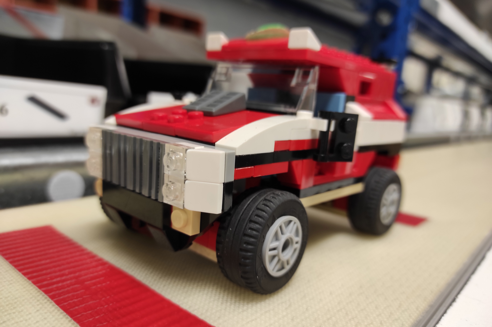{#fig-tmlec-b}

Tiger Motors Lean Education Center and SUV Model
:::

Each participant completes the same task sequence with one of four different Instructional Media Treatments (IMTs). Each IMT offers a different level of augmented instruction, ranging from traditional paper instructions with no augmentation to a mixed reality head-mounted display where interactive instructions are superimposed on their field of view.

Instructional design for all augmented IMTs was based on the paper work instructions, adapted only as needed to leverage the specific affordances of each technology. This helped ensure that any differences observed in the study were due to the augmentation level of each IMT, not variations in instructional content.

The remainder of this chapter will describe in detail all aspects of the study's methodology, including participant recruitment, human subjects considerations, experimental design, data collection, and analysis. The chapter will conclude by considering the limitations of this study.

## Study Design {#study-design}

TODO: write intro for study design: This study design is a randomized controlled trial, consisting of three true experiments with human subjects, conducted in two sessions. between groups design...

### Task and Context

Each participant is tasked with the operation of one of 15 workstations involved in the SUV assembly. The Lean Lab assembly line consists of two manufacturing cells followed by a conveyor with five additional stations. Each manufacturing cell consists of five workstations arranged in a U-shape.

The experiment is run at ST-8, which is located in the middle of the second manufacturing cell, flanked on either side by workstations six through ten. This arrangement is pictured in @fig-tmline.

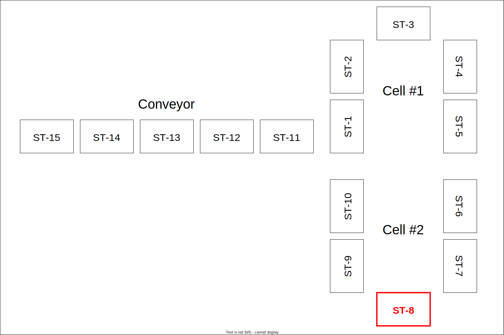{#fig-tmline width="5in"}

All workstations in both cells are similarly equipped with work surface and trays for parts bins. Work instructions for both car models normally produced on the line are displayed above the bins. The bins are removable to facilitate part resupply, but their arrangement at each station is standardized and specified on the work instructions. @fig-st8 shows ST-8 and its bin layout.

::: {#fig-st8 layout-ncol="2"}
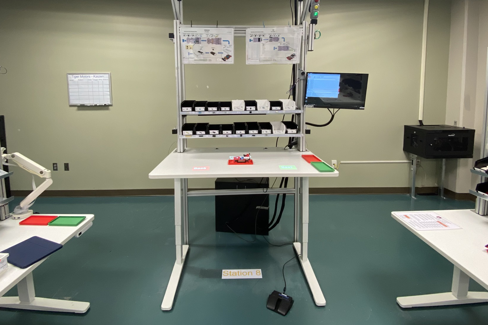{#fig-st8-a}

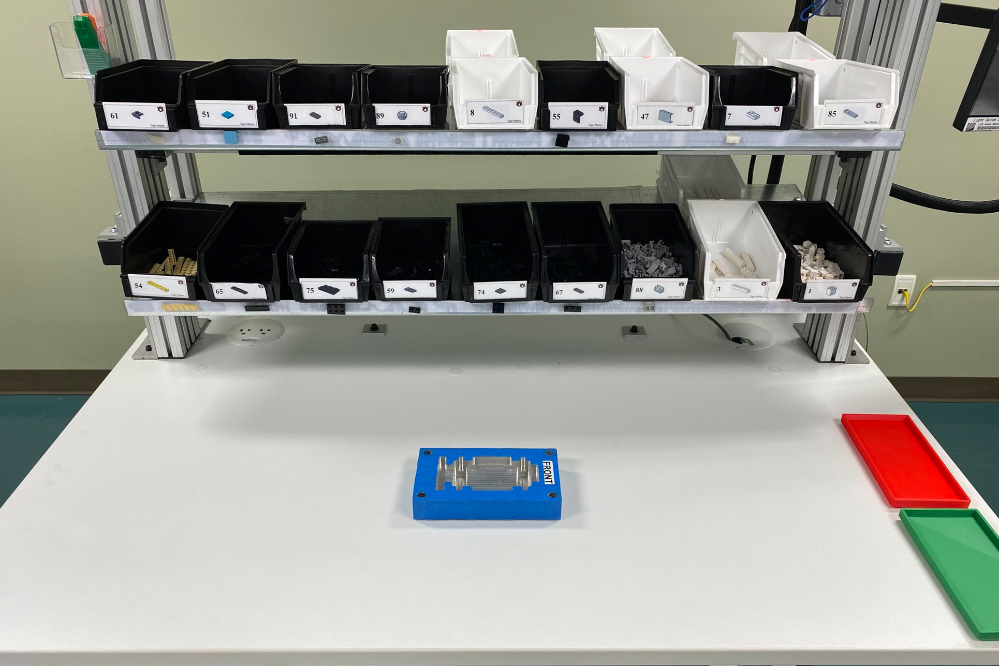{#fig-st8-b}

Workstation Eight
:::

The green and red trays pictured on the right of the work surface are for finished goods and rework, respectively. The central fixture provides for standard placement and secure retention of the workpiece. All of these are removable to allow the lab to operate with varying levels of Lean practice in effect.

### Treatment Levels

As described in @sec-random, each participant in this between-groups design is randomly assigned to a single level of the Instructional Media Type (IMT) treatment. There are four levels of this treatment, each with increasingly augmented work instructions: (1) traditional paper work instructions, (2) projected augmented reality, (3) head-mounted optical see-through augmented reality, and (4) head-mounted optical see-through mixed reality. All are detailed in the sections that follow.

#### Paper Work Instructions

Paper work instructions (PWI) are printed instructions traditionally used in manufacturing assembly processes. Unlike all other IMTs in this study, PWIs are inherently static and do not adapt to the operator in any fashion.

The process at workstation eight (ST-8) is a three step sequence in which 16 pieces, consisting of eight different part types, are affixed to the workpiece. The PWIs for this process are pictured in @fig-ws8instruct.

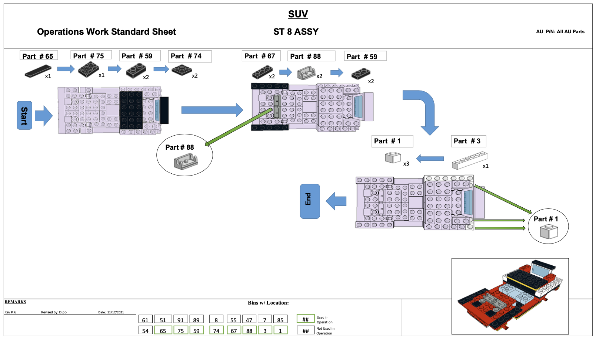{#fig-ws8instruct width="5in"}

The instructions consist of one top-down view of the workpiece for each step, plus an isometric view of the ST-8 assembly. In each step, the car's prior state is shown in grey and new parts have the correct color. A sequence of parts is shown for each step, with the unique part number and quantity required. It is up to the operator to discern the correct placement of those parts from the diagram. Additional detail views are incorporated to each PWI where more clarity or detail are required. At the bottom center of each PWI a map of the workstation's parts bins depicts which are used in the task.

Manufacturing simulations in the Lean Lab are expected to run at a takt time of one minute. Therefore, the instructions for each of the 15 workstations have been carefully designed to include one minute of work content.

While it may seem trivial to complete the work at ST-8 correctly in one minute or less, experience shows that is not the case. The Lean Manufacturing Systems class at Auburn University (INSY 5800/6800), has validated these instructions through countless lab sessions in the administration of that course. They served as the basis for the design of all other IMTs, and as the control for this study.

#### Projected AR

Projected AR (PAR) systems integrate work and instruction by projecting the later onto the work surface. Work steps are displayed sequentially, either under operator control or automatically triggered.

ST-8 is equipped with a PAR system by LightGuide[^24-methods-2] (LG), a Michigan-based company focused on innovative, AR-based manufacturing solutions. As shown in @fig-lgs, Their system uses a Windows PC, industrial-grade projector, and 2D or 3D vision system, along with other optional input devices and tools. All components are commercially available and integrated by the LG software, where digital work instructions are both authored and played back.

[^24-methods-2]: Lightguide: <https://www.lightguidesys.com/>

Note that the Lean Lab's LightGuide system predates this study. Its specification, installation, setup, and configuration, along with the design and implementation of the instructional materials it uses at ST-8, were conducted by prior teams.

TODO: cite papers related to LEGO lab development

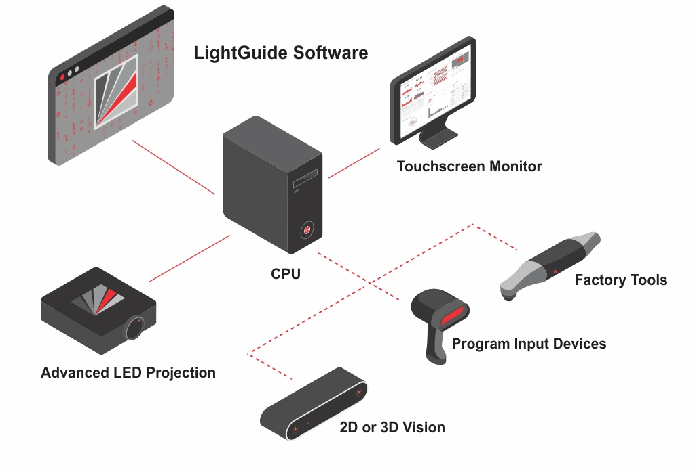{#fig-lgs width="5in"}

TODO: replace bold terms in LG system description

The system at ST-8 uses a **PROJECTOR MODEL** and **CAMERA MODEL** mounted above the paper work instructions. The output of a PC MODEL running Windows 10 and LightGuide **VERSION NUMBER** is displayed on a **MONITOR MODEL**, which is conveniently situated to the right of the bin trays. All equipment, except the PC itself, is mounted on a robust structure of extruded aluminum components from 80/20[^24-methods-3] to ensure operator safety, consistent alignment, and stability. A foot-operated switch provides an alternative to gesture-based control of the system, but it was not used in our study. The complete installation is shown in @fig-st8lgs, with each component labeled.

[^24-methods-3]: 80/20: <https://8020.net/>

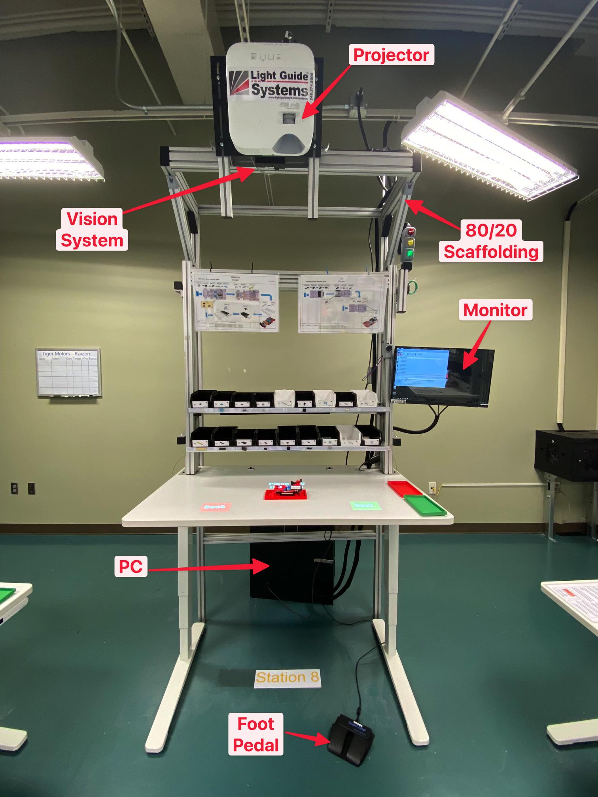{#fig-st8lgs width="4in"}

In order to create a consistent user interface across all XR treatments this study leveraged the LG's vision-based system for operator control. In this mode, an infrared time-of-flight camera provides a real-time depth map of the work area. This 2D video signal encodes the distance of objects from the camera as a color value at each pixel. That output, commonly known as a depth map, is processed using computer vision techniques to detect motion and identify any obstructions in the workspace. @fig-lgvision demonstrates the output of this system in a simulated operator interaction.

::: {#fig-lgvision layout-ncol="2"}
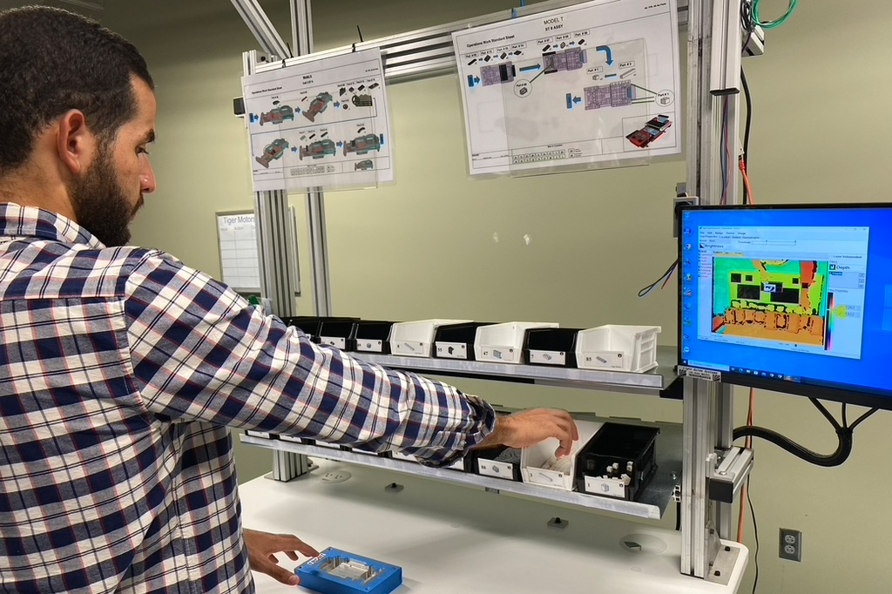{#fig-lgvision-a}

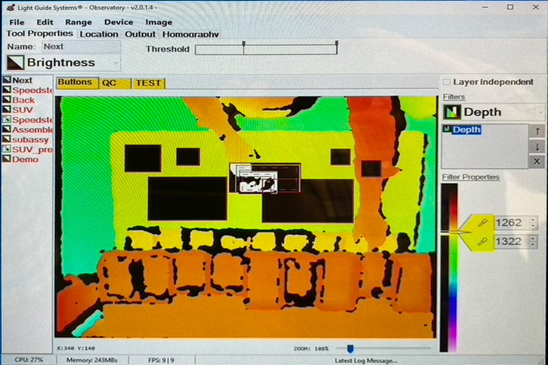{#fig-lgvision-b}

LightGuide Vision System
:::

With this information the LG can, for example, recognize the operator's hand placement and trigger system actions, warnings, or data logging events. In the ST-8 implementation, some applications of this method include triggering a green or red overlay when the operator reached into the right or wrong part bin, advancing to the next assembly step when the operator swipes over the virtual `NEXT` button, and automatically advancing when it appeared that the operator had installed a piece.

The images below were grabbed from PAR trial recordings. @fig-parcap-a shows a side view of the workspace and @fig-parcap-b shows the same moment from the operator's perspective. Both images are cropped to focus on the work surface, but the operator view maintained the original aspect ratio with minimal cropping.

::: {#fig-parcap layout-ncol="2"}
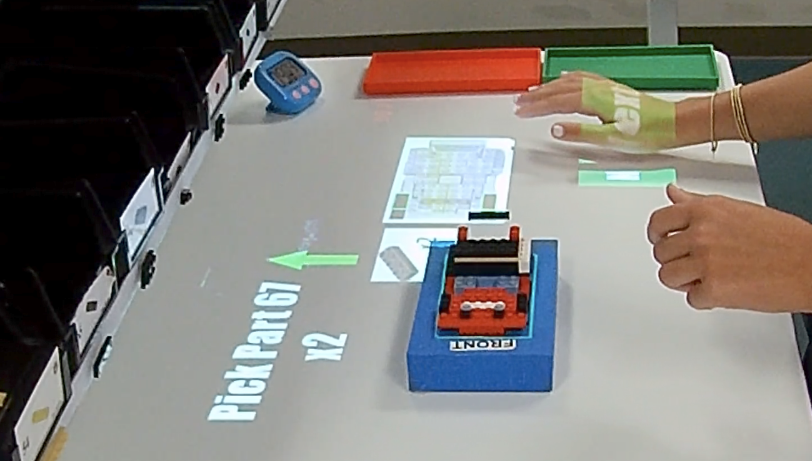{#fig-parcap-a}

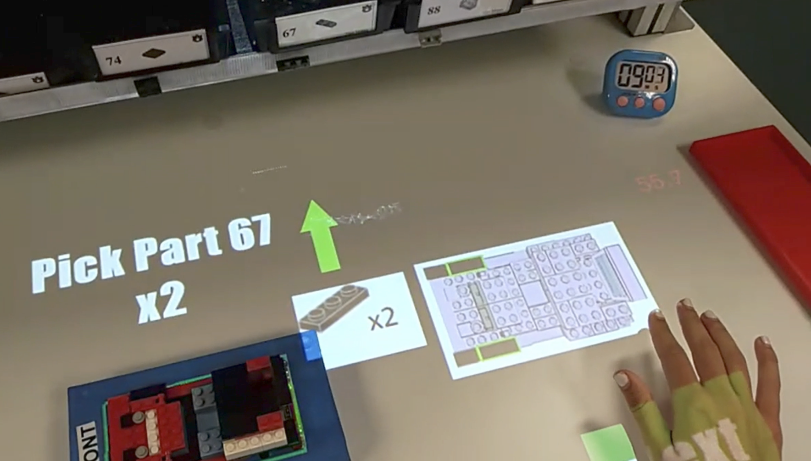{#fig-parcap-b}

PAR in Operation
:::

The PAR instructions were designed and implemented by students and graduate assistants in the Lean Manufacturing class. They were adapted from the same PWIs used as the control in this experiment. Like the PWIs, the PAR system has been validated through extensive use in the lab.

#### Head-Mounted AR

Like PAR, head-mounted AR (HMDAR) systems integrate dynamic instructions into the work area. Whereas PAR relies on traditional projectors and classical computer vision techniques, HMDAR employs sophisticated displays and fused sensor data to superimpose instructions and virtual controls directly into the operator's field of view, properly aligned with the work area.

As detailed in the subsequent section on [System Development](#sysdev), Microsoft's HoloLens2[^24-methods-4] (HL2) was used for this treatment. The HL2's area-based tracking capabilities were used to align the virtual and physical coordinate systems, enabling the proper in-view placement of UI objects, independent of the position and orientation of the operator's head. As with the PAR treatment, user motion was the only input modality, implemented via the HL2's more sophisticated hand tracking and gesture recognition systems. @fig-arcap shows the side and operator view of this treatment at the same moment.

[^24-methods-4]: HoloLens2: <https://www.microsoft.com/en-us/hololens>

::: {#fig-arcap layout-ncol="2"}
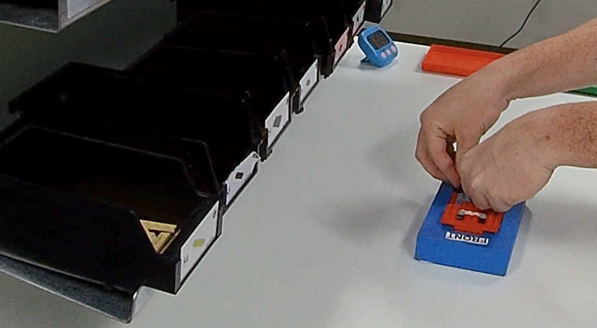{#fig-arcap-a}

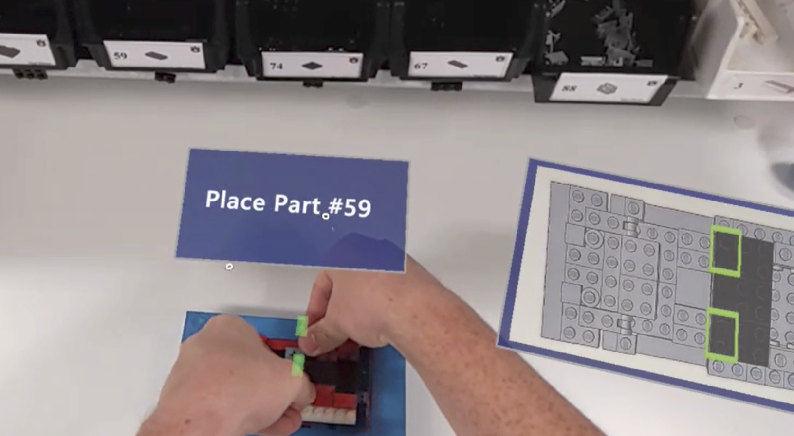{#fig-arcap-b}

HMDAR in Operation
:::

The instructional content for this treatment was intentionally designed to mirror that of the PAR system. By controlling for variables such as instructional content and task complexity, the study design allows for a direct comparison based on the distinct affordances of each technology—namely, the nature of their display and interface. This approach ensures that differences in operator experience and performance can be attributed most directly to the technological medium.

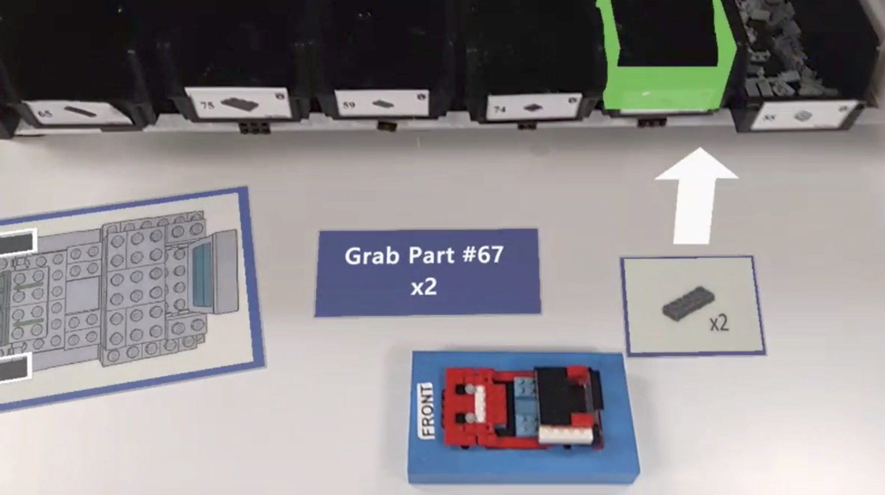{#fig-arcomp width="5in"}

For comparison purposes, @fig-arcomp shows the HMDAR operator's view of the same instructions pictured in @fig-parcap for the PAR treatment. The two differ only in that the digital work instruction is placed on the operator's left in the HMDAR version to prevent overlap.

#### Head Mounted MR

Head-mounted MR (HMDMR) extends the capabilities of the HMDAR treatment with a more sophisticated tracking method that allows for more natural interactions with the workpiece. For all other treatments, the workpiece remains in a fixture, forcing the operator to align themselves, both physically and mentally, to its placement.

HMDMR eliminates the need for a fixture and allows the operator to rotate and/or lift the work off the surface if it seemed natural to them to do so. It achieves this by incorporating model-based tracking to to align instructions with the workpiece itself. The added flexibility was expected to make the process more intuitive and ergonomic, enhancing operator performance.

Using model-based tracking, part placement indicators remain properly aligned with the workpiece, regardless of its position and orientation in space. This is demonstrated in @fig-mrmodtrack, where participant #1040 has rotated the workpiece approximately 45 degrees from its normal orientation to facilitate the installation of parts at the rear of the model. Note that the green part proxies and white placement arrows, all virtual, remain properly oriented.

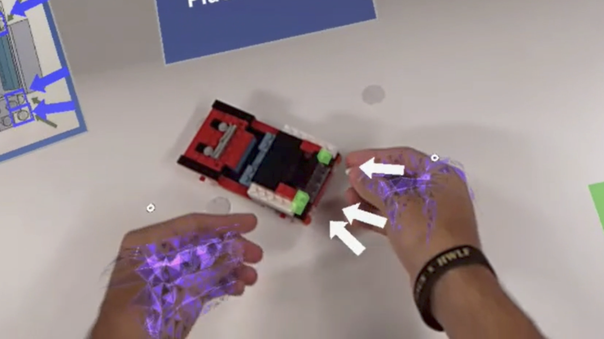{#fig-mrmodtrack width="5in"}

@fig-mrcap provides a side and operator view of this treatment, and illustrates the lack of a fixture. Otherwise, the HMDMR treatment was unchanged from the HMDAR, allowing for direct comparisons of all treatments based only on the affordances of interest.

::: {#fig-mrcap layout-ncol="2"}
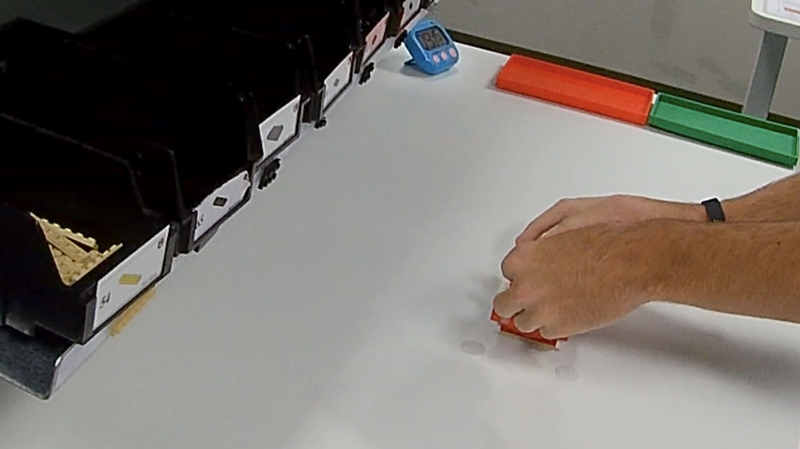{#fig-mrcap-a}

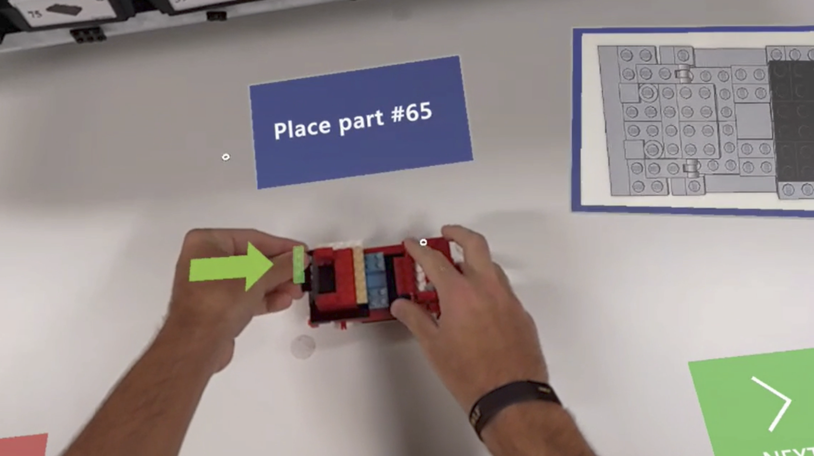{#fig-mrcap-b}

HMDMR in Operation
:::

### Affordances and Theoretical Benefits

In order to better understand the underlying factors that contribute to any significant measured differences in treatment outcomes, a set of nine affordances were defined, as described below.

1.  Task Instructions: A description of how to complete the task.
2.  Hands-On Engagement: The learning method involves physical interaction with the subject matter.
3.  Direct View of Work: The work area is viewed without mediating devices like screens or displays.
4.  Step-Wise Guidance: Instructions are presented sequentially, adapting to user needs and pace.
5.  Feedback Mechanisms: The system provides real-time feedback on user actions.
6.  Workspace Integration: Instructional materials are integrated with the workspace.
7.  Sensor-Based Interaction: The system is controlled with sensor-based input devices, eliminating the need for physical controllers.
8.  User-Centric Display: Instructions are displayed in the user's view, rendered from their perspective.
9.  Freeform Interaction: The system allows for natural manipulation of the workpiece.

These affordances were identified based on their direct applicability to the learning tasks within an AR/MR environment, their alignment with a carefully chosen set of instructional treatments, and their foundation in educational theories known to influence learning outcomes positively. Each affordance serves to operationalize these theories within the context of the experimental design, with the expectation that their integration into the instructional treatments will lead to measurable improvements in learning and performance.

| **Affordance**           | **PWI** | **PAR** | **HMDAR** | **HMDMR** |
|--------------------------|:-------:|:-------:|:---------:|:---------:|
| Task Instructions        |    Y    |    Y    |     Y     |     Y     |
| Hands-On Engagement      |    Y    |    Y    |     Y     |     Y     |
| Direct View of Work      |    Y    |    Y    |     Y     |     Y     |
| Step-Wise Guidance       |         |    Y    |     Y     |     Y     |
| Feedback Mechanisms      |         |    Y    |     Y     |     Y     |
| Workspace Integration    |         |    Y    |     Y     |     Y     |
| Sensor-Based Interaction |         |    Y    |     Y     |     Y     |
| User-Centric Display     |         |         |     Y     |     Y     |
| Freeform Interaction     |         |         |           |     Y     |

: Summary of Affordances by Treatment {#tbl-affords tbl-colwidths="\[40,15,15,15,15\]" .striped}

@tbl-affords maps each treatment to its set of affordances. It demonstrates a progression of complexity and sophistication. "Task Instructions," "Hands-On Engagement," and "Direct View of Work" provide the baseline capabilities for all treatments. Additional affordances add layers of instructional complexity and interactivity.

As discussed in @sec-theory, the theoretical benefits underpinning these affordances are rooted in educational theories that are particularly relevant to AR/MR learning environments. *Active learning theories*, including *experiential learning theory* support the idea that learning is enhanced through direct experience and reflection, which is fundamental to several of the identified affordances, including "Hands-On Engagement," "Step-Wise Guidance," and "Feedback Mechanisms."

*Flow theory* emphasizes the importance of a state of heightened focus and immersion for optimal learning, which is fostered by affordances that engage users in a compelling and intuitive way, such as "Egocentric Display" that ensures the instructional content is seamlessly integrated into the user’s field of view.

The theory of *embodied cognition* posits that cognitive processes are deeply intertwined with the physical actions of the body. In an AR/MR setting, affordances that align with this theory, such as "Freeform Interaction," allow for a more natural and intuitive learning process by leveraging the body's movement and spatial orientation. Other *constructivist* theories, including *animate vision* and *spatial cognition theory* are similarly represented by "User-Centric Display," and "Workspace Integration."

*Cognitive load theory* provides a framework for understanding how information is processed and suggests that well-designed instructional materials can reduce unnecessary cognitive load, making learning more efficient. This directly relates to affordances like "Sensor-Based Interaction" which simplifies the user interface, and "Workspace Integration," which eliminates context switching associated with referencing instructions away from the work surface.

Lastly, the affordances have been selected with *educational best practices* in mind, ensuring that they not only align with theoretical perspectives but also adhere to the principles of effective instruction design, such as clarity, engagement, and scaffolding.

This design links the chosen affordances with the framework for instructional design with AR/MR augmentation for industrial training applications that was proposed in @sec-guidelines and illustrated by @fig-idforar.

While it may be tempting to make a-priori claims about the most influential affordances or theories in this context, the relationships are not so clear-cut. Each identified affordance can claim some benefit from most identified theories; all are interrelated and contribute to the overall learning experience.

Instead, this work hypothesizes that treatments leveraging more affordances will result in better learning outcomes. But the success of these treatments also depends on the quality of their implementation and the balance between enhanced functionality and added complexity. The later may have a negative impact on the overall user experience, increasing cognitive load, breaking flow, and otherwise offsetting the intended gains. Finally, the interplay between different affordances — how they complement or interfere with one another — is also a significant consideration.

### Tradeoff

Both HMD treatments were designed to resemble the PAR, and, by extension, PWI experiences as closely as possible. This choice was made to deliberately control for the instructional design and focus treatment differences on the benefit of underlying affordances. While any of the treatments could have been "improved" with additional system-specific functionality, that would have been detrimental to the experimental design. For example, obvious shortcomings of the PWI could have been corrected, or participants could have been given the option to use the PAR's footswitch. Either would likely have improved the results for those treatments but led to less relevant comparisons.

This methodology acknowledges the potential limits to each treatment's efficacy, but upholds the integrity and clarity of the study's comparative analysis.

## Measures and Variables

In this study, we evaluate the efficacy of different instructional methods in manufacturing assembly training, focusing on key variables that impact learning, recall, and retention. This section outlines these crucial variables, alongside a comprehensive set of hypotheses for both primary and secondary outcomes, ensuring a robust and systematic assessment of each instructional treatment's effectiveness.

### Dependent Variables

The key measures of this study are learning, recall, and retention.

*Learning* is the process through which knowledge, skills, behaviors, or values are acquired or modified. For this study, it is measured by how quickly a participant progresses towards the level of proficiency expected of a qualified operator. Specifically, it is a function of the dependent variables quality (error rate) and performance (time efficiency).

*Recall* refers to the ability to access information from memory without being re-exposed to it after initial training. Here, it is assessed by how well participants can perform the task after the learning phase, without ongoing instructional support.

*Retention* is the ability to maintain information, skills, or knowledge over time. For this study it is measured by re-testing recall some time after the initial training.

TODO: cite learning / recall / retention definitions? relate quality and performance to OEE? justify these choices?

### Independent Variables

The primary independent variable in this study is the treatment level assigned to each participant. Of the four treatments, three serve as interventions: PAR, HDMAR, and HMDMR. The fourth treatment, PWI, is the standard for manufacturing assembly training and therefore a natural choice for the control.

Post-hoc analysis will be conducted to determine if any of the participant demographics should be considered secondary independent variables. Those of particular interest include age and prior experience with LEGO or manufacturing. The results of this analysis may have implications for the generalizability of the study.

### Controlled Factors

To ensure the validity of the outcomes, the study design carefully controlled for various factors, isolating the impact of the treatments.

1.  Participant Sampling: The recruitment strategy aimed for a diverse and representative sample within the constraints of the study's target population.
2.  Random Treatment Assignment: This method was utilized to evenly distribute potential confounding variables across the different treatment groups, thereby minimizing biases.
3.  Uniform Device Usage: All participants wore the HL2 during the learning and recall experiments to standardize any potential impact of using the device.
4.  Screening for Prior Experience: Prospective participants were screened and excluded if they had prior experience with similar AR/MR devices or Lean Lab assembly tasks.
5.  Task Consistency: The content, complexity, and duration of the task were uniform for all participants, ensuring that any learning differences were attributable to the treatments rather than task variability.
6.  Standardized Session Conduct: The environment and methodology of conducting each session were kept consistent, further ensuring that differences in outcomes were treatment-related.

These control measures were integral to maintaining the integrity of the study and ensuring that the results accurately reflect the effects of the instructional treatments.

### Primary Outcomes

The primary outcomes of this study are the results of the hypotheses tests for each phase, as outlined below.

#### Learning Phase Hypotheses

The first group of hypotheses are designed to test the effect of each treatment on training outcomes.

> **Research Question 1**
>
> *How does each IMT affect performance during the learning phase?*
>
> $$H_{1a}\textrm{: Average time per car varies with treatment}$$ $$H_{1b}\textrm{: Average error count per car varies with treatment}$$ $$H_{1c}\textrm{: Learning rates vary with treatment}$$

To better understand those results, additional analysis will consider the treatment effect on error types, task completion rate, and first-task performance. Finally, we'll investigate which treatment group had the highest percentage of "qualified operators" at the end of the 10-min session. This will be assessed relative to expected performance metrics, including takt time and OEE.

This approach provides a robust assessment of the instructional treatments' effectiveness during the learning phase. It examines key performance metrics — efficiency, accuracy, and learning progression — to capture a comprehensive understanding of participant performance. The evaluation against real-world manufacturing standards further ensures the study's relevance to practical training contexts. This design allows for a nuanced interpretation of how each treatment influences learning outcomes in manufacturing assembly training.

#### Recall Phase Hypotheses

The second group of hypotheses aim to evaluate the residual impact of each treatment on recall — specifically, participants' ability to correctly replicate the task without further training.

> **Research Question 2**
>
> *How does each IMT affect performance during the recall phase?*
>
> $$H_{2a}\textrm{: OEE varies with treatment}$$ $$H_{2b}\textrm{: Total duration of PWI references varies with treatment}$$

In contrast with the RQ1 analyses, which focused on the learning *progress*, these hypotheses are designed to assess the training *results*. OEE was chosen as the primary measure due to its practical relevance in answering "Did the training work?" It effectively quantifies the participants' ability to utilize acquired skills under conditions that mimic real-world expectations, where both speed and accuracy are crucial.

Subsequent analyses will investigate the primary drivers of OEE (efficiency vs. quality) and PWI reference duration (frequency and length of references). Additional exploration into error types, task completion rate, first-task performance, and ongoing learning rate may also provide additional insight into the nuances of recall performance across treatment types.

#### Retention Phase Hypotheses

Phase three of the study is designed to assess the residual impact of each treatment on retention. This describes the "stickiness" of the learning and is measured by testing recall several weeks post-intervention. No additional training is provided in the meantime.

> **Research Question 3**
>
> *How does each IMT affect performance during the retention phase?*
>
> $$H_{3a}\textrm{: Change in OEE varies with treatment}$$

Here we look at the change in operator performance since the recall experiment. We expect performance to degrade for all treatments, but are interested to find if there are significant differences in the magnitude of change based on the instructional method. Both absolute and percentage change will be tested, and the primary driver of OEE identified as before.

Given the limited data available from the retention phase (only one replication per volunteer participant), and the variable delay between experiments, these results will be treated as exploratory. While they may not be conclusive, these findings can help illuminate underlying patterns in treatment effects.

### Secondary Outcomes

The study design supports several other areas for statistical, exploratory, and qualitative analysis. A variety of secondary outcomes, each described in the sections that follow, are incorporated to provide better context for and understanding of the primary outcomes.

#### Statistical

A variety of additional statistical tests will be performed, involving workload, usability, demographics, and performance variability. Specifically, we plan to investigate the following relationships:

-   TLX composite score (workload) and performance across treatments.
-   SUS composite score (usability) and performance across treatments.
-   Demographics (e.g. age, prior experience) and performance across treatments.
-   Within-group performance variance

#### Exploratory

In addition to commonly used descriptive statistics and visualization methods, this study will employ a variety of other statistical methods to explore second level effects.

-   The TLX components (e.g. mental workload, frustration) with the greatest influence on performance.
-   The relationship between workload, usability, treatment, and their interactions on performance.
-   Factors influencing within-group performance variance during the recall phase.

#### Qualitative

Qualitative feedback from participants is an essential complement to our other findings. Through thematic analysis, we aim to systematically identify and interpret patterns in comments gathered during exit interviews and other interactions throughout the study. These insights are crucial for integrating and enriching our findings beyond what quantitative data alone can reveal.

## Experiments

This study was organized into two sessions, encompassing three distinct experiments, each aimed at evaluating one of the three measures of training effectiveness described above.

This section will detail the methods, variables, and rationale behind the design of each experiment. For a step-by-step description of how each session was conducted, see @sec-conduct1 and @sec-conduct2.

### Surveys and Instruments

Two surveys and three instruments were completed during the course of this study, all during the first session. Each is described below, and copies are included in the [IRB approval forms](#app-irb).

#### Participant Intake Form {#sec-pif}

The *Participant Intake Form* (PIF) is a survey designed to gather information, essential to understanding the participant demographic makeup, assessing the generalizability of the study, identifying potential confounding factors, and facilitating post-hoc analyses involving matching or grouping:

1.  General demographics, including gender, age, height, race, ethnicity, country of origin, primary language, education level, and student status.
2.  The presence of color blindness.
3.  The need for corrective lenses, and whether they will be used during the experiment.
4.  Any other condition that might affect their performance during the study.
5.  Self-rated experience with LEGO building and background in manufacturing.
6.  The method by which they learned about the study.

#### General Feedback Sheet

This simple form is used to record each participant's qualitative feedback on their overall experience. It is administered by the PI in a very open-ended manner. A list of standard questions is available for participants that aren't forthcoming or otherwise benefit from prompting. It is only used at the end of the first session.

#### NASA Task Load Index {#sec-tlx}

As discussed in @sec-lrinstruments, the *NASA Task Load Index* [TLX, @hart2006tlx] was designed to assess the perceived workload of a task. The primary outcome of the TLX is a weighted average of six factors that contribute to overall workload. Three of those factors are related to the mental, physical, and temporal demands placed on the participant by a task. The remaining three measure the participant's perceived effort, frustration, and performance during it.

The TLX is comprised of weighting and scoring processes that are repeated by participants upon task completion. First, to account for the subjective nature of workload, each factor is weighted by the participant. This *Sources of Workload Evaluation* is accomplished by having them indicate which element of each pair made the greatest contribution to their perceived workload. This is illustrated in @fig-tlxsow. For example, given the pair "Mental Demand or Effort," a participant would likely indicate *effort* for a task like lawn work, but *mental demand* for a philosophical debate. This is repeated for all fifteen possible combinations of the six factors.

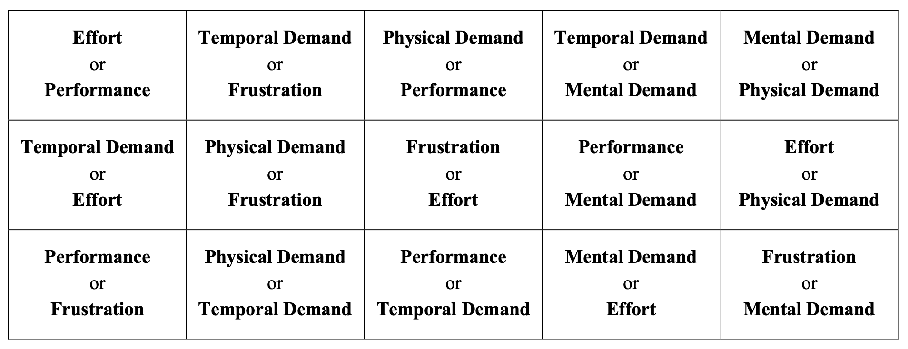{#fig-tlxsow width="5.5in"}

Next, participants complete the *Workload Rating Scales* form to assess the magnitude of each factor for the given task. This uses a Likert-like scale with 20 equal intervals and bipolar descriptors. No numeric values are given and participants are instructed to mark it freely. The mental demand rating scale shown in @fig-tlxwrs is representative.

TODO: cite Likert?

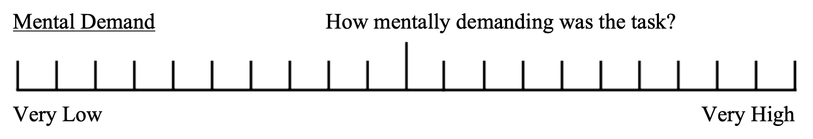{#fig-tlxwrs width="5in"}

The results of the TLX are expected to provide insight into the overall user experience for each treatment, along with how workload varies across treatments and what underlying factors contribute to both. This will aid in contextualizing the positive or negative influence that workload might have on learning outcomes.

#### System Usability Scale (SUS) {#sec-sus}

TODO: add SUS and citation to LR

As discussed in @sec-lrinstruments, the *System Usability Scale* \[SUS, citeme\] is a widely used instrument designed to quickly and reliably assess the overall usability of a product or service. The SUS is composed of 10 questions that participants respond to according to their experience with the system. Each is ranked on a five point scale anchored by "Strongly Agree" and "Strongly Disagree" bipolar descriptors. Note that alternating items are reverse-scored to improve validity. A portion of the form used is shown in @fig-sus.

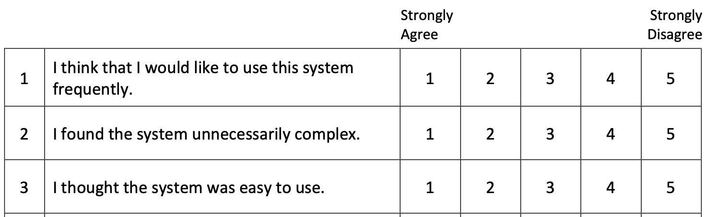{#fig-sus width="5.5in"}

The SUS score is calculated by summing the scores of each question. For odd-numbered questions, the formula is the response value minus one; for even-numbered questions, it is five minus the response value. The total is then multiplied by 2.5:

$$\textstyle{S = 2.5 \times \left( \sum_{i \text{, odd}} (R_i - 1) + \sum_{i \text{, even}} (5 - R_i) \right)}$$ {#eq-sus}

where $R_i$ represents the response to each of the ten items. The SUS score, $S$, calculated by @eq-sus will range from zero to 100. Values above 68 are generally understood to represent above-average usability.

#### Behavioral Control Survey {#sec-bcs}

The final instrument completed during the intake process was the Adult ADHD Self-Report Scale [ASRSv1.1, @green2019evide]. Referred to simply as a *Behavioral Control Survey* (BCS) in order to avoid the possibility of biasing participant responses, the data collected are the focus of a separate study [@ballard2024role], and not further discussed in this work.

### First Session - Learning and Recall

The first session of the study tested its primary research questions in two phases, as described below.

#### Learning Phase {#sec-learning}

Phase one, Learning, compared the effects of the assigned treatment on the speed (task completion time) and accuracy (number and type of corrected and uncorrected errors) with which participants performed each repetition of the task. These measures, tracked for each assembly during the 10-minute session, were later used to assess both the learning rate and depth of skill acquisition. This approach offers insights into how efficiently and effectively each treatment imparts necessary skills and knowledge for the task.

Participants were instructed to focus on three priorities during the first phase: (1) learn the steps of the assembly process, (2) complete each assembly correctly, and (3) finish as many assemblies as possible in the time allowed. This approach mirrors the principles of Overall Equipment Effectiveness (OEE) in manufacturing, which balances the need for accuracy and precision (reflecting the Quality aspect of OEE) with efficiency (mirroring the Performance aspect of OEE). In the context of this study, OEE's third component, Availability, is out of the participant's control, but, as discussed elsewhere, does manifest in some system related issues that were encountered.

TODO: add OEE and citation to LR, update above?

The fixed duration of 10-minutes was deliberately chosen to align with various aspects of the learning process and the operational context of the task. In addition to the OEE considerations outlined above, using a fixed duration ensured that all participants have the same opportunity to learn the procedure. A fixed car count approach (e.g. "make 6 cars") was rejected due to concerns that the absence of a time constraint could lead to uneven learning opportunities and extend session lengths beyond practical limits.

A 10-minute timeline was chosen based on prior experience with learning curves for the task. The Lean Lab is designed around a 60-second takt time, which constrains the work content for experienced operators at each station. Before training, the time to complete these tasks varies widely. Our expectation was that participants would typically complete between three and six cars during their 10-minute session, but any individual participant might complete only one or as many as ten cars.

#### Recall Phase {#sec-recall}

The second phase was designed to assess the residual effects of the instructional treatment on each participant's ability to perform the task correctly and efficiently. The assembly task was repeated four times in the control condition, and the same measures were recorded.

Participants were given three priorities: (1) deliver error-free results, (2) reference the work instructions only if necessary, and (3) work quickly. This emphasized working from memory with expectations appropriate for an operator in training. Although participants were encouraged to work quickly, no time limit was set to ensure each produced four complete assemblies.

#### First Session Data Collection {#sec-s1data}

Manual data collection was limited during the learning and recall experiments. Each assembly was reviewed for correctness and the number and types of uncorrected errors were recorded on the appropriate data sheet. For incomplete (time expired) or retired (breakage requiring rework) assemblies, the final part count was also recorded.

The majority of the data was collected from photographs and video recordings. For each participant, both experiments were recorded on a pair of cameras. One, integrated into the HL2, provided a clear view of the process from the participant's perspective. The other camera was positioned and oriented to record the entire work area from the operator's left, as seen in @fig-sidecam.

::: {#fig-sidecam layout-ncol="2"}
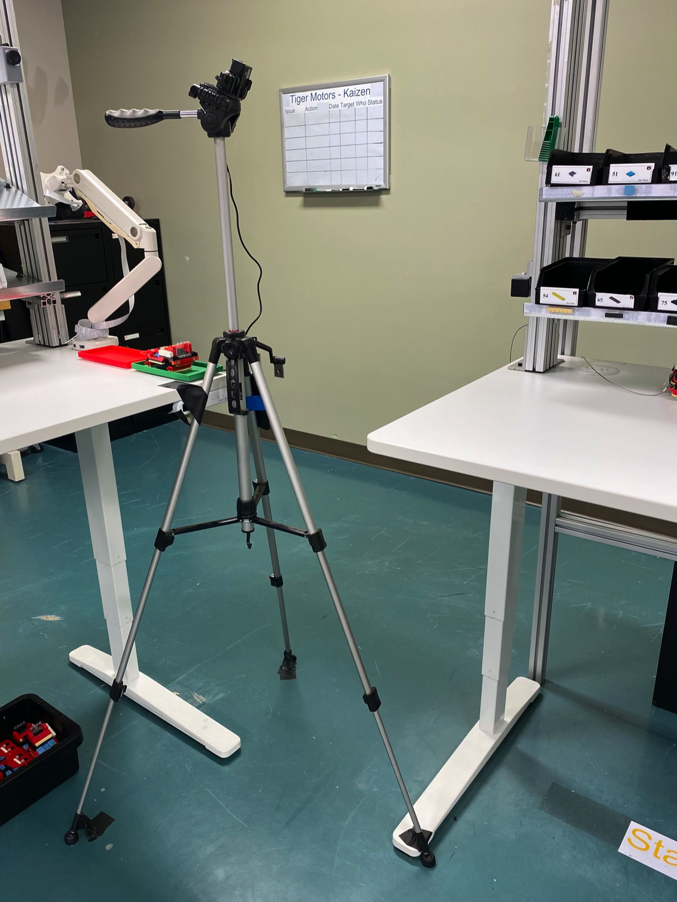{#fig-sidecam-a width="80%"}

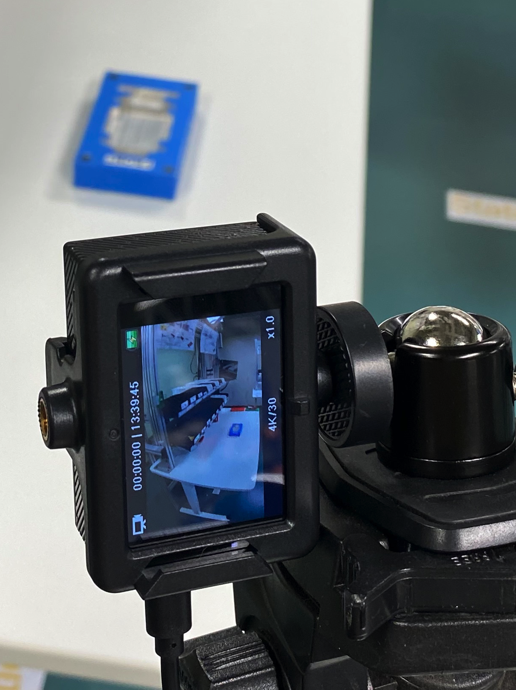{#fig-sidecam-b width="80%"}

Side Camera Setup
:::

Photos were also taken to provide a detailed, high-quality record of the results for each experiment, complementing the video data. This is exemplified by @fig-resphoto, which shows that participant #1053 completed three cars in the learning phase. The 4^th^ car pictured here is rotated to indicate that it was incomplete or retired when time expired. Laminated treatment slates are included in these photos to easily embed essential metadata.

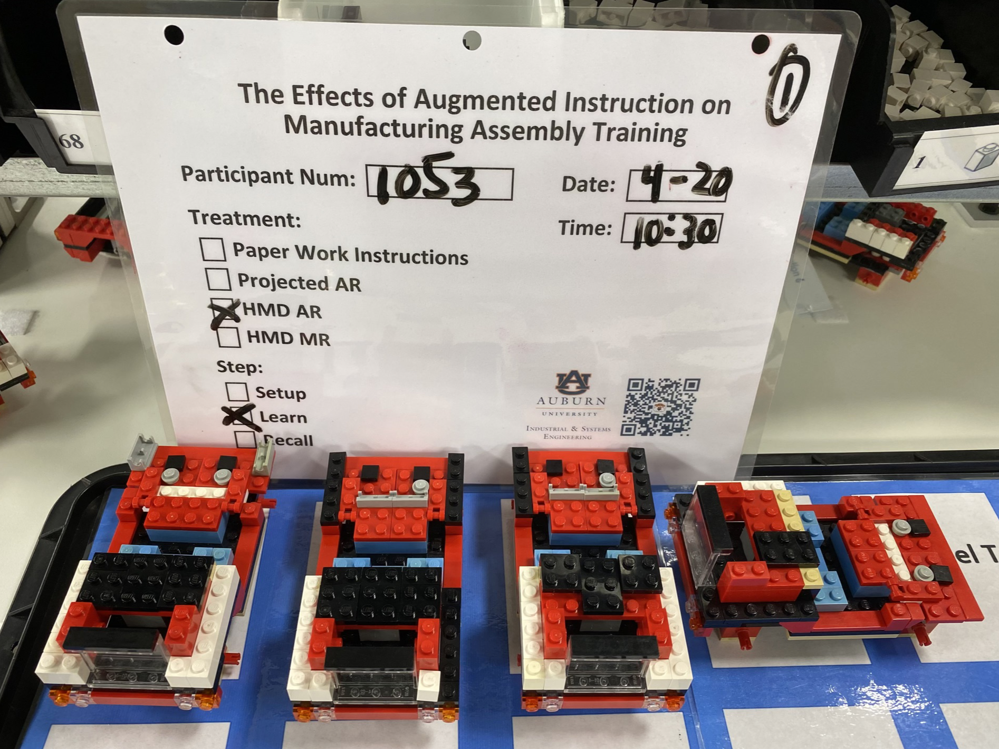{#fig-resphoto width="5in"}

Subsequent analyses, as detailed in @sec-analysis, confirmed the original results and extracted additional data related to timing, error type, PWI usage during recall, and more. While video review was a long and tedious process, this approach allowed us to focus on administering the experiment correctly and carefully observing the participant without the distraction of data collection. This ultimately improved the accuracy and traceability of the results.

The TLX and SUS instruments were both administered twice during this session, once after each experiment. This gave us workload and usability information for all treatment groups during the learning task and for all participants during recall. The later could be used as baseline measurements for the ST-8 work content.

The PIF, BCS, and a trial run of the TLX were also administered during the intake process of this session. Finally, during the exit interview, general feedback was collected. All of this is detailed in @sec-conduct1.

### Second Session - Retention {#sec-retention}

The second session took place in the Lean Lab several weeks after the learning and recall experiments, as part of an [end of study event](#comp-event). All prior participants were invited to attend. In order to address confidentiality concerns that might arise due to the public nature of this event, attendance was entirely voluntary.

Based on the number of trials in the first session, the maximum anticipated turnout during this 4-hour event was 40. That suggested a traffic rate of 10 to 15 participants per hour, implying a conservative maximum duration of 3 minutes per trial. This necessarily limited the scope and complexity of the experiment.

This experiment was designed to assess longer-term benefits of the original intervention. Each participant was asked to build a single car from memory, without additional instruction. They were asked to prioritize (1) completing the assembly correctly and (2) finish within the station takt time of 60 seconds. Task completion time was collected, but a generous 2-minute time limit was imposed in the interest of expediency. Compensation was awarded as described in @sec-comp.

The interval between the original intervention and this session varied for each participant. This variable time gap, which could range from one to 11 weeks, will be a consideration during analysis.

#### Second Session Data Collection {#sec-s2data}

As in the first session, the emphasis was on minimizing the amount of manual data collection required. Each trial was recorded using a compact forehead-mounted video camera. Task completion time and error count, along with any essential observations, were documented. The completed car was also photographed, ensuring that the timer and notes were visible in the frame.

{width="5in"}

This single photo approach streamlined data collection during the event without compromising the integrity of the results. While the photos alone provide sufficient data for our primary analysis, the video recordings offer additional detail if desired.

## HMD System Development {#sysdev}

TODO: write intro for sysdev section

### Hardware

Of the HMDAR systems commercially available in 2021, when the precursor to this study began, only the HL2 was well-suited for enterprise applications, including manufacturing. Originally released for that market in 2019, the HL2's distinguishing features are tabulated in @tbl-hl2, below.

| Feature               | Description                                                                                                                                                                                                                                                                                                                                                         |
|-------------------------|-----------------------------------------------|
| Natural Field of View | The HL2 is an optical-see-through system (OST) where its display is overlayed on the user's normal view of the world. Its optical design provides a wide and minimally obstructed field of view (FOV), giving a natural and safe user experience. The HL2 also can be used with glasses and features a unique, flip-up design that eliminates the device from view. |
| Hands-free use        | The HL2 relies entirely on natural inputs - gestures and voice controls - rather than physical input devices like tablets or game-style controllers. This leaves operators free to use their hands for their required tasks.                                                                                                                                        |
| Untethered            | The HL2 is a stand alone design with integrated power and compute. This eliminates the need for power or data connections that can encumber users, limit their motion, and introduce tripping hazards.                                                                                                                                                              |
| General Purpose       | HL2 is a versatile XR device that supports open development across various industries. Its hardware supports image, model, and area tracking methods to allow for a wide range of augmentation. Unlike some devices, the HL2 is not limited to specific applications or development by authorized partners.                                                         |

: HoloLens2's Distinguishing Features[^24-methods-5] {#tbl-hl2 tbl-colwidths="\[30,70\]" .striped}

[^24-methods-5]: HoloLens2 Hardware Details: <https://learn.microsoft.com/en-us/hololens/hololens2-hardware>

Only the Magic Leap 2[^24-methods-6] design is similar. However, despite being released nearly three years later, it has a more limited FOV, requires prescription inserts for vision correction, offers less extensive developer support, and has achieved less market adoption than the HL2. Both devices are pictured in @fig-hmdxrs, below.

[^24-methods-6]: MagicLeap: <https://www.magicleap.com>

::: {#fig-hmdxrs layout-ncol="2"}
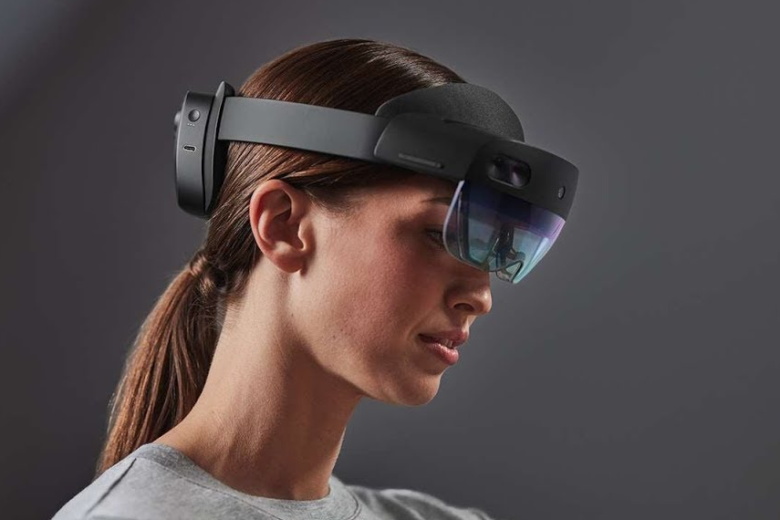{#fig-hmdxrs-a}

{#fig-hmdxrs-b}

HoloLens 2 and Magic Leap 2
:::

Because the HL2 represented the state of the art in OST HMD enterprise XR devices when this study commenced, it was adopted for the HMD AR/MR treatments. At the time of this writing, nearly four years after its introduction, the HL2 hardware design and the feature set it enables remain largely unchallenged.

Unlike the LG, the HL2 is entirely self-contained, processing data from an array of sensors to enable six degree-of-freedom visual tracking, spatial mapping, gesture recognition, voice commands, hologram rendering, and optical compositing in real-time. @fig-hl2exp provides an exploded view of the HL2 components.

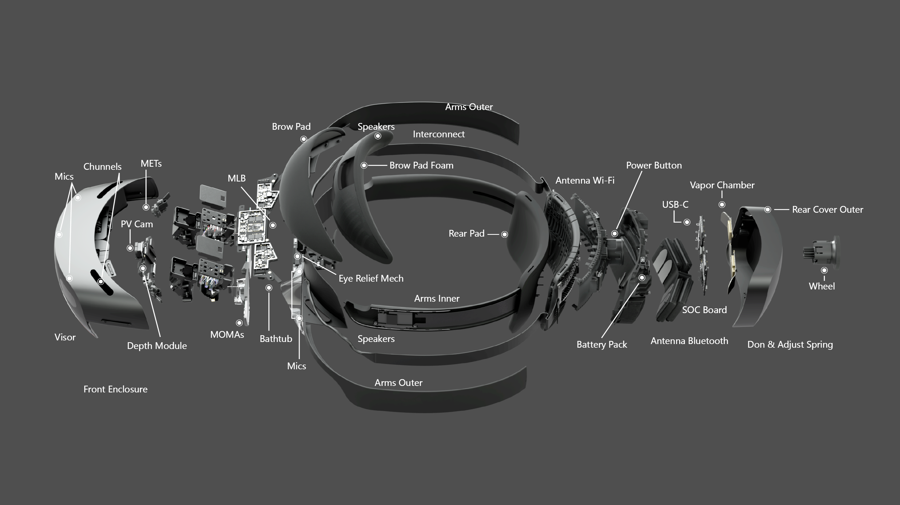{#fig-hl2exp}

### Software

Development options for XR systems are limited. For creating custom apps on HL2, Microsoft supports and endorses Unity[^24-methods-7] with the Mixed Reality Toolkit[^24-methods-8]. Ultimately, the need for model and area based tracking capabilities required further tooling. Each element is described below.

[^24-methods-7]: Unity: <https://unity.com/>

[^24-methods-8]: Mixed Reality Toolkit (MRTK): <https://learn.microsoft.com/en-us/windows/mixed-reality/mrtk-unity>

#### Unity

Best known as a "game engine," Unity is a very capable tool, commonly used for industrial, commercial, and defense applications. It offers a comprehensive feature set for creating and animating objects, rendering high-quality visuals, programming systems and interactions, simulating physics-based dynamics, processing music and audio, designing user interfaces, and much more.

Despite its complexity, Unity is relatively easy to learn. High quality training, documentation, and support are widely available, both through official channels and from a large and enthusiastic development community. Like most tools of its type, Unity is extremely extensible via plugins, many of which are distributed through the official asset store.

Unity is free for non-commercial and academic applications[^24-methods-9]. For research applications like this one, which won't be distributed or otherwise commercialized, its Terms of Service[^24-methods-10] did not pose major concerns. Crucially, Unity allows users to retain rights to content they create, and makes no ownership claims over it.

[^24-methods-9]: Unity Pricing: <https://unity.com/pricing#plans-student-and-hobbyist>

[^24-methods-10]: Unity's Terms of Service and other legal info: <https://unity.com/legal>

Other options, including Epic's Unreal and Vuforia Studio, were carefully considered but ultimately rejected due to a lack of support, functionality, flexibility, or some combination thereof.

#### Mixed Reality Toolkit (MRTK)

The MRTK is a software development kit (SDK) designed to simplify and accelerate the development for XR hardware, including the HL2. It provides developers access to essential HL2 capabilities, including spatial mapping, hand and eye tracking, natural input modalities, and more, all from within Unity.

MRTK is a free, open-source project that was initiated by Microsoft and first released under the very permissive MIT License [@saltzer2020origi] in 2017[^24-methods-11].

[^24-methods-11]: MRKT Github Repository and Licensing File: <https://github.com/microsoft/MixedRealityToolkit-Unity>

#### Vuforia Engine

MRTK's built-in tracking support is limited to image-based solutions and spatial anchoring techniques that were insufficient for this project. After exploring available options, it was determined that the Vuforia Engine[^24-methods-12] (VE) by PTC could best address that limitation. This SDK works with Unity, MRTK, and the HL2 to add robust marker, model, and area based tracking capabilities that were necessary for this project.

[^24-methods-12]: Vuforia Engine SDK: <https://www.ptc.com/en/products/vuforia/vuforia-engine/ar-app-development>

PTC's Vuforia product line is a commercial product designed for enterprise customers, but the Basic version of the Engine SDK is available at no cost. With that plan a limited number of model and area targets can be generated, so long as the resulting app is not published[^24-methods-13]. Within the constraints of this work, PTC's Terms of Use and Developer Licensing Agreement[^24-methods-14] posed no significant concerns.

[^24-methods-13]: Vuforia Pricing and Licensing: <https://developer.vuforia.com/library/faqs/pricing-and-licensing-options>

[^24-methods-14]: Vuforia Terms of Use and Developer Agreement: <br><https://developer.vuforia.com/legal/tos><br> <https://developer.vuforia.com/legal/vuforia-developer-agreement>

### Timeline {#sec-timeline}

The software used for both HL2 treatments was based on work originally done during the Summer of 2022 by a team of three undergraduate computer science and software engineering students. Led and directed by the author, that team created an augmented in-situ training prototype for manufacturing operators. The resulting system utilized a HL2 to align in-context instruction with the workpiece using image based methods — QR codes attached to the fixture.

In the following semester the same team adapted and extended the underlying codebase to support this study. This effort primarily consisted of assessing enhanced tracking tools, integrating the selected SDK, configuring area and model based tracking, and adapting instructional content from the PAR treatment. The project timeline is approximately illustrated by @fig-timeline.

```{r}
#| label: fig-timeline
#| fig-cap: "Approximate Project Timeline"
#| echo: false
#| message: false
#| warning: false
#| fig-width: 7
#| fig-height: 2.5

library(ggplot2)
library(dplyr)

## Timeline
# Summer 22 - osh dev
# Fall 22 - osh/lego dev
# Spring 23 - trials
# Summer 23 - data stuff
# Fall 23 - too little
# Spring 24 - finish

# Define the tasks data frame with reversed levels for Section
tasks <- data.frame(
  Section = factor(c("HL2 Prototyping", "HMDAR/MR Development", "Study Conducted", "Data Extraction and Cleaning"), 
                   levels = c("Data Extraction and Cleaning", "Study Conducted", "HMDAR/MR Development", "HL2 Prototyping")),
  Start = as.Date(c("2022-05-16", "2022-08-19", "2023-02-10", "2023-04-01")),
  End = as.Date(c("2022-10-15", "2023-03-10", "2023-04-29", "2023-08-31")),
  Description = c("des1", "des2", "des3", "des4")
)

# Plot Gantt chart with reversed order and reduced vertical gap
ggplot(tasks, aes(y = Section, x = Start, xend = End, yend = Section, group = Description)) +
  geom_segment(size = 10, aes(color = Description), show.legend = FALSE) +
  scale_x_date(date_labels = "%m/%y") +
  theme_minimal(
    base_size = 14
  ) +
  theme(
    axis.title.x = element_blank(),
    axis.title.y = element_blank()
    )
```

### Strategy

Development was iterative with roughly two-week sprints. Except during the summer, the developers were full-time students and were managed accordingly. Expectations had to reasonably balance their availability and inexperience with the project goals and timeline. Flexibility was critical to everyone's success. Atlassian's Trello[^24-methods-15], a lightweight, web-based project collaboration tool with kanban style task tracking, was used to manage the project.

[^24-methods-15]: Trello: <https://trello.com/home>

### Tactics {#sec-devtactics}

The HMDAR and HMDMR apps were developed in Unity version 2022.x with MRTK v2.7x and VE v10.7x. Development was done entirely on MSI GE76/66 Raider (11UH-053/227) laptops running the 64-bit version of Windows 10 with the latest updates. Both laptop models were equipped with an Intel Core i9-11980HK CPU, NVIDIA GeForce RTX3080 GPU, 32 or 64GB, and 2GB of M.2 NVMe storage.

Systems were configured the Visual Studio 2019 integrated development environment (VS) as described in the MRTK setup instructions[^24-methods-16]. Unity Version Control (VCS, formerly Plastic) was used to manage all assets and source code, allowing the developers to track changes and collaborate effectively.

[^24-methods-16]: MRTK Setup Instructions: <https://learn.microsoft.com/en-us/windows/mixed-reality/develop/install-the-tools>

All programming was done in C#, as required by Unity. C# is an object-oriented language with strong typing and simplified memory management. It has a familiar syntax that is similar to Java and C++, both of which influenced its design. This enabled the developers, all new to C#, to adapt with relative ease.

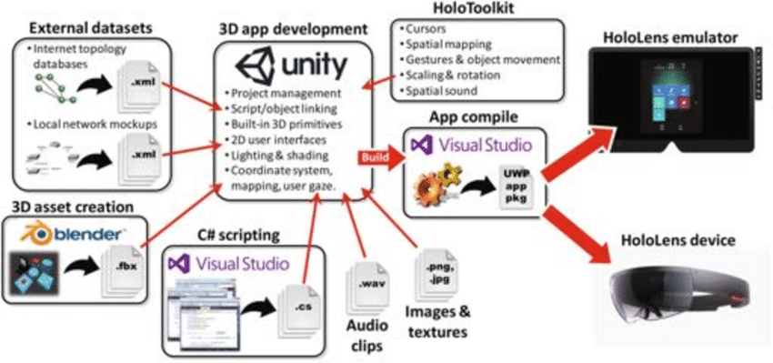{#fig-devwkflow width="5in"}

TODO: create an accurate image of HL/Unity/MRTK workflow to replace this one

Unity development for HoloLens2 generally proceeds as illustrated in @fig-devwkflow, and described below.

1.  Configure a scene in the Unity editor, including the placement, orientation, and properties of rendered items and UI components, along with cameras, lights, and other "helper objects" used to manage the experience.

2.  Write C# scripts to control scene interactions. These scripts are attached to game objects and get events, trigger responses, and pass messages to other objects. Unity's component-driven architecture offers a variety of predefined methods and event functions, which is extended by MRTK.

3.  Do initial testing, using the Unity editor to simulate HL2 interactions directly on the laptop screens. This approach allows for rapid iteration and real-time feedback to changes made in the editor, facilitating early debugging.

4.  Building for the HL2 device is a two step process. First, Unity generates a bundle of processed data and scripts. The result is then used by VS to compile and package a UWP (Universal Windows Platform) app for the HL2. In the process all C# scripts are converted into C++, and then into a native binary for the HL2's ARM-based architecture.

5.  Finally, the UWP app is transferred to the HL2 via USB.

The inter-dependencies between Unity, MRTK, and VS, each with their own packaging systems, dependencies, and versions, made this an intricate process. Our initial understanding was greatly accelerated by Microsoft's online resources[^24-methods-17] and tutorials[^24-methods-18], along with Ferrone's annually updated *Learning C# by Developing Games in Unity* [-@ferrone2021learn].

[^24-methods-17]: MRTK Unity Documentation: <https://learn.microsoft.com/en-us/windows/mixed-reality/mrtk-unity/mrtk2>

[^24-methods-18]: MRTK Tutorials: <https://learn.microsoft.com/en-us/training/modules/learn-mrtk-tutorials/>

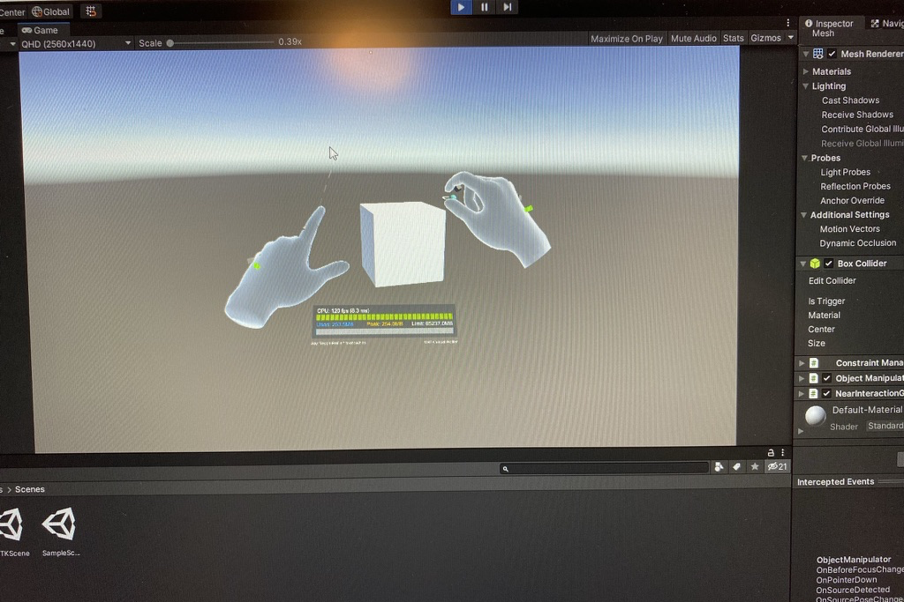{#fig-unityhl width="5in"}

TODO: get a better image of Unity HL2 simulator interface

### Design

#### HMDAR Treatment

The HMDAR experience was analogous to that of the PAR treatment. Interactions in both were controlled by hand placement / motion in the scene, mimicking button inputs. Both used a fixture to keep the model in the reference position, facilitating the alignment of virtual objects. Essentially, both were projected AR experiences, differentiated primarily by the manner of projection and input detection.

The PAR system used traditional optics to project virtual instructions onto the work surface and a depth-sensing camera to detect inputs. "Tracking" in this case was static and mechanically set, where the projector's orientation, throw angle, and focal length were fixed based on its location relative to the workpiece.

The HMDAR system used the HL2 to project virtual instructions into the operator's visual field via a sophisticated sensing, display, imaging, and optical systems. This user-centric display is the affordance that differentiates the HMDAR treatment. Tracking was dynamic, based on the operator's position and head angle relative to the work surface, and intrinsic properties of the HL2 system. Input detection utilized the system's hand tracking capabilities, which rely on fused sensor data and machine learning techniques.

#### HMDMR Treatment

A consistent approach was taken for the HMDMR treatment design, extending the capabilities of the HMDAR treatment. HMDMR used more sophisticated tracking methods to enable freeform interaction with the workpiece. This

### Implementation

TODO: make project code and data available?

The HMDAR treatment was developed first. Using the HMDAR version as a baseline, the HMDMR version extended it to incorporate model based tracking methods.

#### HMDAR Implementation

This effort primarily involved: (1) recreating the PAR's instructional design approach, (2) setting up the interaction methods, and (3) implementing the tracking system.

The first was relatively straightforward. Assets were modeled in Unity to resemble components from the PAR instructions. They were arranged in the scene relative to the workpiece location, based on an established scale. Finally, scripts were written to control the scenario logic, changing the scene based on user behavior.

Our interaction implementation relied on HL2 input systems provided by MRTK's modular, component-based architecture. In this system, input actions like `select` or `activate` and the events they trigger act as the bridge between the user's physical actions and the software's response. Physical actions are captured via HL2 sensors and interpreted by MRTK's various modalities, including gesture and hand tracking. Different interaction styles are associated with available pointer types, e.g. ray pointers for distant interactions and poke pointers for nearby. With this approach a diverse range of interactions can be design through careful composition of components.

For HMDAR tracking, we relied on VE's *Area Targets*[^24-methods-19] feature, an implementation of the area-based tracking methods described in @sec-tracking. The area-based tracking method compares a 3D model of the workspace with a real-time spatial map of the same to determine the current position and angle of the participant's head relative to it. The spatial map is a polygonal mesh generated by the HL2 at runtime. It is created with live scene data from the depth sensor, visible light cameras, and inertial measurement unit. A sample is shown in @fig-spatmap.

[^24-methods-19]: Vuforia Area Targets: <https://developer.vuforia.com/library/environments/area-targets>

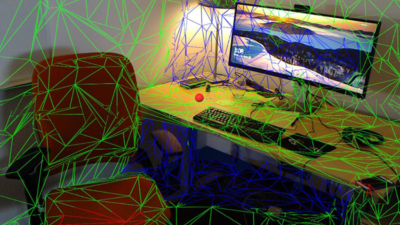{#fig-spatmap width="5in"}

TODO: replace with image of spatial mapping from study

Area-based tracking was selected over image or marker-based methods to minimize tracking loss. Marker-based tracking will fail if there are no markers within view of the HMD's sensors. Area-based tracking provides a continuous map of registration points for the entire scene, greatly reducing drop-outs. It also tends to (re)acquire tracking more quickly than marker-based methods, again due to the number and distribution of features available.

The 3D model is created offline, first by scanning the area with the Vuforia Creator App[^24-methods-20]. Pictured in @fig-areatgt-a, this tool uses a LiDAR equipped iPhone / iPad Pro to capture an accurate model of the area in E57 format, per ASTM E2807 [@astm2019stand]. The E57 data is then processed to generate an Area Target asset package for Unity, which includes all the required geometry, textures, and metadata.

[^24-methods-20]: Vuforia Creator App: <https://developer.vuforia.com/library/tools/creator-app>

::: {#fig-areatgt layout-ncol="2"}
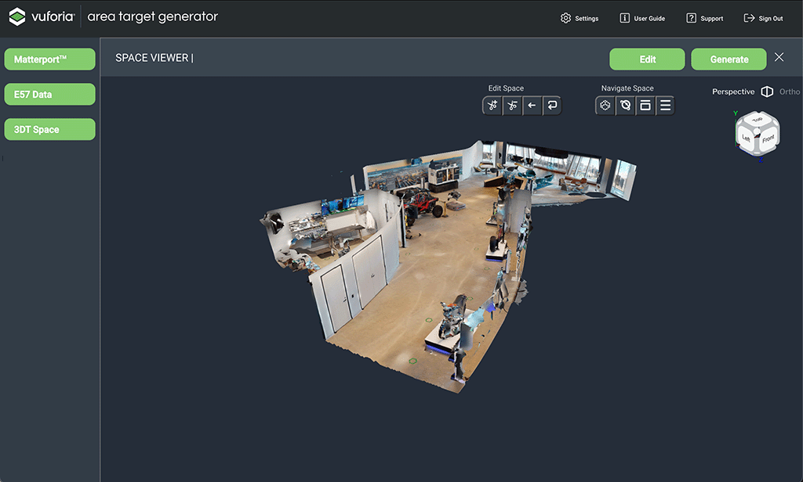{#fig-areatgt-a}

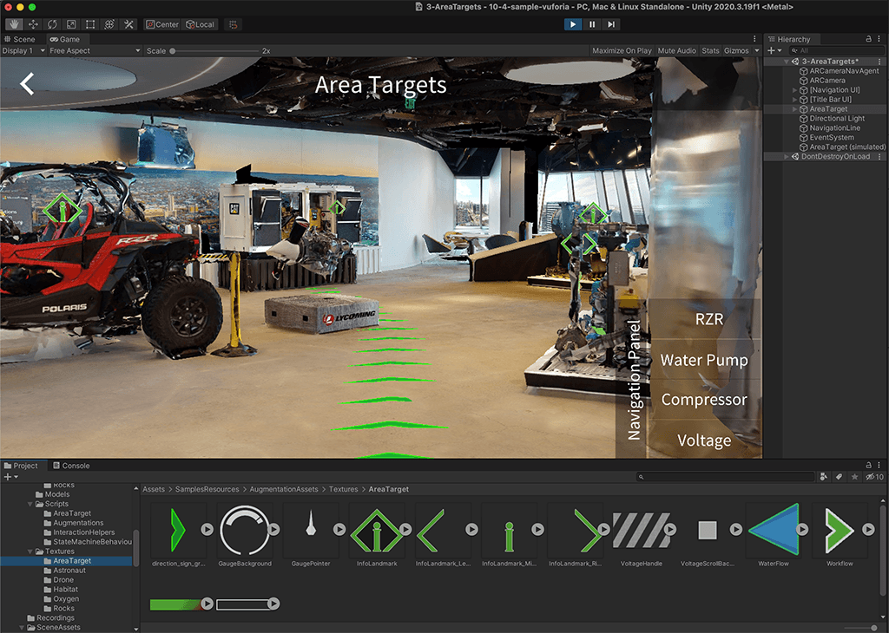{#fig-areatgt-b width="85%"}

Vuforia Area Target Processing
:::

TODO: replace with images from study: VE creator app and work area target

Once imported into Unity and properly configured[^24-methods-21], the 3D model is used to align the placement of virtual objects in the real world scene. This allows the developer to design the experience in the context of the real world model, as seen in @fig-areatgt-b.

[^24-methods-21]: Vuforia Area Targets in Unity: <https://developer.vuforia.com/library/develop-area-targets/area-targets-unity>

Finally, at runtime, key points encoded from the Area Target mesh are compared with the real-time spatial map to estimate the operator's head position and angle relative to the workpiece, thus establishing a coordinate system for the spatially coherent placement of virtual objects.

#### HMDMR Implementation

In order to support freeform interaction, the system needed a way to properly place instructional cues on the workpiece, regardless of its position and orientation. This was accomplished with model-based tracking, using the Model Targets[^24-methods-22] feature from VE. Note that this treatment continues to use Area Targets for workspace pose estimation, but adds Model Targets for those involving the workpiece. Otherwise, the HMDMR implementation is unaltered.

[^24-methods-22]: Vuforia Model Targets: <https://developer.vuforia.com/library/objects/model-targets>

The distinct technical requirements of model and area based tracking necessitate separate implementations. Where area-based tracking focuses on spatial orientation within a static environment, the prime challenge for model-based tracking is dynamic object recognition and pose estimation. While there might be some overlap in the fundamental computer vision and machine learning techniques used, the specific algorithms and their optimization differ significantly, catering to the unique challenges of each tracking type.

Overall, the Model Target implementation process was similar to that for Area Targets. First, a 3D model of the object was constructed and converted into a Model Target using VE tools. These steps were completed offline. At runtime, the system again compares live sensor data with Model Target data to recognize and then track object(s) in the scene.

Model source data was constructed in LeoCAD[^24-methods-23], a tool for designing models using LEGO bricks. LeoCAD uses the comprehensive LDraw[^24-methods-24] database of LEGO parts, most of which are modeled from actual pieces. This standard uses a proprietary unit of measure, the LDraw Unit (LDU), which is based on the smallest stud-to-stud spacing on a standard LEGO brick: 1 LDU = 0.4mm.

[^24-methods-23]: LeoCAD: <https://www.leocad.org/>

[^24-methods-24]: LDraw: <https://ldraw.org/>

TODO: cite LDraw standard?

LeoCAD's design adheres to LEGO design principles, ensuring that the way parts attach in the software reflects the real-world equivalent. The combination of LDraw's precision and LeoCAD's tooling ensures that the resulting models are faithful representations of their physical counterparts.

@fig-leocad-a is a screenshot of the LeoCAD interface, highlighting some of its capabilities. Both LDraw and LeoCAD are unofficial, open source, community run, multi-platform tools that are free to use.

::: {#fig-leocad layout-ncol="2"}
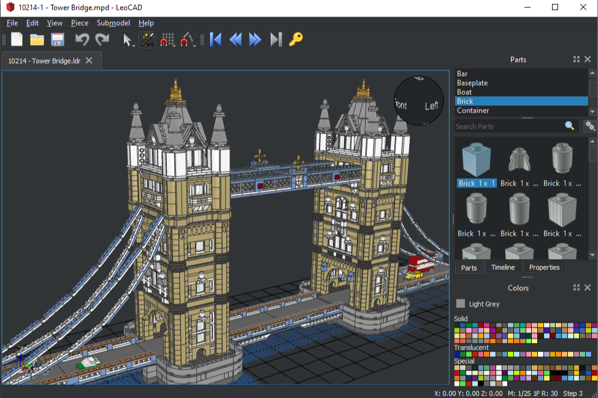{#fig-leocad-a width="95%"}

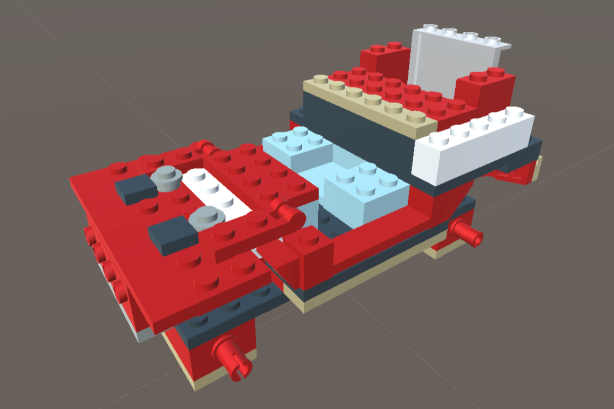{#fig-leocad-b width="95%"}

LeoCAD UI and Model Target
:::

Our source model was constructed in LeoCAD based on the PWI, using LDraw models of the specified LEGO parts. The result, seen in @fig-leocad-b, was exported as a 3DS[^24-methods-25] file and imported into Unity as a part hierarchy. There, it was scaled from LDUs to conventional units and exported in the FBX[^24-methods-26] interchange format for VE's Model Target Generator (MTG).

[^24-methods-25]: 3DS File Type: <https://en.wikipedia.org/wiki/.3ds>

[^24-methods-26]: FBX File Type: <https://en.wikipedia.org/wiki/FBX>

The MTG supports two Model Target types. *Advanced Model Targets* can be automatically recognized and tracked from any angle, without the manual alignment and recognition process required by *Standard Model Targets*. The requirement for the HMDMR treatment to provide freeform interactions in an otherwise equivalent experience mandated the use of Advanced Model Targets.

The MTG process begins by checking for model suitability. Model targets must be free of errors and unnecessary internal geometry, with rigid geometry and real-world scale. Ideal candidates for Advanced tracking also feature optically stable surface features, minimal symmetry, and accurate surface colors. Highly reflective, transparent, or featureless surfaces provide insufficient visual cues and highly symmetric objects make it difficult to determine orientation.

Next, the model geometry is analyzed and a set of Guide Views are automatically generated for a 360-degree recognition range. This step leverages deep learning methods trained to generate optimal views from arbitrary angles based on the geometric features and surface qualities of the model. The output of this process includes the trained recognition model, along with the associated dataset and guide views. This package is imported into Unity and used by VE to provide the desired model-tracking functionality.

TODO: adjust / update model tracking implementation description per Carson's details below?

> As for model tracking, if I recall correctly, since only a few pieces changed between the start and end of the training, I was able to just use one model of the car before any pieces were added. Another reason this approach worked was that once the model tracking system detects a match between the target model and a real-world object, it "expects" to keep finding the target object there, so small changes in the car don't really throw it off. It also helped a lot that we had a really high-quality model of the car, so the model tracking had a lot of points to pull from when comparing real-world objects to the target model. As for displaying the individual pieces as you build them, if I remember correctly, I just exported a finished version of the car's model as separate pieces and then enabled and disabled specific pieces as needed.

### Challenges

TODO: elaborate on list of development challenges and/or convert into narrative

-   reflectance of aluminum fixture confused trackers
-   complexity of MR, less reliable tracking, crashes
-   complexity of software dev environment; inexperience of developers; part time development
-   The build times for step four can be quite disruptive; donning / doffing
-   Managing and optimizing for the computational constraints of the HL2.
-   Balancing fidelity and performance in the model and area-based tracking.
-   area tracking sensitive to changes in the configuration of the workstation

## Participants

### Recruitment and Selection

A convenience sample of participants were recruited from the Auburn University community using digital and printed promotions around campus, the graduate school mailing list, and outreach in various undergraduate engineering classrooms. The later focused on freshman and sophomore engineering students in Industrial & Systems Engineering, as they are accessible and most likely to meet all requirements. @fig-recruit exemplifies the recruiting materials, approved copies of which are included in [Appendix A, IRB Documentation](#app-irb).

{#fig-recruit width="5in"}

Potential participants in the first investigation were screened for exclusion based on their age (under 19) or a tendency to motion sickness. Additionally, we screened for experience using head-mounted or projected AR devices with gesture based controls. This does not exclude those having experience with VR headsets like META's Occulus product line, which is relatively common among the target population, but utilize traditional input devices.[^24-methods-27] Finally, we excluded anyone that had previously participated in a manufacturing simulation in the Tiger Motors Lean Education Center as part of INSY 5800/6800 or otherwise. This ensured that none of our participants had experience with the assembly task.

[^24-methods-27]: This distinction had to be explained to several interested participants, which supports the notion that the differences between AR and VR are not yet well understood. Ultimately, no participants were eliminated by this requirement.

TODO: mention target sample size and justify based on power / practical limits

### Benefits and Compensation

Other than the compensation described below, there were no direct benefits for participants in this study. All were offered an opportunity to interact with projection and/or head-mounted AR hardware and training methods for the first time. This may have lead them to a greater appreciation of the benefits and opportunities these technologies offer.

In order to incentivize sign-ups, some extra credit and the possibility of financial compensation were offered. In addition, all participants were invited to an event at the end of the study.

#### Extra Credit

Any instructor promoting these studies to their students was free to provide extra credit for participation. This was entirely at their discretion. We cautioned all instructors to offer no more than 1% on the final class average, and encouraged them to provide alternative bonuses for students unable to participate.

#### End of Study Event {#comp-event}

At the conclusion of the main study, all participants were invited to return to the lab for an "open house" event. This gave them the opportunity to experience other treatments and related technologies, and learn more about the experiment and lab. Food and drink were provided. In exchange, we asked all attendees to participate in a brief retention experiment. Attendance and participation were voluntary.

#### Compensation {#sec-comp}

The possibility of financial compensation was introduced in the final IRB Modification, submitted April 3, 2023. Following its approval on April 10, we began promoting this retroactive benefit. All participants in the main study were eligible for one of three random drawings. Those that attended the end of study open house qualified for additional awards, as outlined in @tbl-comp.

| Study     | Category      | Quantity | Amount (each) | Sub-Total |
|-----------|---------------|:--------:|:-------------:|:---------:|
| Main      | Participation |    6     |     \$25      |   \$150   |
| Retention | Performance   |    1     |     \$50      |   \$50    |
| Retention | Participation |    4     |     \$25      |   \$100   |

: Compensation drawings by study and award category. {#tbl-comp .striped}

For the performance prize in the retention study, eligibility was limited to those who completed the experiment in under one minute without errors. A total of \$300 was awarded via email in the form of digital Amazon Gift Cards.

No member of the research team was eligible for any of the financial compensation described, and all payment processing was handled by appropriate members of the ISE staff.

### Onboarding

The initial participant onboarding process was conducted manually by the PI. In a phone call with interested participants the PI would (1) briefly explain the investigation, recapping and elaborating on the recruiting materials; (2) discuss the exclusion criteria and identify relevant issues for the candidate; (3) set expectations for participant involvement, including time commitment and tasks; and (4) answer any questions the candidate had regarding participation in the investigation.

If the candidate indicated a willingness to proceed, their information was collected using the Subject Recruitment Data Sheet included in [Appendix A](#app-irb). A unique participant ID was logged on the code list and a date and time for data collection were then assigned. As [detailed below](#sec-privacy), the code list and consent form provided the only link between personally identifiable information and experimental data. Afterwards, a confirmation email was sent. A copy of the Informed Consent form was included for their review prior to the appointment.

This process quickly proved impractical, and a self-service web-based alternative was offered. By eliminating the reliance on manual, call-based screening, SignUpGenius[^24-methods-28] streamlined the entire onboarding and scheduling process. This increased the rate for converting interested into scheduled participants and allowed the team to focus on running the experiments.

[^24-methods-28]: SignUpGenius: <https://signupgenius.com>

### Random Assignment {#sec-random}

Random assignment of participants was accomplished through a combination of randomized ordering of treatments and random participant scheduling. Treatments were ordered using a methodical yet randomized process to ensure a balanced distribution. Participants set their own appointments based on availability, without knowledge of the underlying treatments or their ordering. During the intake process, each was assigned the next randomly-ordered treatment type. By randomized the order of both participation and treatment assignment this design ensures assignment without bias or predictability. Another advantage of this approach was that it helped ensure a dataset balanced by treatment type, regardless of the final number of participants.

Treatment randomization was completed before the onboarding process began. To ensure that each treatment was tested at the start, a random sequence of all four treatments started the order. Next, a set of eight treatments, including two of each type, was shuffled to create a randomly ordered batch with an even distribution. This block-wise process was repeated as necessary to cover the maximum number of participants. The batches were combined, in the order generated, to create the final treatment sequence.

The treatment randomization process was implemented with a simple Python function, `gen_treatment_order()`, as seen in @fig-rctpy, below. The `random.shuffle`[^24-methods-29] function from the base Python 3.x distribution was used to randomly reorder a group of values. Though this program was only run once (after validating and verifying its output), no random seed was set to ensure that a unique sequence was generated with each use.

[^24-methods-29]: `random.shuffle` Documentation: <https://docs.python.org/3/library/random.html#random.shuffle>

::: {#fig-rctpy}
``` python
def gen_treatment_order(n=2):
    '''
    generate random treatment order
    
    IMTS is a list of the four treatments
    NUM_CYCLES is the number of 4-treat batches
    '''

    # start with random selection of all treats
    trials = []
    first_set = IMTS.copy()
    random.shuffle(first_set)
    trials.extend(first_set)

    # shuffle IMTS in groups of 8 (two cycles)
    for _ in range(NUM_CYCLES // n):
        part_trial = IMTS * n
        random.shuffle(part_trial)
        trials.extend(part_trial)
    
    return trials
```

Python 3.x Code for Treatment Randomization
:::

## Research Compliance

As with any protocol that involves human participants, this study required Institutional Review Board (IRB) approval. This section will describe that process, and detail considerations related to consent, privacy, security, and risks / discomforts identified.

### Institutional Review Board

An initial review of the protocol found that it created minimal risk to participants, did not involve vulnerable populations, invasive methods, or sensitive data, and required informed consent. Furthermore, it involved the "collection of data from voice, video, digital, or image recordings," which is identified by the University as a category of research eligible for expedited review.[^24-methods-30]

[^24-methods-30]: Per AU IRB Expedited Category Guidance: <https://cws.auburn.edu/shared/files?id=159&filename=AU%20Expedited%20Categories%20Guidance.doc>

The IRB submission and expedited review process began in December of 2022, and final approval was granted on April 10, 2023. During that time four versions of the IRB were approved, and only two rejected. The approval dates and changes are summarized in @tbl-irbs.

| Version | Description                                 | Approved |
|---------|---------------------------------------------|:--------:|
| 1.1     | Original submission                         | 1/30/23  |
| 1.1a1   | Adjusted protocol to add survey instruments | 2/13/23  |
| 2.1     | Incorporated 2nd investigation              | 2/23/23  |
| 3.0     | Added compensation                          | 4/10/23  |

: IRB Version History {#tbl-irbs .striped}

This process was somewhat complicated by the decision to incorporate two separate but related investigations into a single application. The first investigation (I1) is the focus of this dissertation. I2 (the second investigation) is a separate work that used similar methods to investigate the relationship between I4.0 technologies and Lean Manufacturing systems. There is no connection between I1 and I2 beyond the collaborative relationship between their research teams.

The development of the IRB was a collaborative effort which I spearheaded as the Principle Investigator (PI), authoring the majority of the application, and ensuring alignment with the study's goals and ethical standards. Contributions from other members of the research teams, as specified in [Appendix B: Team Contribution Matrix](#app-contribs), were essential to its thorough design and timely approval.

The final approved version, including all supporting materials, is incorporated as [Appendix A: Institutional Review Board Approval](#app-irb). All processes described herein are all based on the approved protocols.

### Consent

All participants were provided a copy of the approved informed consent form in advance of their trial. As part of the intake process they were provided a paper copy for further review and encouraged to ask any questions or share any concerns they might have. After a verbal confirmation that the participant had read and is satisfied with the terms of the informed consent agreement, they were asked to sign and date it. The form was then countersigned and placed in a locked filebox.

### Privacy and Data Security {#sec-privacy}

A variety of data were collected for this study, including video recordings, performance metrics, demographic information, and survey responses. All data were collected anonymously, referenced only by the unique ID assigned to each participant. The code list, used solely for contacting participants during the ongoing protocol, was securely stored alongside the consent forms in a locked box within a restricted-access location. Notably, the consent forms do not include any reference to the participants' ID numbers. Both the consent forms and the code list are maintained exclusively in paper format to facilitate secure storage and subsequent disposal through shredding. Upon the completion of the protocol, the code list will be destroyed, thus rendering the data completely anonymous. These measures were diligently enforced to protect the privacy and confidentiality of participant data.

All electronic data pertaining to the study are stored on a secure server. Non-identifiable data is available to other members of the research group, for the purposes of approved research, under conditions that ensure continued confidentiality. Access to consent forms and the code list is limited to the PI and, if required, the research committee.

For reasons detailed in the [study design](#study-design), two angles of each trial were recorded on video; a view from the participant's perspective and a side view focused on the work surface. The side view was carefully framed to limit identification of the participant, and later edited to crop out identifying features, ensuring participant privacy. Additionally, all participants were required to wear the HoloLens2 head-mounted display, which further obscured their appearance.

### Risks and Discomforts

Beyond the privacy and data concerns previously described, other potential risks and discomforts were identified. Prolonged used of HMD VSTs has been reported to cause mild neck strain, disorientation, and eye strain in some cases. The optical and physical design of these systems can also result in a limited or obscured field of view and degraded acuity, which could increase the participant's risk of trip or impact.

TODO: cite risk of prolonged use using ISO paper?

The HL2's untethered design with wide, unobstructed field of view mitigates many of these concerns, but additional precautions were taken. All participants were screened for a tendency towards motion sickness. The study was intentionally designed to limit each participant's time wearing the HL2, and to ensure that they were generally stationary in an obstruction-free environment. Finally, the Lean Lab was selected in part because it is a organized, safe, and well-lit environment with no history of related hazards.

As these experiments were conducted in the Spring of 2023, the risk of COVID-19 exposure remained a lingering concern. Precautions were implemented during data collection as outlined in the University-provided protocol for studies without high-risk procedures or participants (Category C). All work surfaces and equipment were wiped down before and after each participant, and necessary supplies were made available. All research participants followed the University’s guidance on self-screening. Throughout the administration of this study, the CDC’s COVID-19 community level for Lee County, Alabama remained LOW, eliminating the need for participant screening. The Shelby Center for Engineering Technology, where this protocol was administered, is assigned the highest level of building readiness due to increased air turn-over and filtration.

This study did not involve any vulnerable populations. Overall, the likelihood and impact of any of the risks outlined above were considered low. Nevertheless, all participant activities were supervised to monitor for likely symptoms or unexpected side-effects. In either event, the experiment would be suspended and the situation assessed. If escalation was deemed necessary, an emergency plan and contact list were available to the research team.

During the post-experiment debriefing all participants were asked about injury and discomfort, and were observed for lingering or delayed effects. Ultimately, only a few mild discomforts were reported, and no significant side effects, injuries, or need for escalation.

## Conduct of First Session {#sec-conduct1}

This section will describe key operational details for conducting the first session protocol, including the learning and recall experiments. For more information, see [Appendix C - Session 1 Conduct](#app-s1conduct).

The conduct of this study was designed to ensure participants felt comfortable and understood the tasks, while also aiming for valid results and thorough data collection. The approach balanced a need for clear procedures and ethical integrity with the flexibility required to adapt to individual participant needs.

### Division of Labor {#sec-dol}

The approach detailed herein was designed for three roles, referred to as the primary, secondary, and tech. The role of the primary investigator (PI) was always played by the author.[^24-methods-31] The secondary investigator (SI) role was typically filled by his counterparts on collaborating studies. Finally, the tech support (TS) role was played by a member of the study's HL2 development team.

[^24-methods-31]: Except when he was quarantined for a week with COVID, during which PIs from collaborating studies generously substituted. The show must go on!

The responsibilities of each role vary throughout the session as described below. All three roles were usually filled for each session, allowing for the most comfortable division of labor, but some trials were run effectively with fewer.

### Start and End of Day Procedures

Daily preparation for the study involves careful setup across three roles. The PI ensures the schedule and trial documents are ready, workstations and PCs are prepared and operational, and camera equipment is correctly configured and tested. The SI handles the specifics of the trial setup, including treatment slates, car checks, and part inventories, while coordinating with additional support staff. TS focuses on maintaining the software, streaming setup, and hardware sanitation. Together, the team ensures a controlled environment ready for trials.

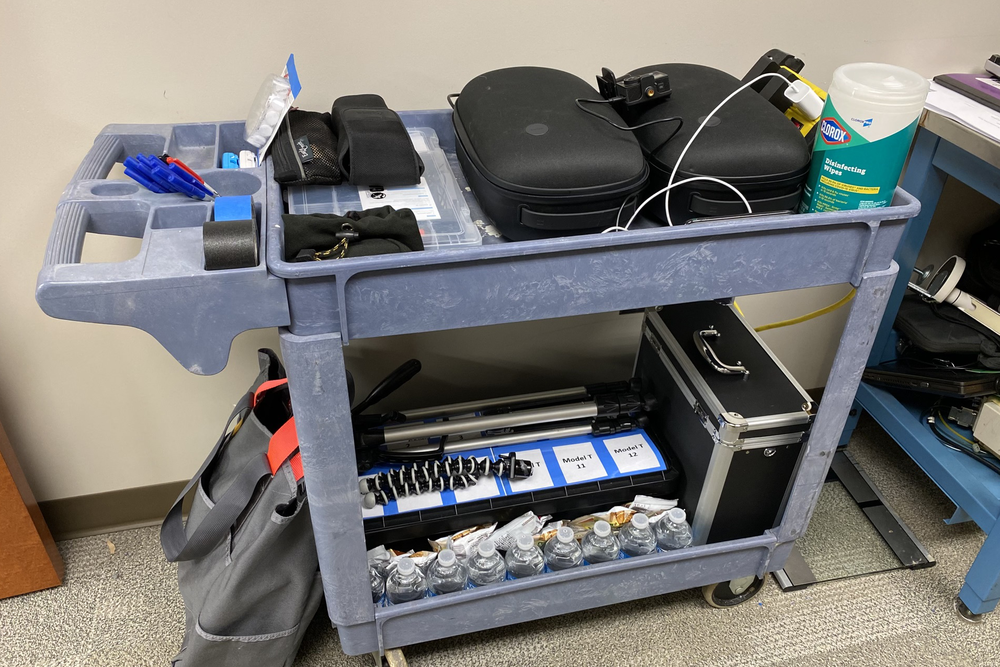{#fig-cart width="5in"}

The PI is also responsible for returning the lab it its original condition at the end of each day. Post-session procedures include resetting all cell two workstations, powering down equipment, cleaning and sanitizing the lab, turning off lights, and securing the premises. Additionally, batteries and memory cards are tended to, and consent forms securely stored. Both setup and tear-down were facilitated by the rolling cart adopted for this study (@fig-cart), affectionately known as the "battle wagon."

### Workflow and Roles {#sec-workflow}

Workstations seven through nine are configured for the first session as seen in @fig-wssetup1. The numbered positions indicate the flow of work in process (WIP) through the system. Assemblies begin at (1) and move, sequentially, to WS-8 (2). When a car is completed or retired (due to breakage considered irreparable by the participant), it is moved to either the green (3a) or red tray (3b), respectively. WIP at (3a) and (3b) is promptly collected and moved to (4) for inspection, after which they are moved to the results tray (not represented). Video recording and HL2 performance are monitored via the PC and iPad represented. This figure is not to scale but does effectively convey the approach used.

{#fig-wssetup1 width="5in"}

The flow of WIP is facilitated by the SI, who is responsible for collecting and inspecting finished assemblies, recording results, and related tasks. The PI is focused on interactions with the participant and recording observations about their performance. The TS manages the HL2 system and acts as a secondary observer. In addition to these primary duties, all team members collaborated effectively to ensure the successful conduct of this study. This division of labor is summarized in @tbl-resp.

| Responsibility  | Description                                                                                                                                                                                               |  Role   |
|-------------------|----------------------------------|:-----------------:|
| Workflow        | Facilitate the flow of work into and out of ST-8. Ensure that an inventory is available on ST-7 and promptly collect completed or rework items from ST-8.                                                 |   SI    |
| Data Collection | Review all completed, retired, and incomplete assemblies. Record the number and type of errors for each, along with the steps completed if incomplete.                                                    |   SI    |
| Documentation   | Photograph the starting setup and the final output with the trial card in frame. Get additional photos were required to document unexpected results.                                                      |   SI    |
| Run HL2         | Manage operation of the HL2 for treatments and/or recording. Monitor the stream and recording. Troubleshoot as required.                                                                                  |   TS    |
| Interact        | Lead all participant interactions.                                                                                                                                                                        |   PI    |
| Observe         | Carefully observe the participant without disrupting their work. Intervene if required to correct unexpected behavior. Record interesting observations and insights. Respond to any work-stoppage events. |   PI    |
| Recycle         | Prepare work area for next experiment or participant. Disassemble ST-8 complete cars to ST-7 state and verify. Maintain bin inventory, reset recording devices and HL2.                                   | SI & TS |

: Primary Responsibilities, First Session {#tbl-resp .striped}

At the start of each day, ST-7 through 9 are cleared and configured as described above. Ten pre-built assemblies are positioned to the participant's left, at position (1). The construction of all ST-7 inventory is carefully verified against ST-7 standards, as pictured in @fig-st8wip, to ensure an accurate starting point for all ST-8 tasks. A completed ST-8 assembly is also pictured for comparison.

::: {#fig-st8wip layout-ncol="2"}
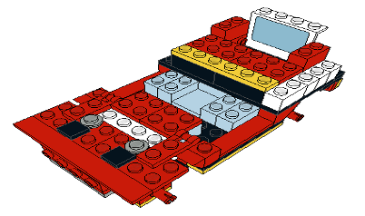{#fig-st8wip-a width="95%"}

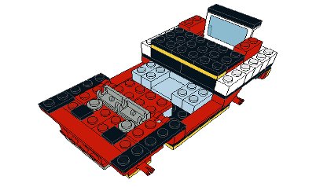{#fig-st8wip-b width="95%"}

Start and End Configurations for ST-8 Assemblies
:::

TODO: replace ST8 start and end images with photos?

TODO: fixture blue

### General Policies {#sec-genpol}

Except as otherwise noted, several policies are followed throughout the conduct of each session. Participants are encouraged to ask questions at any time. At each transition point, their understanding and readiness to proceed are confirmed. Discussion is allowed but limited and questions are answered but not embellished upon. Members of the research team are not allowed to prompt or otherwise instruct participants, except as specified. Overall, these policies were established to put participants at ease while maintaining a semi-formal tone and staying "on-script."

### Session Procedure

Following the initial setup, each session would proceed as follows.

1.  Intake: welcome the participant, complete initial paperwork and instruments
2.  Orientation: introduce the participant to the Lean Lab and their work area
3.  Introduction: describe the general workflow at ST-7
4.  Demo: demonstrate the assigned treatment at ST-8
5.  HoloLens: introduce the participant to the HL2; don it and adjust fitment
6.  Practice: have the participant practice using their assigned treatment
7.  Learning Experiment: conduct the first experiment
8.  Intermission: complete TLX and SUS for first experiment
9.  Reset: prepare ST-8 for the second experiment
10. Recall Experiment: conduct the second experiment
11. Debrief: complete TLX and SUS for the second experiment; gather General Feedback
12. Recycle: prepare ST-8 for the next participant

#### Intake

Each participant is greeted and welcomed into the conference room, where drinks and snacks are offered. After they are settled, the participant is talked through the consent document, which was previously supplied. Once any questions are answered, they are asked to acknowledge their understanding and acceptance of it, initial each page, and sign. The document is countersigned by the primary investigator and placed in a lockbox with other consent forms before proceeding.

In accordance with the experimental procedure outlined in the [NASA TLX](#sec-tlx) instructions, all participants were familiarized with that instrument during the intake process. The primary investigator first introduces the TLX as a tool for workload assessment and briefly summarizes its design. The participant is then asked to read the provided *Subject Instructions*, after which their questions are answered. Finally, the participant is asked to complete a mock administration of the TLX for a hypothetical task, including both the *Sources of Workload Evaluation* and *Workload Rating Scales*. For this step they were asked to imagine they had just run a marathon, a task chosen for the high level of workload likely associated by all participants, regardless of running experience.

Next, the participant provides a variety of demographic data on the [Participant Intake Form](#sec-pif) and self-reports behavioral data on the [Behavioral Control Survey](#sec-bcs). Finally, they are briefed on COVID protocols and emergency procedures.

#### Orientation

The participant is guided to the second work cell while receiving a brief summary of the lab's LEGO-based training methodology, which emphasizes real-world practices and efficient, high quality production. Importantly, they are made aware of the line's 60-second takt time and its implications. This description is read from a script to ensure consistent delivery of the information. Upon arrival at the second work cell, they are introduced to assisting members of the research team.

#### Introduction

At the second work cell, workstations seven and eight are identified. Before moving to ST-8, where the experiment is conducted, participants are introduced to the general assembly process at ST-7. They are shown how to interpret the paper work instructions and a few assembly steps are demonstrated. The PWI from ST-7 is used to limit exposure to the ST-8 task details.

Then, a few rules and expectations are set related to dropped parts, correcting errors, breakage, and rework. It is also explained that the research team will only intervene in the event of an event that stops work.

#### Demonstration

The participant is led to ST-8 where they are informed of the assigned treatment. Interventions are briefly demonstrated to all those assigned, while members of the control group proceed to the next step. Each intervention is demonstrated in a manner similar to that used for the PWI at ST-7, with a focus on the treatment's operational details rather than the instructional content. Critically, all system controls, UI elements, and feedback mechanisms are explicitly described.

The HMDAR and HMDMR treatments, whose output is invisible to observers, requires a different approach. One member of the research team performs the demo while another narrates the process. The HL2's output is simultaneously streamed to a nearby laptop on ST-9. This allows participants to observe the HL2 operations as they are described, from both real and virtual perspectives.

#### HoloLens

Participants are reminded that, for observation and recording purposes, they are required to wear the HL2 during the practice session and all subsequent experiments. Additionally, they are notified of a second camera, positioned to the left of ST-8 and adjusted to only capture the work area.

Streaming is initiated on the HL2 before the participant is advised to don the device. Assistance is provided as necessary to ensure proper fit, after which the participant is asked to look at a reference point. If the streamed video centers on that target, it confirms that the wearer's line of sight aligns with the HL2's field of view.

#### Practice

Participants are instructed to engage in a brief practice session during which they assemble the first four bricks according to the provided instructions. This task is designed to ensure their operational understanding of the instructional treatment, while deliberately avoiding undesirable task training.

#### Learning Experiment

The assigned task, timeline, priorities (as outlined in @sec-learning), and workflow (as outlined in @sec-workflow) are described. Recording is then initiated on both cameras and participants are asked to view the treatment slate (see @fig-slate) while recording and alignment are re-checked. This also serves to mark the start of both videos with essential details that might help avoid confusion later. A 10-minute timer in view of the participant and both cameras is initiated, and they begin building with the aid of their IMT. Data is collected during the experiment as described in @sec-s1data.

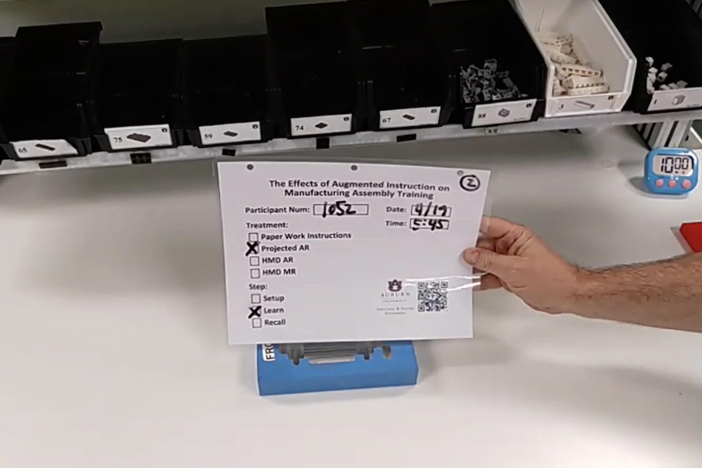{#fig-slate width="5in"}

#### Intermission and Reset

At the conclusion of the first experiment recordings are stopped and the participant is asked to remove the HL2. Then they are escorted back to the conference room, where they are asked to complete the [TLX](#sec-tlx) and [SUS](#sec-sus) based on their experience.

During this intermission, the research team records the learning results and resets the workstation for the next experiment. Four pre-built assemblies are put into inventory at ST-7, and any models built in the previous experiment are recycled to that standard. Photos of the results tray and reset inventory are taken to document the process and results.

::: {#fig-st8docs layout-ncol="2"}
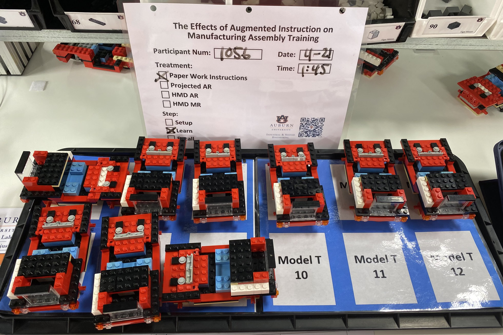{#fig-st8docs-a width="100%"}

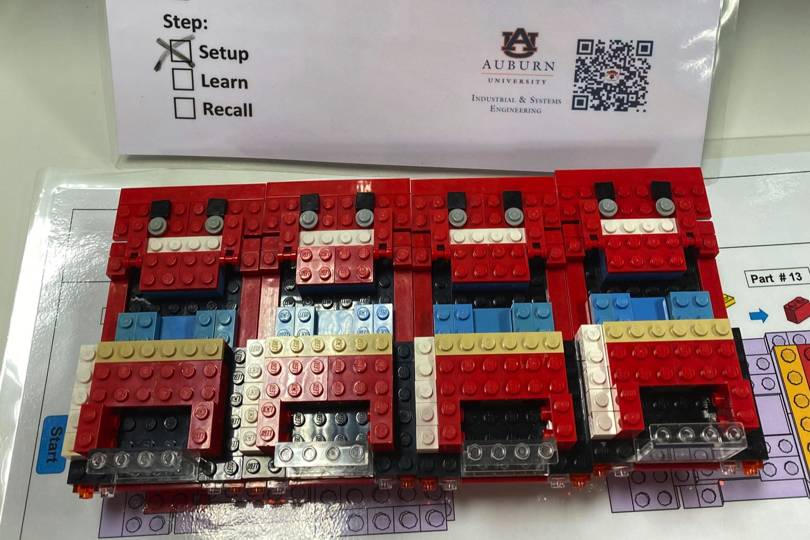{#fig-st8docs-b width="100%"}

Documenting Results and Setup
:::

#### Recall Experiment

The second experiment is conducted in the same manner as before. No timer or intervention is used, and the instructions / priorities are altered, per @sec-recall. Otherwise, the procedure is identical. This experiment concludes when four cars are completed.

#### Debrief

Following the second experiment the participant is led back to the conference room for the accompanying round of the TLX and SUS. Finally, the PI solicits any additional feedback the participant is willing to offer. For those that require prompting, the PI can refer to a list of standard topics. All participants are asked if they experienced injury or discomfort during the session. Feedback and responses are recorded on the General Feedback Sheet. Finally, the participant is thanked for their time and escorted to the exit.

#### Recycle

During the debrief, the research team records the recall results, resets the workstation for the next participant, and documents both with photographs.

## Conduct of Second Session {#sec-conduct2}

This section will describe key operational details for the retention assessment, which was conducted during the end of study event. As described in @sec-retention, the scope and complexity of these trials was limited by expected traffic at the event. This also necessitated different signup procedures, lab arrangement, workflow, and staffing, all of which are described below.

For additional details on the conduct of these trials, refer to [Appendix D](#app-s2conduct), where the step-by-step script used to conduct them is included.

### Signup

The signup process was again managed by SignUpGenius, making it easy for the research team and invitees alike. The system was configured to help even out the flow of arrivals, preventing a backlog and keeping the event well attended throughout the day.

Twelve different start times were offered, one every 15-minutes between noon and 3:15pm. Up to five people could sign up for any start time, allowing for up to 60 total signups. Though we expected fewer, this ensured some flexibility in start times for those interested in attending. Start times were set, but all attendees were free to stay as long as they liked.

### Setup and Traffic Flow

Prior to the event, the Lean Lab was arranged as depicted in @fig-party. Ongoing demonstrations for attendees would require the LG system at ST-8. Consequently, the retention experiment was relocated to ST-3, a similarly configured workstation in work cell #1. This choice ensured that the experience at ST-3 would most closely mimic ST-8, thus controlling for the effects of the change.

{#fig-party}

Experiments and demos from the collaborating study were conducted at ST-5 and 10, respectively.

### Workflow and Roles

Before entering, attendees would register at (1), where they were given the appropriate data sheet and welcomed inside. Seating was provided at (3) to handle the queue of attendees waiting for their trial. Partitions placed at (2) obscured their view of the ongoing experiments and demos. This provided privacy and prevented re-exposure to the instructional material. As each retention trial concluded participants were led, in order of arrival, to ST-3. Those finishing were thanked and informed of the food and available educational / entertainment options.

Volunteers from both studies were responsible for directing attendees through registration process, through the queue to their assigned experiment, and onto the activities that followed. The [general policies](sec-genpol) set forth in the first session were again applied.

At the end of the day the lab was cleaned and restored to its normal operating state.

### Session Procedure

Participants were asked to complete the ST-8 task for one car, from memory, without reference (e.g. paper work instructions). Data was efficiently collected with a single video camera, timer, and photos. With this approach, only a single research associate (RA) was required to direct and document the trial. An additional volunteer was responsible for recycling the inventory of assemblies.

## Administration of Protocol

This section will describe the manner in which the study was run, with a focus on administrative details like the team, scheduling, location, safety measures, quality assurance, and challenge.

### Personnel and Certifications

The IRB that this research was conducted under approved two related but separate studies. A third study planned to use the data from both for separate analysis. Members of all teams collaborated in the administration of the separate experiments, helping one another provide the coverage and support required to perform over 100 trials in a single semester.

As a result, the final IRB listed 13 key personnel, as summarized in @tbl-team.

| Type                | Description                                                                                                                  | Count |
|-------------------|----------------------------------|:-----------------:|
| Study PIs           | The Principal Investigators for all collaborating studies.                                                                   |   3   |
| Faculty Members     | Members of related committees, for oversight and institutional stewardship.                                                  |   3   |
| Research Assistants | Graduate (3) and undergraduate (1) student volunteers assisting with the conduct of experiments.                             |   4   |
| Technical Support   | Members of the undergraduate research team that developed the HL2 capabilities and assisted with the conduct of experiments. |   3   |

: Research Team Breakdown {#tbl-team .striped}

All team members were certified by the Collaborative Institutional Training Initiative[^24-methods-32] (CITI), in accordance with university policy and the team's commitment to professional research. Through this program they received training on the ethical implications and compliance standards of their work.

[^24-methods-32]: Collaborative Institutional Training Initiative: <https://about.citiprogram.org/>

Except for faculty members, members from all groups were directly involved in the various aspects of the conduct of this study, as detailed throughout this document. Volunteers signed up for shifts on SignUpGenius, using a form separate from the participants.

### First Session Scheduling

As discussed in @sec-timeline, the first session experiments were conducted in the Spring of 2023. Specifically, trials were run for 10 weeks, from February 10th to April 27th. A routine schedule of weekly trials was established based on the availability of the Lean Lab and members of the research team.

Between 10 and 12 slots were available each week at a variety of days and times. A total of approximately 100 available slots were offered. Though we planned to run significantly fewer, this would make it easier for interested participants to find a day and time that would work with their schedule. A few Saturday shifts were also offered for the same reason.

Each slot was 75-minutes in duration, which was slightly more than the estimated average treatment duration (60-minutes). This padding allowed us to accommodate late arrivals, unusually long trials, and other unexpected events with little knock-on effect.

SignUpGenius was configured to only show available slots in a rolling two-week window. This was done with the hopes of encouraging signups by creating a sense of scarcity and urgency, and reducing no-shows by preventing interested but forgetful participants from signing up too far in advance. At the start of each week the schedule was reviewed to make adjustments for staff availability (e.g. illness and travel) and notify interested participants of slots that remained open.

### Safety Measures

All team members were aware of the study's COVID-related precautions and emergency action plan, and committed to the self-screening and reporting as required by the former. Both documents were readily available to team members, who were trained to reach out to members of the included contact list or escalate to emergency or non-emergency assistance as deemed necessary. Current phone numbers were provided for all cases. This documentation is included with the approved IRB forms in [Appendix A](#app-irb).

Additionally, team members were trained to observe all participant activities for dizziness, related vestibular issues, or any other significant but unexpected side-effect. In that event, the experiment would be suspended, HL2 removed, and the participant seated for assessment. In the event assistance was required, the emergency plan would be consulted.

General safety procedures included routine sanitation and work area maintenance. All work surfaces were wiped down before each participant and the HL2 was sanitized between wearers. In keeping with the Lab's 5S[^24-methods-33] plan, all team members worked to ensure the work area remained free of obstructions and trip hazards.

[^24-methods-33]: 5S is a methodology and mindset for maintaining a work space organized for efficiency and effectiveness. <https://en.wikipedia.org/wiki/5S_(methodology)>

### Test Runs

Prior to running the first participant trials, a series of five test runs were conducted to train the research team on its execution and identify any procedural issues. These sessions utilized volunteer members of the research team that were not qualified to participate in the study due to their experience in the Lean Lab and/or with the interventions. Accordingly, no data was collected for subsequent analysis.

Feedback and notes collected during these tests were reviewed by the team and changes proposed. The outcome was used to refine the procedure, streamline its flow, identify details previously overlooked in the checklists and data collection forms, and flesh out the draft script. Though no large scale changes were made, collectively, the improvements had a meaningful effect on the procedure's overall quality. They were incorporated into the second IRB submission as appropriate to ensure it properly reflected the latest protocol.

### Quality Assurance

Throughout the design and conduct of this study, every effort was made to ensure its findings were valid and verifiable. Primarily, this was achieved through the deliberate and meticulous design of the protocol, as documented throughout this chapter.

Quality assurance was operationalized through a carefully documented procedure that integrated a script and checklists (see [Appendix C](#app-s1conduct)). The script was used by the PI to ensure consistent interactions with each participant. Checklists were used by the entire team to verify that workstations, assemblies, and equipment were always properly configured.

Standard roles, consistent staffing, and clearly defined responsibilities were all established to help ensure routine trials by reducing variability in their conduct. Test runs performed before the first participant were used to train the team and collectively identify ways to refine the plan. Once trials began, feedback from team members and participants was routinely used to make adjustments that improved the process without impacting the results.

Results recorded by the SI were routinely double-checked by the PI before being photographed for later review. Most data was extracted and verified outside of the hustle of data collection, using video and photo evidence to ensure the accuracy of data post-intervention.

Together, these measures helped ensure the quality of the data collected, thereby elevating the integrity of our findings.

## Data Extraction {#sec-extraction}

This section will describe the methods used to extract the data collected in instruments, data sheets, photographs, and video. All extraction processes were performed by the author on a 16" 2019 MacBook Pro (model A2141) with 2.3 GHz 8-Core Intel i9, 32GB of RAM, and an AMD Radeon Pro 5500M with 8GB, running MacOS 13.x. Before being archived, all original paper documentation was digitized using a Fujitsu ScanSnap iX1300 scanner and the included software.

When extracting raw data from PDF sources, the only changes made were to label categorical values as described in the following sections. Otherwise, except where specifically noted, no changes were made to the data during transcription. Where no value was provided, "N/A" was used.

Any data issues encountered were noted and marked for correction during the subsequent cleaning process. This approach allowed us to explicitly document required corrections in the code that made them, improving transparency and reproducibility. Finally, anything more involved than simple labeling, such as more sophisticated encoding (e.g. one-hot encoding) was left to the analysis phase, where computational methods would be employed to reduce the chance of error.

### Instruments and Data Collection Sheets

The contents of all digitized results were manually transcribed from their PDF into spreadsheet format. Excel was used at this stage for its human-friendly interface, which facilitated data entry and consolidated all results into a single file. As detailed in the subsequent section, the `XLSX` file format is an open standard easily parsed by most programming languages. Together, these considerations made `XLSX` an ideal interim format for raw data.

Each instrument was given a separate tab, with each row representing a participant record. The results from both Data Collection Sheets were combined into a single tab, where each row recorded the outcome of a single assembly task.

This process was straightforward except as described below. Complete details, including all categorical labels, can be found in [Appendix G - Data Dictionary](#app-datadict). The final output of this process was saved as `i1_raw_data.xlsx`.

#### Personal Information Form

Fields in the PIF were a mix of numeric (e.g. age, height), nominal and ordinal categorical (e.g. gender, education level), datetime (e.g. the date and time of scheduled trial), and text values (e.g. notes). One change was made to the raw data for this form. Where participants that were known to be degree-seeking AU students incorrectly marked “High school degree or equivalent,” their status was changed to “Some college but no degree”.

#### NASA TLX {#sec-tlxextract}

For each of the TLX's Sources of Workload comparisons, the response was labeled `1` or `2` for top and bottom choice, respectively. Columns were labeled `S1` through `S15`, corresponding to each of the 15 pairs shown in @fig-tlxsow, numbered left to right and top to bottom. For example, a value of `2` (bottom choice) for `S2` (Temporal Demand vs Frustration), corresponds to a user response of Frustration.

Workload Ratings were similarly tabulated in columns `R1` through `R6`, as designated in Appendix G. They were scored as marked on the 100-point scale, with 5-point graduations. Any mark between graduations was rounded up, per the TLX instructions.

The first five participants were incorrectly given a Likert-style scale with values from 1 to 7 and bipolar descriptors "Very Low" and "Very High." These were scored as indicated with a note to correct the values during analysis. The form was corrected for subsequent participants.

Finally, some participants may have mistakenly scored their Performance Rating. While other factors employ a scale progressing from left to right, with descriptors ranging from Very Low to Very High, the Performance scale is labeled with Perfect and Failure at its endpoints, reflecting the inverse correlation between performance and perceived workload. Despite the consistency of a rightward increase in perceived workload for all factors, participants might erroneously associate higher ratings with enhanced performance. This issue is noted in the TLX instructions and explicitly pointed out to participants, but suspicious values appeared during the transcription process. We will investigate potential issues during the data cleaning stage.

#### System Usability Scale

Numeric responses (1-5) for all ten questions were transcribed as--is in columns `Q1` through `Q10`. Participant #1058 realized they had scored themselves using a reversed scale during the first administration of the SUS. This was noted in the data, which was corrected during transcription.

#### Data Collection Sheets

Each row of the "Outcomes" tab contained the manually-recorded results for each attempted assembly task, i.e. a unique combination of participant number, experiment number, and car number. The number of uncorrected errors (UCE) was determined by inspection of each final assembly, verifying that the brick for each step was correctly selected, placed, and oriented. The quality of attachment was not considered. For each UCE encountered, its type was recorded as a combination of selection, position, and rotation errors. Brief descriptions of the nature of each error, e.g. "front 59 swapped", were also included to aid interpretation.

Results recorded by the research team during the experiments were naturally error-prone. During transcription, all were verified against the corresponding photographs and, if necessary, video recordings. Corrections were made as required. This approach differs from the handling of self-reported data, where the integrity of participants' personal perceptions must be preserved as provided.

A final step transcribes the recorded results into a concise format that encodes a detailed, contextualized description of each error. For example, `F59LRP (2)` indicates that, at the front of the car (`F`), part `59` attached to the left and right (`LR`), were incorrectly positioned (`P`), accounting for `(2)` errors. This encoding scheme, detailed in [Appendix G](#app-datadict), was developed for the study to describe error types in a contextually rich manner that may better relate to the corresponding human error than the discrete elements it comprises. This approach is designed to facilitate pattern discovery and analysis, support predictive modeling and simulations, and inform more targeted interventions.

TODO: make sure the data dictionary clearly defines columns for raw data (`i1_raw_data`) vs combined / ingested data. The current Car Outcomes section describes the later, which is different from the former.

### Qualitative Feedback

In addition to the quantitative data from surveys, observed results, and annotated performances, a number of qualitative observations were recorded by the research team during the conduct of each session and in debriefs that followed. These were manually transcribed from various sources, including the Data Collection Sheets, General Feedback Forms, and the PI's notes. When transcribing notes from the debriefing, which were often terse, care was taken to accurately represent the participant's original feedback.

The results were collected in a separate Markdown[^24-methods-34] file (`MD`) for each participant, e.g. (`1001.md`). Markdown is a lightweight plain-text formatting syntax proposed by John Gruber in 2004[^24-methods-35]. Originally intended as a tool for HTML generation, Markdown is now widely used to create text documents that have structure and are easily rendered in a variety of styles.

[^24-methods-34]: Markdown: <https://en.wikipedia.org/wiki/Markdown>

[^24-methods-35]: Original Markdown Project Home: <https://daringfireball.net/projects/markdown/>

::: {#fig-mdsample}
``` md
# 1048

## Script Notes
- Tall, head-looker
- Area tracking drop tally: 3
- Button issues - inconsistent, sometimes first tap, others 5-10

## Participant Feedback
- Next button inconsistent - sometimes didn't work, double-clicked
- Memorized by c2-3 in Learn
- Broke down assembly steps by section of car: front, back, middle
- Going back to previous part (eg 59?) problematic
```

Sample of Collected Feedback, in Markdown Format
:::

@fig-mdsample exemplifies both collected feedback and Markdown formatting, using data from participant #1048.

### Video

The bulk of collected performance data was extracted from the video recordings, a tedious and time-consuming process. Given the estimated 12-18 hours of total footage, the need for efficient, accurate results demanded a strategy that allowed close inspection from multiple synchronized views along with rapid tagging and annotation. Careful consideration was given to the selection of tools used to achieve that.

#### Tooling

When considering tools for the video annotation workflow, priority was given to robust and reliable software with modest hardware requirements, user-friendly interfaces, and affordability. Specifically, the annotation workflow must be capable of exporting machine-readable outputs. Finally, it was essential to avoid altering the original videos. A non-destructive editing approach would dismiss any concerns regarding the veracity of the recordings, by ensuring a reliable and traceable data source.

A search was conducted, and a variety of tools were tested. Some notes from that process are included in [Appendix E](#app-videotool). In the end, three complementary tools were selected that best fit the requirements identified:

1.  Filmora[^24-methods-36] v12.x was selected to combine the raw video into a split screen presentation with synced action. This facilitated annotation by providing two angles of the action and a zoomed view. Filmora is an affordable, non-destructive editor that offers a good balance of capabilities and ease of use.

2.  Handbrake[^24-methods-37] v1.7.x was selected to downsize and compress Filmora output, improving performance during annotation. Handbrake did this much faster and with better final quality than Filmora. This popular and highly-regarded tool is free and open-source.

3.  Kyno[^24-methods-38] v1.8.x was selected to add markers for instantaneous events (e.g. breakage occurs) and sub-clips for events with duration (e.g. task completion times). Notes can be added to either as desired. The metadata is exported in eXtensible Markup Language [XML, @w3c2008xml], a flexible, text-based language that is used to structure, store, and transport data. Kyno is specifically designed to accelerate this task in a production environment and is generously priced for the market.

[^24-methods-36]: Filmora: <https://filmora.wondershare.com/>

[^24-methods-37]: Handbrake: <https://handbrake.fr/>

[^24-methods-38]: Kyno: <https://lesspain.software/kyno/>

#### Processing

A general description of video processing follows. For a step-by-step treatment, see [Appendix F](#app-videoproc) for the original instructions.

For each participant, two composite videos are created, one from footage of their learning experiment and another for recall. Raw video files are first renamed in a standardized format based on part number, phase, and camera angle, then organized into specific project folders.

For each participant experiment, a single three-pane video was created in Filmora, as demonstrated by @fig-threepane. The two stacked views on the left provide the first-person view captured by the HL2 (top) and a zoomed-in view from the side camera, centered on the fixture (bottom). The right-hand pane provides a wider angle version of the same side camera footage. All three views are manually synchronized by tagging corresponding events and sliding the clips to align those markers, matching the observed action. Before exporting the result, the Filmora project is saved.

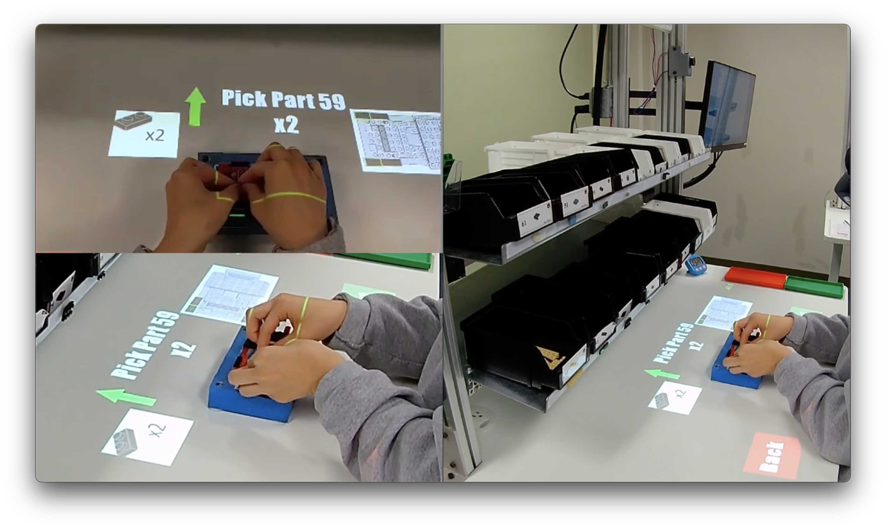{#fig-threepane}

The output was rendered by Filmora in the MP4 video format with full HD resolution (1920x1080) at 30 frames per second, using H.264 compression. This was then resized to 720p (1280x720) by Handbrake. The final file size is reduced to about 20mb / minute from multiple gigabytes of source material. This greatly increases the responsiveness the annotation experience without significantly degrading visual quality.

The compressed 720p video is loaded in Kyno where two types of events were annotated. Instantaneous events (e.g. car breaks during assembly) are identified by placing a marker at the moment of occurrence. Events with a duration (e.g. the start and end of each assembly task) are assigned to sub-clips. Both markers and sub-clips are given standard names that denote the event type, and descriptions where additional detail is called for. The standard list of names is included in [Appendix F](#app-videoproc), along with other important details about this process.

Finally, the Kyno project file is saved and annotation data is exported in XML format. A sample of that output is provided in @fig-learnxmp, based on participant #1051's learning experiment. This is confirmed by line (2), which shows the data is associated with the file `1051-Learn.mp4`. Lines (10) and (12) denote the start and end times of the "Car 1" sub-clip, each given in 1/90,000ths of a second.

::: {#fig-learnxmp}
``` xml
<context-info>
  <url>file:/Volumes/.../1051-Learn.mp4</url>
  <size>173341872</size>
  ...
</context-info>
<title>1051-Learn</title>
<description>side camera views are...</description>
<marker>
  <id>6436e1f6-b9a2-4a58-800a-12a13ed89ab7</id>
  <timestamp time-base="1/90000">895175</timestamp>
  <type>subclip</type>
  <duration time-base="1/90000">17932825</duration>
  <title>Car 1</title>
  <description>First car duration</description>
</marker>
```

XML Export of Annotation Data from Kyno
:::

### XML Processing

A Python (v3.11) script was used to create a CSV comprised of performance data extracted data from all Kyno `XML` files. The process is outlined with pseudocode in @fig-xmlproc.

::: {#fig-xmlproc}
``` text
For each xmlFile:
    Extract file metadata (url, size, etc.)

    For each marker in xmlFile:
        Extract marker details (id, timestamp, type, title, descript.)
        If duration element present, add duration to marker
        Convert timestamp and duration to seconds
        Add marker to markers list

    Categorize markers into subclips and other
    Add data to xmlData with key (participant, phase)

For each participant, phase pair in xmlData:
    Extract subclip markers for the participant and phase
    For each subclip marker:
        Format data (participant, phase, marker details) as row
        Add row to csvData

Write csvData to a CSV file
```

Pseudocode for XML Data Extraction (`process_data.py`)
:::

TODO: double check this pseudocode

While the XML data includes annotations for both instantaneous events (e.g. breakage occurs or defect encountered) and those with duration (e.g. task completion time), only the later are included in the resulting CSV. While instant events can provide important context for understanding performance, the focus of our analysis will be on task outcomes, which involve a duration.

The result includes columns for participant number, experiment number, and the event name, start time, duration, and description. For example, the data extracted for the first participant's learn experiment is summarized in @tbl-i1_times_csv.

| **Part** | **Exp** | **Event** | **Start** | **Dur** | **Description**          |
|:--------:|:-------:|-----------|-----------|---------|--------------------------|
|   1001   |    1    | Car 1     | 6.28      | 97.933  | N/A                      |
|   1001   |    1    | Car 2     | 108.367   | 66.7    | N/A                      |
|   1001   |    1    | Break 3   | 178.367   | 76.033  | failed attempt to repair |
|   1001   |    1    | Car 4     | 260.933   | 68.9    | N/A                      |
|   1001   |    1    | Car 5     | 333.467   | 60.9    | N/A                      |
|   1001   |    1    | Car 6     | 397.333   | 66.933  | N/A                      |
|   1001   |    1    | Defect 7  | 467.867   | 27.333  | prebuilt missing piece   |
|   1001   |    1    | Car 8     | 498.4     | 53.7    | corrected                |
|   1001   |    1    | Car 9     | 556.067   | 47.833  | finishes at the buzzer   |

: Learning Event Data Extracted for Participant #1001 {#tbl-i1_times_csv tbl-colwidths="\[7,7,16,15,15,40\]" .striped}

This shows they attempted nine cars and completed seven. Breakage occurred during the third assembly and a repair was attempted, but the car was ultimately retired. Car 7 was also retired when a defect was noticed in the prebuilt. The last car was completed in only 47.8 seconds, just before the 10-minute time limit.

The output of this script was saved as `i1_times.csv` and carefully validated against the XML data, video recordings, and reports described next.

TODO: where can the reader find code?

### System Availability

TODO: elaborate on dropout logging?

Due to challenges associated with area and model-based tracking, described elsewhere, participants using the HL2 would experience system down time that we referred to as "drop-outs." This was the result of a loss of tracking that caused the user interface to deactivate. All drop-outs were marked as subclips during video annotation process so the lost time could be accounted for.

Each drop-out event was later reviewed to assess how much impact it had on the current task. In some cases the drop-out occurred between cars or was disregarded by the participant. In others it caused worked to stop until tracking was reacquired. For each drop-out a value between 0.0 and 1.0 was assigned, based on the assessed impact.

The resulting times and weights could be used later to scale the drop-out duration accordingly, either for the overall analysis or to compare results with and without drop-out effect. Alternatively, they could be treated as system availability for OEE calculations.

This process was done manually and based on the PI's best judgement after all other annotation work was complete. It was recorded in a separate Excel sheet, `adjusted_drop_events.xlsx`.

### Report Generation

To assist with data validation and better understand factors that contribute to individual performance, a detailed report was generated for each participant. This was done as part of the same XML extraction Python script described above.

Each report aggregates participant demographics and car outcomes from observed and self-reported data, qualitative feedback from transcribed Markdown files, and quantitative event data from XML annotations. The result paints a comprehensive picture of the participant's experience in a single Markdown report. This is demonstrated by @fig-report, a screenshot of the recall portion of #1001's report. Complete reports can be reviewed...

TODO: include some / all reports in appendix or online?

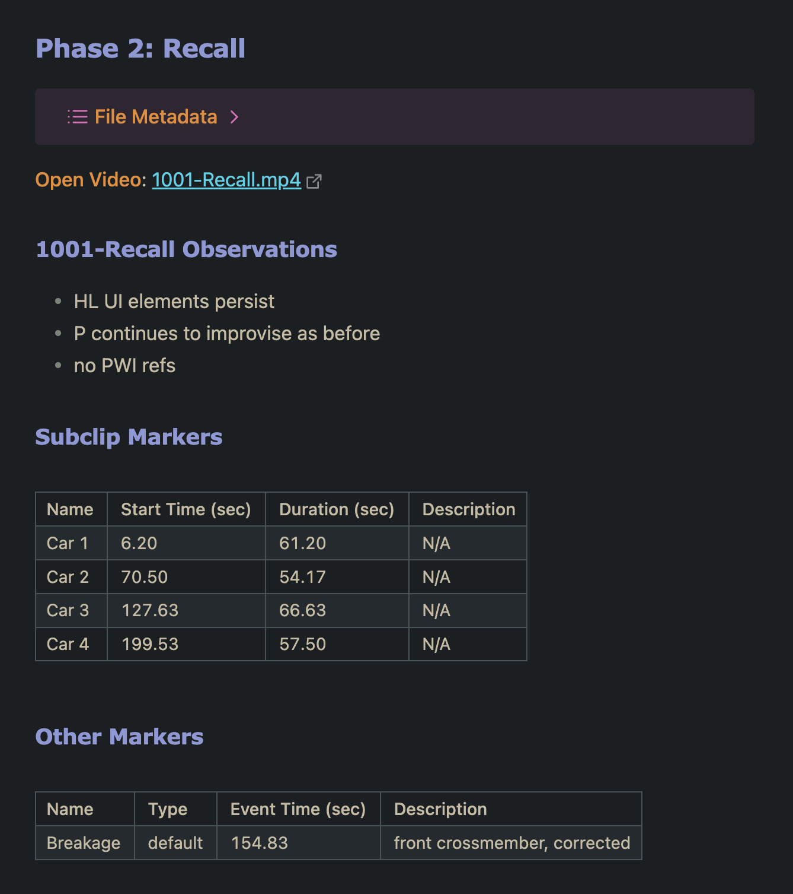{#fig-report width="70%"}

From the top, this report includes metadata (collapsed for brevity), clickable link to the video, list of PI's observations, and summaries of performance (subclip) and event (other) markers. The instantaneous event markers included here provide valuable added context. For example, we can see that a breakage was corrected during the third car, likely contributing to its increased duration.

The formatting seen in this image was rendered by Obsidian[^24-methods-39], a powerful tool for making and organizing Markdown documentation. This approach greatly facilitated the review of participant outcomes.

[^24-methods-39]: Obsidian: <https://obsidian.md/>

### Data and Code Management

Like all academic work, the success of this study hinged on the credibility, transparency, and reproducibility of the research, data, and results. As such, data management was a critical consideration in the development of the data extraction and processing workflow. The plan carefully accounted for data storage, version management, and the file formats used. Those details aligned with an access plan balancing accessibility and portability with privacy and security.

Anonymous data was stored locally in three separate locations, all on secure hardware accessible only to the PI: an internal laptop hard drive, an external RAID5 storage array, and an external NVMe backup drive. Additionally, GitHub[^24-methods-40] and BOX[^24-methods-41] cloud services were employed to provide more redundancy and secure access to select team members. A detailed account of this plan, including the hardware, software, folder structures, and naming conventions used, are provided in [Appendix H](#app-dataorg).

[^24-methods-40]: GitHub: <https://github.com/>

[^24-methods-41]: Box: <https://www.box.com/>

TODO: diagram of data storage?

Key criteria for software selection included multiplatform compatibility, open-source licensing, and the ability to generate files using open, preferably text-based, standards. These characteristics were crucial to ensuring data portability and the reproducibility of results.

Wherever appropriate, working files, including all data analysis in R and Python, and manuscript development in Quarto[^24-methods-42], were placed under version control using Git[^24-methods-43], and synchronized to GitHub. HL2 source code was treated separately, as discussed in @sec-devtactics.

[^24-methods-42]: Quarto: <https://quarto.org/>

[^24-methods-43]: Git: <https://git-scm.com/>

TODO: discuss use of virtual environments for Python and R library management

The entire process was designed to ensure traceability, allowing every result to be reliably linked back to its original source data, bolstering the integrity of our research findings. The priorities outlined here were carried on throughout the analysis process, described next.

### Challenges

TODO: elaborate on list of data extraction challenges and/or convert into narrative

-   sync is hard, dropped frames on HL2 made sync drift; use side camera for car related logging and HL for PWI / HL UI related logging to ensure accuracy
-   dropped video and crashes - multiple syncs required; multiple videos for each camera
-   some experiments required a TON of annotation work
-   time consuming!!
    -   2 phases x 2 videos x 62 = 248 videos
    -   (10 min + 5 min) x 62 = 930 mins = 15 hours 30 mins of video
    -   watched multiple times, at ≈2x speed avg
    -   plus time to layout and synchronize videos = 10 mins
    -   plus 10 mins processing time per output video = 2 x 62 x 10 mins = 20.7 hours; some overlap
    -   approx total time per participant ≈ 45mins min, 2.5hrs max, 1.25hrs avg
    -   plus annotation
-   corrected errors impractical to record consistently
-   terse notes in debrief lossy, recording would be better

## Data Analysis {#sec-analysis}

This section will detail the procedures for data preparation, then summarize the intended analytical approach. Analysis will be implemented and more thoroughly detailed in the [Results](#25-results) chapter to follow.

### Tools and Methodology

R was used for all data cleaning and analysis. A mix of R Markdown (`RMD`) and Quarto (`QMD`) notebooks were created in the RStudio integrated development environment (IDE). The notebook format allows users to intermingle Markdown-formatted text, with code and output in a way that is very well suited to the exploratory nature of this work. This best approximates the idea of *Literate Programming* originally described by Donald Knuth as narrative approach that presents code and writing in a way that is understandable to the reader.

TODO: cite and footnote Knuth!

TODO: discuss "tidy" methods

TODO: detail / cite / footnote packages used

TODO: where to find code? appendix or web?

### Cleaning and Transformation

The primary outputs of the prior extraction effort were:

1.  `i1_raw_data.xlsx` containing the self-reported data and observed results, manually transcribed. Each tab contains a different data set.
2.  `i1_times.csv` containing event times extracted from the video annotations. Each row corresponds to a participant, experiment, car number combination.
3.  `adjusted_drop_times.xlsx` listing all drop out events and the assigned weights.
4.  Notes for each participant in `MD` format, compiled from observations and feedback.

Prior to analysis, additional cleaning and transformation was required. This included identifying parent-child relationships among events, scoring the TLX and SUS, correcting errors in the data, enforcing standard naming conventions and data types, and collecting the results into a single `XLSX` file.

TODO: add chart illustrating data processing workflow

Data was cleaned and transformed by R code found in the notebook `forms_data.rmd`. The process was iterative, with each step detailed in the following sections.

#### First Pass

The initial pass of cleaning and transformation can be summarized as follows:

1.  Process Demographics: Combine date and time into a single datetime column, cleans column names, and converts most columns to factors.
2.  Process Car Outcomes: Replace flag values with meaningful categories and assign sequence numbers.
3.  Process Car Times: Clean names, extract event types, assign sequence numbers, and categorize markers into parent and child events based on event types and times
4.  Correct Errors: Implement various changes to correct for previously identified errors in the data. Each is documented and justified in the code.
5.  Join and Save: Add unique IDs (UIDs) for events and outcomes, reorder essential columns, join table data, and save as CSV.

TODO: add details re: parent / child and error correction

#### Second Pass

The first pass output was carefully reviewed, during which an improved categorization scheme was defined for all events. The new scheme, which simplified and standardized the ad-hoc labels generated during annotation, is summarized in @tbl-eventcats.

| Type   | Category   | Description                                   |
|--------|------------|-----------------------------------------------|
| Parent | Car        | Assembly completed during the time allowed.   |
| Parent | Breakage   | Assembly retired due to breakage.             |
| Parent | Defect     | Assembly retired due to defect in prebuild.   |
| Parent | Incomplete | Assembly incomplete when time expired.        |
| Child  | Drop       | Time lost due to HL2 drop-out.                |
| Child  | PWI        | Time lost to PWI reference (recall only).     |
| Child  | Repair     | Time lost as repairs are made to assembly.    |
| Child  | System     | Time lost due to other system related issues. |

: Event Categorization Scheme {#tbl-eventcats .striped}

The second pass of changes started by applying the updated categories. Again, each change is explicitly stated in the code. Adjusted drop times were then joined with the resulting data, and two new columns were generated for each type of child event. These totaled the number of events of each type for each parent, and their durations. Finally, those results were verified with automated tests and the results were written to `CSV`.

#### TLX and SUS Scoring

These instruments were scored as described by their providers. As noted in @sec-tlxextract, TLX responses for the first five participants were corrected by rescaling to the standard 100-point system, rounding up. TLX and SUS results were written to separate `CSV` files and reviewed for correctness.

#### Final Output

Finally, the outputs described above were combined and saved as `combined_results.xlsx`, again with one tab for each: demographics, car outcomes, car times, car results, system usability scores, and tlx scores. For clarity, the car tabs differ as follows:

-   **Outcomes** is the final version of the observed result and errors for each car.
-   **Times** is the final version of the data extracted from video annotations, including child events, with event type and category.
-   **Results** combines the outcomes and times tables, with one row per assembly and aggregating all time lost to child events.

Most analysis will focus on the Results tab, but the others are retained for traceability.

### Analysis

::: content-hidden
-   **Summary of Analytical Techniques**: Provide a brief overview of the statistical methods or analytical techniques planned for the Results chapter.
-   **Hypotheses or Research Questions**: Reiterate the hypotheses or research questions that the analysis will address.
-   **Preliminary Considerations**: Discuss any preliminary analysis conducted to inform the detailed analysis in the Results chapter.
-   **Software and Tools**: Briefly mention any specific statistical software or tools that will be used for the analysis.
-   **Identification and Handling of Inconsistencies**: Explain how you identify and manage inconsistencies, missing data, or outliers.
-   **Data Transformation**: Describe any transformations applied to the data (e.g., normalization, categorization).
:::

TODO: summarize analysis methods used in results chapter

## Limitations of Study Design

TODO: elaborate on list of study limitations and/or convert into narrative

-   compensation added after IRB v3, approved April 10; 5 prior subjects plus some thereafter were recruited without knowledge of compensation
-   convenience sample
-   pseudo-random selection
-   legos are not real cars
-   difficulty / complexity of the task insufficient?
-   the HMDAR and MR treatments are not exact replications of the PAR instructions but no material difference
-   few participants assigned HMDMR took advantage of the affordance
-   does not account for interactions between affordances
-   learning effect (training, etc.)
-   orientation doesn't precisely control for learning across treatments, e.g. PAR, AR/MR all introduce the treatment using ST-8 instructions (in addition to ST-7), where PWI gets only ST-7 and no prior training with ST-8

## Summary

TODO: write methods summary / transition to results
